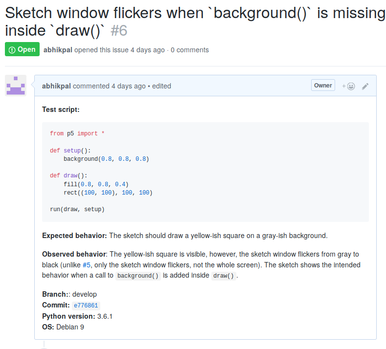

Contributing to p5
==================

Thank you for considering contributing to p5! We are still a very
small project and it's amazing that you want to help out! There are
many ways you can help make p5 better; you can, for instance:

- `File bug reports`_
- `Test things out`_
- Help out with documentation
- `Propose new features`_
- `Write tutorials for p5 and spread the word!`_
- ...and, of course, write code.

Depending on what you are interested in, use the list above to jump to
the relevant section.

File bug reports
----------------

You can use the issues tab to let us know about bugs and other issues
that you face while *using p5*. When you do open a bug report, please
mention:

- The operating system and Python version that you are using.
- A sample code snippet that reproduces the bug
- The expected behavior (what *should* the piece of code do?)
- The actual behavior (what does the piece of code *actually* do?)
- version of p5 that you are using (or, if you are using the latest
  version from the develop branch, the hash of the latest commit.)
- If the p5 produces a whole lot of error messages, please copy paste
  them into the description!

Here's a `sample bug report <https://github.com/p5py/p5/issues/6>`_:

Test things out
---------------

There are multiple ways you can test p5 and then `File bug reports`_
if something doesn't work. There are two ways you can go about testing things:

- Try running some code and lookout for unexpected behavior. Does the
  screen flicker when it shouldn't? Is the shape being drawn at the
  wrong position? Does a function simply doesn't work? etc.

- Most of the development work happens on a computer running Debian 9.
  If you have access to machines that run different operating systems,
  we would love to know how p5 performs on them. Just take some test
  code and try running it on different machines; if something doesn't
  work, open an issue.

Propose new features
--------------------

You can use the issues tab to propose new features. When you open a
new feature request make sure to prefix your issue title with
"[Feature Request]". for instance, if you would like to have support
for multiple sketch windows, you might open a new issue with the title
``[Feature Request] Multiple sketch windows`` and then describe the
feature you're proposing in detail.

We already have enough on our hands for the next couple of months and
for now, we are priorotizing the features listed in the "Feature
Roadmap" section of the `README <README.rst>`_. Nevertheless, we would
love to have your suggestions :)

Write tutorials for p5 and spread the word!
-------------------------------------------

If you have a blog/website and would like to write a tutorial that
uses p5, feel free! If you want to let us know, use the Issues tab and
prefix your issue with ``[Tutorial]``. You can also let us know if you
use p5 to create something cool!

Join the community on slack!
----------------------------

|ImageLink|_

.. |ImageLink| image:: https://user-images.githubusercontent.com/15258498/89115901-60fe5c00-d4ab-11ea-9987-6dc1770ab01e.png
.. _ImageLink: https://join.slack.com/t/p5py/shared_invite/zt-g9uo4vph-dUVltiE1ixvmjFTCyRlzpQ