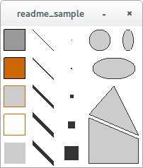

p5py
====

Prototype for a Python package based on Processing_. To run the prototype, install PyGame and PyOpenGl (preferably inside a  virtualenv) and then:

.. code:: bash

    $ # Clone the repo
    $ git clone 'https://github.com/abhikpal/p5py'
    $ cd p5py

    $ # Run sketches!
    $ python -m p5py ~/path/to/sketch/folder/the_sketch.py

Example
-------

.. code:: python

    from p5py import *

    def setup():
        background(255, 255, 255)

        fill(153)
        rect(5, 5, 30, 30)

        fill(204, 102, 0)
        rect(5, 45, 30, 30)

        fill(204, 204, 204)
        stroke(204, 102, 0)
        rect(5, 85, 30, 30)

        no_fill()
        rect(5, 125, 30, 30)

        fill(204, 204, 204)
        no_stroke()
        rect(5, 165, 30, 30)

        stroke(51, 51, 51)
        for i, w in enumerate([1, 2, 5, 10, 20]):
            stroke_weight(w)
            line((45, 5 + i*40), (75, 35 + i*40))
            point(100, 20 + i*40)

        stroke_weight(1)
        ellipse(140, 20, 30, 30)
        ellipse(180, 20, 15, 30)
        ellipse(160, 60, 60, 30)

        triangle((160, 85), (125, 125), (195, 155))
        quad((125, 130), (195, 160), (195, 195), (125, 195)):

This produces:

Reference
---------

(See ``./examples/core/`` for sample code)

``point(x, y)``
    Draws a point at (x, y)

``line(p1, p2)``
    Draws a line from ``p1`` to ``p2`` (``p1``, ``p2`` are tuples)

``triangle(p1, p2, p3)``
    Draws a triangle with corners at ``p1``, ``p2``, ``p3`` (``p1``, ``p2``, ``p3`` are tuples).

``quad(p1, p2, p3, p4)``
    Draws a quad with corners at ``p1``, ``p2``, ``p3``, ``p4`` (``p1``, ``p2``, ``p3``, ``p4`` are tuples).

``rect(x, y, width, height)``
    Draws a rectangle of dimensions with width ``width`` and height ``height`` whose top-left corner is at (``x``, ``y``).

``ellipse(x, y, width, height)``
    Draws an ellipse centered at (``x``, ``y``) with width ``width`` and height ``height``.

``fill(*args, **kwargs)``
    Sets fill color.

``no_fill()``
    Turns off fill.

``stroke(*args, **kwargs)``
    Sets stroke color.

``stroke_weight(weight)``
    Sets stroke weight.

``no_stroke()``
    Turns off stroke.

``background(*args, **kwargs)``
    Sets background color.

.. _Processing: https://www.processing.org
