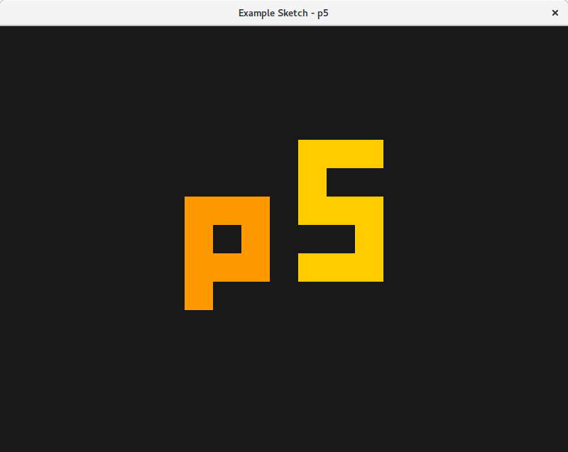

.. image :: docs/_static/processing-header-thin.png
    :width: 100%
    :align: center
    :alt: ---

p5
===

p5 is a Python library that provides high level functions to work with
graphics. p5 combines the core ideas of Processing — learning to code
in a visual context — with Python's readability to make programming
more accessible to beginners and artists.

There's a lot of work happening on p5 right now; it is being developed
by `Abhik Pal <https://github.com/abhikpal>`_ as a `project
<https://summerofcode.withgoogle.com/projects/#5809403503575040>`_ for
the `Google Summer of Code 2017
<https://summerofcode.withgoogle.com/>`_. `Manindra Moharana
<http://www.mkmoharana.com/>`_ of the `Processing Foundation
<https://processingfoundation.org/>`_ is mentoring the project.

Documentation for the project is available at `p5.readthedocs.io
<http://p5.readthedocs.io/>`_ and `p5py.github.io
<https://p5py.github.io/>`_ has links to other relevant resources.

If you've found a bug in p5, please file it under the `"Issues" tab
<https://github.com/p5py/p5/issues>`_ for this repository. For now,
you can also use the issues tab to propose new features. Please read
the relevant section from the `Contributing <CONTRIBUTING.rst>`_ file
before opening an issue.

Example
-------

p5 borrows Processing's metaphor of software "sketches". A typical
sketch looks like:

.. code:: python

    from p5 import *

    background_color = (0.1, 0.1, 0.1, 1.0)

    def setup():
        size(800, 600)
        title("Example Sketch")
        no_stroke()

    def draw():
        scale(2.0)
        background(*background_color)

        with push_matrix():
            translate(160, 150)

            fill(1.0, 0.6, 0.0, 1.0)
            square((-30, -30), 60)
            square((-30, -50), 20)

            fill(*background_color)
            square((-10, -10), 20)

        with push_matrix():
            translate(240, 170)

            fill(1.0, 0.8, 0.0, 1.0)
            rect((-30, -50), 60, 100)

            fill(*background_color)
            rect((-30, -30), 40, 20)
            rect((-10, 10), 40, 20)

    if __name__ == '__main__':
        run()
           
...and, when run, produces:

Installation
------------

p5 requires Python 3. Once you have that installed, you can then run

.. code:: bash

   pip install p5

from the command line. p5 includes a test script and you can run

.. code:: python

   >>> import p5
   >>> p5.sketch.test_run()

from the interactive prompt to view the test render.

Features Roadmap
----------------

For the next couple of months, we plan to focus on the following
features:

#. Support most 2D drawing primitives and related utility functions
   from the Processing API (the `Project Status wiki page
   <https://github.com/p5py/p5/wiki/Project-Status>`_ for this repo
   has a proper checklist.)

#. Port relevant tutorials and reference material from Processing's
   documentation.

#. Support live coding of sketches in the Python REPL (here's a
   `screencast <https://p5py.github.io/videos/p5-repl-demo.webm>`_ from
   an earlier prototype).

License
-------

p5 is licensed under the GPLv3. See `LICENSE <LICENSE>`_ for more details.

.. image :: docs/_static/processing-header-thin.png
    :width: 100%
    :align: center
    :alt: ---
