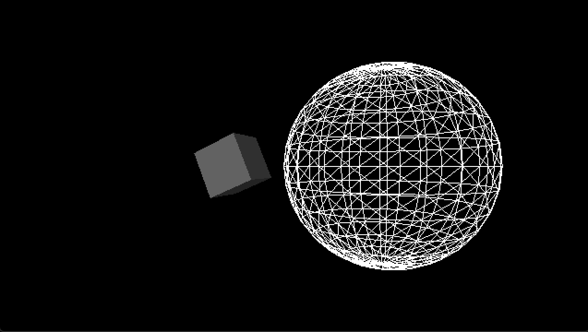

************
Basic Shapes
************

.. code:: python

    # Code from Daniel Shiffman's tutorial, adopted to p5py
    # https://processing.org/tutorials/p3d/

    from p5 import *

    def setup():
        size(640, 360)

    def draw():
        background(0)
        lights()

        with push_matrix():
            translate(-130, 0, 0)
            rotate_y(1.25)
            rotate_x(-0.4)
            no_stroke()
            fill(255)
            blinn_phong_material()
            box(100, 100, 100)

        with push_matrix():
            translate(250, 0, -200)
            no_fill()
            stroke(255)
            sphere(280)

    if __name__ == '__main__':
        run(mode='P3D')
