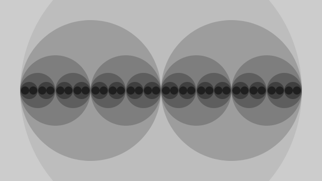

.. p5 documentation master file, created by
   sphinx-quickstart on Thu May 25 17:28:12 2017.
   You can adapt this file completely to your liking, but it should at least
   contain the root `toctree` directive.

p5
====

p5 is a Python package based on the core ideas of `Processing
<https://processing.org>`_. It aims to make programming more
accessible for beginners, artists, and educators by combining Python's
readability with Processing's emphasis on learning to code in a visual
context.

p5 programs are called "sketches" (we borrow this metaphor from
Processing) and can be run as normal Python programs. A typical sketch
often looks like:

.. code:: python

   # Example adapted from "Recursion" Processing example
   
   from p5 import *

   def setup():
       size(640, 360)
       no_stroke()
       no_loop()

   def draw():
       draw_circle(WIDTH/2, 280, 6)

   def draw_circle(x, radius, level):
       fill(126 * level / 4)
       circle(x, HEIGHT/2, radius*2*)
       if level > 1:
           level = level - 1
          draw_circle(x - radius/1, radius/2, level)
          draw_circle(x + radius/1, radius/2, level)
           
When run, this sketch produces:

To get started, use the links below:

.. toctree::
   :maxdepth: 2

   api

p5 is being developed by `Abhik Pal <https://github.com/abhikpal>`_
as a `project
<https://summerofcode.withgoogle.com/projects/#5809403503575040>`_
under the `Processing Foundation <https://processingfoundation.org/>`_
for `Google Summer of Code 2017
<https://summerofcode.withgoogle.com/>`_.. `Manindra Moharana
<http://www.mkmoharana.com/>`_ is the mentor for the project.

