******
Arrays
******

:Authors: Casey Reas, Ben Fry; Arihant Parsoya (p5 port)
:Copyright: This tutorial is "Arrays" chapter from `Processing: A
   Programming Handbook for Visual Designers and Artists, Second
   Edition <https://processing.org/handbook>`_, published by MIT
   Press. © 2014 MIT Press. If you see any errors or have comments,
   please let us know. The tutorial was ported to p5 by Arihant Parsoya. If
   you see any errors or have comments, open an issue on either the
   `p5 <https://github.com/p5py/p5/issues>`_ or `Processing
   <https://github.com/processing/processing-docs/issues?q=is%3Aopen>`_
   repositories.

The term array refers to a structured grouping or an imposing number: “The dinner buffet offers an array of choices,” “The city of Boston faces an array of problems.” In computer programming, an array is a set of data elements stored under the same name. Arrays can be created to hold any type of data, and each element can be individually assigned and read. There can be arrays of numbers, characters, sentences, boolean values, and so on. Arrays might store vertex data for complex shapes, recent keystrokes from the keyboard, or data read from a file. For instance, an array can store five integers (1919, 1940, 1975, 1976, 1990), the years to date that the Cincinnati Reds won the World Series, rather than defining five separate variables. Let’s call this array “dates” and store the values in sequence:

.. image:: ./arrays-res/Dia-28-1.svg
	:align: center

Array elements are numbered starting with zero, which may seem confusing at first but is an important detail for many programming languages. The first element is at position [0], the second is at [1], and so on. The position of each element is determined by its offset from the start of the array. The first element is at position [0] because it has no offset; the second element is at position [1] because it is offset one place from the beginning. The last position in the array is calculated by subtracting 1 from the array length. In this example, the last element is at position [4] because there are five elements in the array. 

Arrays can make the task of programming much easier. While it’s not necessary to use them, they can be valuable structures for managing data. Let’s begin with a set of data points to construct a bar chart.

.. image:: ./arrays-res/Dia-28-2.svg
	:align: center

The following examples to draw this chart demonstrates some of the benefits of using arrays, like avoiding the cumbersome chore of storing data points in individual variables. Because the chart has ten data points, inputting this data into a program requires either creating 10 variables or using one array. The code on the left demonstrates using separate variables. The code on the right shows how the data elements can be logically grouped together in an array.

.. code:: python

	x0 = 50
	x1 = 61
	x2 = 83
	x3 = 69
	x4 = 71
	x5 = 50
	x6 = 29
	x7 = 31
	x8 = 17
	x9 = 39

	x = [50, 61, 83, 69, 71, 50, 29, 31, 17, 39]

Using what we know about drawing without arrays, ten variables are needed to store the data; each variable is used to draw a single rectangle. This is tedious:

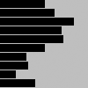

.. code:: python 

	x0 = 50
	x1 = 61
	x2 = 83
	x3 = 69
	x4 = 71
	x5 = 50
	x6 = 29
	x7 = 31
	x8 = 17
	x9 = 39
	fill(0)
	rect((0, 0), x0, 8)
	rect((0, 10), x1, 8)
	rect((0, 20), x2, 8)
	rect((0, 30), x3, 8)
	rect((0, 40), x4, 8)
	rect((0, 50), x5, 8)
	rect((0, 60), x6, 8)
	rect((0, 70), x7, 8)
	rect((0, 80), x8, 8)
	rect((0, 90,) x9, 8)

In contrast, the following example shows how to use an array within a program. The data for each bar is accessed in sequence with a for loop. The syntax and usage of arrays is discussed in more detail in the following pages.

.. code:: python 

	x = [50, 61, 83, 69, 71, 50, 29, 31, 17, 39]

	fill(0)
	for i in range(len(x)):
		rect((0, i*10), x[i], 8)

Define an Array
===============

There are different ways to declare, create, and assign arrays. In the following examples that explain these differences, an array with five elements is created and filled with the values 19, 40, 75, 76, and 90. Note the different way each technique for creating and assigning elements of the array relates to setup().

.. code:: python

	data = [] # declare

	def setup():
		size(100, 100)
		data.append(19)
		data.append(40)
		data.append(75)
		data.append(76)
		data.append(90)

	data = [0]*5 # Declare and create

	def setup():
		size(100, 100)
		data[0] = 19
		data[1] = 40
		data[2] = 75
		data[3] = 76
		data[4] = 90

	data = [19, 40, 75, 76, 90] # Declare and assign

	def setup():
		size(100, 100)

Although each of the three previous examples defines an array in a different way, they are all equivalent. They show the flexibility allowed in defining the array data. Sometimes, all the data a program will use is known at the start and can be assigned immediately. At other times, the data is generated while the code runs. Each sketch can be approached differently using these techniques. 

Arrays can also be used in programs that don’t include a setup() and draw(). If arrays are not used with these functions, they can be created and assigned in the ways shown in the following examples.

.. code:: python

	data = [] # Create

	data.append(19) # Assign
	data.append(40)
	data.append(75)
	data.append(76)
	data.append(90)

	data = [0]*5 # Declare
	data[0] = 19 # Assign
	data[1] = 40
	data[2] = 75
	data[3] = 76
	data[4] = 90

	data = [19, 40, 75, 76, 90] # Declare, Create and Assign

Read Array Elements
===================

After an array is created, its data can be accessed and used within the code. An array element is accessed with the name of the array variable, followed by brackets around the element position to read.

.. code:: python

	data = [19, 40, 75, 76, 90]

	line((data[0], 0), (data[0], 100))
	line((data[1], 0), (data[1], 100))
	line((data[2], 0), (data[2], 100))
	line((data[3], 0), (data[3], 100))
	line((data[4], 0), (data[4], 100))

Remember, the first element in the array is in the 0 position. If you try to access a member of the array that lies outside the array boundaries, your program will terminate and give an ArrayIndexOutOfBoundsException.

.. code:: python
	
	data = [19, 40, 75, 76, 90]
	print(data[0]) # prints "19" to the console
	print(data[2]) # prints "75" to the console
	print(data[5]) # IndexError: list index out of range

The ``len()`` function is used to find the number of elements in an array. The following example demonstrates how to utilize it.

.. code:: python

	data1 = [19, 40, 75, 76, 90]
	data2 = [19, 40]

	print(len(data1)) # prints "5" to the console
	print(len(data2)) # prints "2" to the console

Usually, a for loop is used to access array elements, especially with large arrays. The following example draws the same lines as code 28-09 but uses a for loop to iterate through every value in the array.

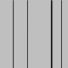

.. code:: python

	data1 = [19, 40, 75, 76, 90]
	data2 = [19, 40]

	print(len(data1)) # prints "5" to the console
	print(len(data2)) # prints "2" to the console

A for loop can also be used to put data inside an array. For instance, it can calculate a series of numbers and then assign each value to an array element. The following example stores the values from the sin() function in an array within setup() and then displays these values as the stroke values for lines within draw().

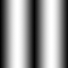

.. code:: python

	from p5 import *

	sineWave = []

	def setup():
	    size(100, 100)
	    global sineWave
	    for i in range(width):
	        r = remap(i, [0, width], [0, TWO_PI])
	        sineWave.append(abs(sin(r)))

	def draw():
	    global sineWave
	    for i in range(len(sineWave)):
	        # Set stroke values to numbers read from array
	        stroke(sineWave[i] * 255)
	        line((i, 0), (i, height))

	if __name__ == '__main__':
	    run()

Record Data
===========

As one example of how arrays may be used, this section shows how to use arrays to store data from the mouse. The pmouseX and pmouseY variables store the cursor coordinates from the previous frame, but there is no built-in way to access the cursor values from earlier frames. At every frame, the mouse_x, mouse_y, pmouse_x, and pmouse_y variables are replaced with new numbers and their previous numbers are discarded. Creating an array is the easiest way to store the history of these values. In the following example, the most recent 100 values from mouseY are stored and displayed on screen as a line from the left to the right edge of the screen. At each frame, the values in the array are shifted to the right and the newest value is added to the beginning.

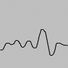

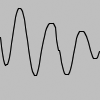

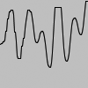

.. code:: python

	from p5 import *

	y = []

	def setup():
	    size(100, 100)

	    global y
	    y = [0]*width

	def draw():
	    background(204)

	    # Read the array from the end to the
	    # beginning to avoid overwriting the data
	    for i in range(len(y) - 1, 0, -1):
	        y[i] = y[i - 1]

	    # Add new values to the beginning
	    y[0] = mouse_y

	    # Display each pair of values as a line
	    for i in range(1, len(y)):
	        line((i, y[i]), (i-1, y[i-1]))

	if __name__ == '__main__':
	    run()

Apply the same code simultaneously to the mouseX and mouseY values to store the position of the cursor. Displaying these values each frame creates a trail behind the cursor.

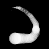

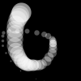

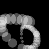

.. code:: python

	from p5 import *

	num = 50
	y = [0]*num
	x = [0]*num

	def setup():
	    size(100, 100)

	    no_stroke()
	    fill(255, 102)

	def draw():
	    background(0)

	    # Shift the values to the right
	    for i in range(num - 1, 0, -1):
	        y[i] = y[i - 1]
	        x[i] = x[i - 1]

	    # Add new values to the beginning
	    y[0] = mouse_y
	    x[0] = mouse_x

	    # Draw the circles
	    for i in range(1, num):
	        ellipse((x[i], y[i]), i/2.0, i/2.0)

	if __name__ == '__main__':
	    run()

The following example produces the same result as the previous one but uses a more efficient technique. Instead of shifting the array elements in each frame, the program writes the new data to the next available array position. The elements in the array remain in the same position once they are written, but they are read in a different order each frame. Reading begins at the location of the oldest data element and continues to the end of the array. At the end of the array, the % operator (p. 57) is used to wrap back to the beginning. This technique, commonly known as a ring buffer, is especially useful with larger arrays, to avoid unnecessary copying of data that can slow down a program.

.. code:: python

	from p5 import *

	num = 50
	y = [0]*num
	x = [0]*num
	index_position = 0

	def setup():
	    size(100, 100)

	    no_stroke()
	    fill(255, 102)

	def draw():
	    background(0)
	    global index_position
	    y[index_position] = mouse_y
	    x[index_position] = mouse_x

	    # Cycle between 0 and the number of elements
	    index_position = (index_position + 1) % num

	    for i in range(num):
	        # Set the array position to read
	        pos = (index_position + i) % num
	        radius = (num - i) / 2.0
	        ellipse((x[pos], y[pos]), radius, radius)

	if __name__ == '__main__':
	    run()

Array Functions
===============

Python provides a group of functions that assist in managing array data.

The ``append()`` function expands an array by one element, adds data to the new position, and returns the new array:

.. code:: python

	trees = ["ash", "oak"]
	trees.append("maple") # adds "maple" to the end
	print(trees) # prints ["ash", "oak", "maple"]

The ``pop()`` function decreases an array by one element by removing the last element and returns the last element of the array:

.. code:: python

	trees = ["ash", "oak"]
	trees.pop() # removes "oak"
	print(trees) # prints ["ash"]

The ``extend()`` function increases the size of an array. It can expand to a specific size, or if no size is specified, the array’s length will be doubled. If an array needs to have many additional elements, it’s faster to use expand() to double the size than to use append() to continually add one value at a time. The following example saves a new mouseX value to an array every frame. When the array becomes full, the size of the array is doubled and new mouseX values proceed to fill the enlarged array.

.. code:: python

	from p5 import *

	x = [0]*100 # Array to store x-coordinates
	count = 0 # Positions stored in array

	def setup():
	    size(100, 100)

	def draw():
	    global x, count
	    x[count] = mouse_x # Assign new x-coordinate to the array
	    count += 1 # Increment the counter

	    if count == len(x):
	        x.extend(x)
	        print(len(x))

	if __name__ == '__main__':
	    run()

New functions can be written to perform operations on arrays, but arrays behave differently than data types such as intgers and characters. As with objects, when an array is used as a parameter to a function, the address (location in memory) of the array is transferred into the function instead of the actual data. No new array is created, and changes made within the function affect the array used as the parameter. 

In the following example, the data[] array is used as the parameter to halve(). The address of data[] is passed to the d[] array in the halve() function. Because the address of d[] and data[] is the same, they both point to the same data. Changes made to d[] on line 14 modify the value of data[] in the setup() block. The draw() function is not used because the calculation is made only once and nothing is drawn to the display window.

.. code:: python

	from p5 import *

	data = [19.0, 40.0, 75.0, 76.0, 90.0]

	def setup():
	    halve(data)
	    print(data[0]) # Prints "9.5"
	    print(data[1]) # Prints "20.0"
	    print(data[2]) # Prints "27.5"
	    print(data[3]) # Prints "38.0"
	    print(data[4]) # Prints "45.0"

	def halve(d):
	    for i in range(len(d)): # For each array element,
	        d[i] = d[i] / 2.0; # divide the value by 2

	if __name__ == '__main__':
	    run()

Changing array data within a function without modifying the original array requires some additional lines of code. In the following example, the array is passed into the function as a parameter, a new array is made, the values from the original array are copied in the new array, changes are made to the new array, and finally the modified array is returned.

.. code:: python

	from p5 import *

	data = [19.0, 40.0, 75.0, 76.0, 90.0]
	half_data = []

	def setup():
	    halfData = halve(data) # Run the halve() function
	    print(halfData[0]) # Prints "9.5"
	    print(halfData[1]) # Prints "20.0"
	    print(halfData[2]) # Prints "27.5"
	    print(halfData[3]) # Prints "38.0"
	    print(halfData[4]) # Prints "45.0"

	def halve(d):
	    numbers = d.copy()
	    for i in range(len(numbers)): # For each array element,
	        numbers[i] = numbers[i] / 2.0; # divide the value by 2

	    return numbers

	if __name__ == '__main__':
	    run()

Array of Objects
================

Working with arrays of objects is technically similar to working with arrays of other data types, but it opens the amazing possibility to create as many instances of a custom-designed class as desired. Like all arrays, an array of objects is distinguished from a single object with brackets, the [ and ] characters. However, because each array element is an object, each must be created with the keyword new before it can be used. The steps for working with an array of objects are: 

#. Create the array 
#. Create each object in the array

These steps are translated into code in the following example. It uses the Ring class from page 371, so copy it over or retype it. This code creates a rings[] array to hold fifty Ring objects. The first time a mouse button is pressed, the first Ring object is turned on and its x and y variables are assigned to the current values of the cursor. Each time a mouse button is pressed, a new Ring is turned on and displayed in the subsequent trip through draw(). When the final element in the array has been created, the program jumps back to the beginning of the array to assign new positions to earlier Rings.

.. figure:: ./arrays-res/28_24_1.png
   :align: center

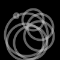

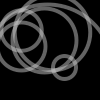

.. code:: python

	from p5 import *

	rings = [] # Create the array
	numRings = 50
	currentRing = 0

	def setup():
	    size(100, 100)

	    for i in range(numRings):
	        rings.append(Ring())

	def draw():
	    background(0)

	    for r in rings:
	        r.grow()
	        r.display()

	def mouse_pressed():
	    global currentRing
	    rings[currentRing].start(mouse_x, mouse_y)

	    currentRing += 1
	    if currentRing > numRings:
	        currentRing = 0

	class Ring:
	    def __init__(self):
	        self.x = 0
	        self.y = 0
	        self.diameter = 0
	        self.on = False

	    def start(self, xpos, ypos):
	        self.x = xpos
	        self.y = ypos

	        self.diameter = 1
	        self.on = True

	    def grow(self):
	        if self.on:
	            self.diameter += 0.5
	            if self.diameter > 400:
	                self.on = False
	                self.diameter = 1

	    def display(self):
	        if self.on:
	            no_fill()
	            stroke_weight(4)
	            stroke(204, 153)
	            ellipse((self.x, self.y), self.diameter, self.diameter)

	if __name__ == '__main__':
	    run()

The next example requires the Spot class from page 363. Unlike the prior example, variable values are generated within the setup() and are passed into each array elements through the object’s constructor. Each element in the array starts with a unique set of x-coordinate, diameter, and speed values. Because the number of objects is dependent on the width of the display window, it is not possible to create the array until the program knows how wide it will be. Therefore, the array is declared outside of setup() to make it global (see p. 12), but it is created inside setup, after the width of the display window is defined.

.. code:: python

	from p5 import *

	spots = [] # Create the array

	def setup():
	    size(700, 100)

	    numSpots = 70 # Number of objects
	    dia = width/numSpots # Calculate diameter

	    for i in range(numSpots): # Create array
	        x = dia/2 + i*dia
	        rate = random_uniform(0.1, 0.2)

	        spots.append(Spot(x, 50, dia, rate))

	def draw():
	    background(0, 12)
	    fill(255)

	    for s in spots:
	        s.move() # Move each object
	        s.display() # Display each object

	class Spot:
	    def __init__(self, xpos, ypos, dia, sp):
	        self.x = xpos
	        self.y = ypos
	        self.diameter = dia
	        self.speed = sp
	        self.direction = 1

	    def move(self):
	        self.y += self.speed*self.direction

	        if self.y > height - self.diameter/2 or self.y < self.diameter/2:
	            self.direction *= -1

	    def display(self):
	        ellipse((self.x, self.y), self.diameter, self.diameter)

	if __name__ == '__main__':
	    run()

Each object in the array is in turn assigned to the variable s, so the first time through the loop, the code s.move() runs the move() method for the first element in the array, then the next time through the loop, s.move() runs the move() method for the second element in the array, etc. The two statements inside the block run for each element of the array until the end of the array. This way of accessing each element in an array of objects is used for the remainder of the book.

Two-dimensional Arrays
======================

Data can also be stored and retrieved from arrays with more than one dimension. Using the example from the beginning of this chapter, the data points for the chart are put into a 2D array, where the second dimension adds a gray value:

.. image:: ./arrays-res/Dia-28-3.svg
	:align: center

A 2D array is essentially a list of 1D arrays. It must first be declared, then created, and then the values can be assigned just as in a 1D array. The following syntax converts the diagram above into to code:

.. code:: python

	x = [[50, 0], [61,204], [83,51], [69,102], [71, 0],
	[50,153], [29, 0], [31,51], [17,102], [39,204]]

	print(x[0][0]) # Prints "50"
	print(x[0][1]) # Prints "0"
	print(x[4][2]) # ERROR! This element is outside the array
	print(x[3][0]) # Prints "69"
	print(x[9][1]) # Prints "204"

It is possible to continue and make 3D and 4D arrays by extrapolating these techniques. However, multidimensional arrays can be confusing, and often it is a better idea to maintain multiple 1D or 2D arrays.

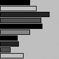

.. code:: python

	from p5 import *

	x = [[50, 0], [61,204], [83,51], [69,102], [71, 0], [50,153], [29, 0], [31,51], [17,102], [39,204]]

	def setup():
	    size(100, 100)

	def draw():
	    for i in range(len(x)):
	        fill(x[i][1])
	        rect((0, i*10), x[i][0], 8)

	if __name__ == '__main__':
	    run()

