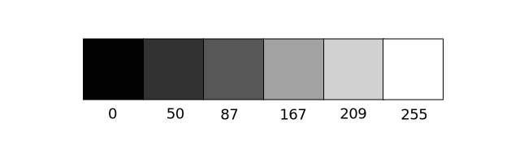
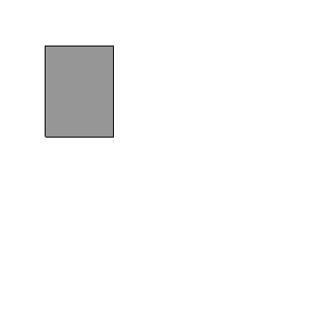
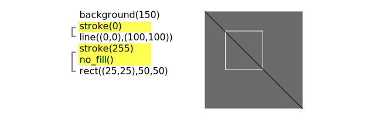
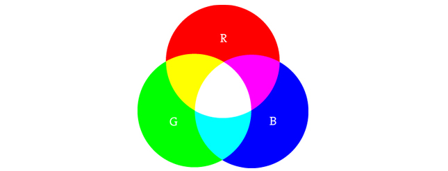
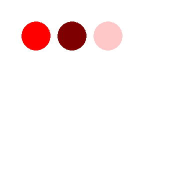
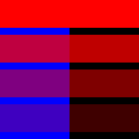
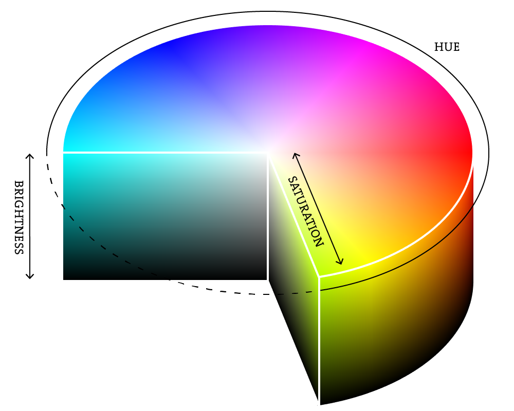

*****
Color
*****

:Authors: Daniel Shiffman; Abhik Pal (p5 port)
:Copyright: This tutorial is from the book `Learning Processing
   <https://processing.org/books/#shiffman>`_ by Daniel Shiffman,
   published by Morgan Kaufmann, © 2008 Elsevier Inc. All rights
   reserved. The tutorial was ported to p5 by Abhik Pal. If you see
   any errors or have comments, open an issue on either the `p5
   <https://github.com/p5py/p5/issues>`_ or `Processing
   <https://github.com/processing/processing-docs/issues?q=is%3Aopen>`_
   repositories.

In the digital world, when we want to talk about a color, precision is
required. Saying "Hey, can you make that circle bluish-green?" will
not do. Color, rather, is defined as a range of numbers. Let's start
with the simplest case: black & white or grayscale. 0 means black, 255
means white. In between, every other number -- 50, 87, 162, 209, and
so on -- is a shade of gray ranging from black to white.

.. note::

   *Does 0-255 seem arbitrary to you?*

   Color for a given shape needs to be stored in the computer's
   memory. This memory is just a long sequence of 0's and 1's (a whole
   bunch of on or off switches.) Each one of these switches is a bit,
   eight of them together is a byte. Imagine if we had eight bits (one
   byte) in sequence -- how many ways can we configure these switches?
   The answer is (and doing a little `research into binary numbers
   <http://en.wikipedia.org/wiki/Binary_number>`_ will prove this
   point) 256 possibilities, or a range of numbers between 0 and 255.
   We will use eight bit color for our grayscale range and 24 bit for
   full color (eight bits for each of the red, green, and blue color
   components).

By adding the :meth:`p5.stroke` and :meth:`p5.fill` functions before
something is drawn, we can set the color of any given shape. There is
also the function :meth:`p5.background` which sets a background color
for the window. Here's an example.

.. code:: python

    from p5 import *

    def draw():
        background(255)
        stroke(0)
        fill(150)
        rect((50, 50), 75, 100)

    if __name__ == '__main__':
        run()

Stroke or fill can be eliminated with the functions:
:meth:`p5.no_stroke` and :meth:`no_fill`. Our instinct might be to say
``stroke(0)`` for no outline, however, it is important to remember
that 0 is not "nothing", but rather denotes the color black. Also,
remember not to eliminate both -- with ``no_stroke`` and ``no_fill``,
nothing will appear!

In addition, if we draw two shapes, p5 will always use the most
recently specified stroke and fill, reading the code from top to
bottom.

RGB Color
=========

Remember finger painting? By mixing three "primary" colors, any color
could be generated. Swirling all colors together resulted in a muddy
brown. The more paint you added, the darker it got. Digital colors are
also constructed by mixing three primary colors, but it works
differently from paint. First, the primaries are diff erent: red,
green, and blue (i.e., "RGB" color). And with color on the screen, you
are mixing light, not paint, so the mixing rules are different as
well.

        
* Red	+ Green = Yellow
* Red	+ Blue 	= Purple
* Green + Blue = Cyan (blue-green)
* Red	+ Green + Blue = White
* No colors = Black

This assumes that the colors are all as bright as possible, but of
course, you have a range of color available, so some red plus some
green plus some blue equals gray, and a bit of red plus a bit of blue
equals dark purple. While this may take some getting used to, the more
you program and experiment with RGB color, the more it will become
instinctive, much like swirling colors with your fi ngers. And of
course you can't say "Mix some red with a bit of blue," you have to
provide an exact amount. As with grayscale, the individual color
elements are expressed as ranges from 0 (none of that color) to 255
(as much as possible), and they are listed in the order R, G, and B.
You will get the hang of RGB color mixing through experimentation, but
next we will cover some code using some common colors.

.. code:: python

   from p5 import *

    def draw():
        background(255)
        no_stroke()

        # bright red
        fill(255, 0, 0)
        circle((72, 72), 58)

        # dark red
        fill(127, 0, 0)
        circle((144, 72), 58)

        # Pink (pale red)
        fill(255, 200, 200)
        circle((216, 72), 58)

    if __name__ == '__main__':
        run()

Color Transparency
==================

In addition to the red, green, and blue components of each color,
there is an additional optional fourth component, referred to as the
color's "alpha." Alpha means transparency and is particularly useful
when you want to draw elements that appear partially see-through on
top of one another. The alpha values for an image are sometimes
referred to collectively as the "alpha channel" of an image.
        
It is important to realize that pixels are not literally transparent,
this is simply a convenient illusion that is accomplished by blending
colors. Behind the scenes, Processing takes the color numbers and adds
a percentage of one to a percentage of another, creating the optical
perception of blending. (If you are interested in programming
"rose-colored" glasses, this is where you would begin.)
        
Alpha values also range from 0 to 255, with 0 being completely
transparent (i.e., 0% opaque) and 255 completely opaque (i.e., 100%
opaque).

   
.. code:: python

    from p5 import *

    def setup():
        size(200, 200)
        no_stroke()

    def draw():
        background(0)

        # No fourth argument means 100% opacity.
        fill(0, 0, 255)
        rect((0, 0), 100, 200)

        # 255 means 100% opacity.
        fill(255, 0, 0, 255)
        rect((0, 0), 200, 40)

        # 75% opacity.
        fill(255, 0, 0, 191)
        rect((0, 50), 200, 40)

        # 55% opacity.
        fill(255, 0, 0, 127)
        rect((0, 100), 200, 40)

        # 25% opacity.
        fill(255, 0, 0, 63)
        rect((0, 150), 200, 40)

    if __name__ == '__main__':
        run()

Custom Color Ranges
===================

RGB color with ranges of 0 to 255 is not the only way you can handle
color in Processing. Behind the scenes in the computer's memory, color
is always talked about as a series of 24 bits (or 32 in the case of
colors with an alpha). However, Processing will let us think about
color any way we like, and translate our values into numbers the
computer understands. For example, you might prefer to think of color
as ranging from 0 to 100 (like a percentage). You can do this by
specifying a custom :meth:`p5.color_mode`.

.. code:: python
   
   color_mode('RGB', 100)

The above function says: "OK, we want to think about color in terms of
red, green, and blue. The range of RGB values will be from 0 to 100."

Although it is rarely convenient to do so, you can also have different
ranges for each color component:

.. code:: python

   color_mode('RGB', 100, 500, 10, 255)

Now we are saying "Red values go from 0 to 100, green from 0 to 500,
blue from 0 to 10, and alpha from 0 to 255."

Finally, while you will likely only need RGB color for all of your
programming needs, you can also specify colors in the HSB (hue,
saturation, and brightness) mode. Without getting into too much
detail, HSB color works as follows:

* **Hue** --The color type, ranges from 0 to 255 by default.
* **Saturation** -- The vibrancy of the color, 0 to 255 by default.
* **Brightness** -- The, well, brightness of the color, 0 to 255 by
  default.

With :meth:`p5.color_mode` you can set your own ranges for these
values. Some prefer a range of 0-360 for hue (think of 360 degrees on
a color wheel) and 0-100 for saturation and brightness (think of
0-100%).
