****
Data
****

:Authors: Daniel Shiffman; Arihant Parsoya (p5 port)

:Copyright: This tutorial is from the book `Learning Processing, 
   2nd Edition <https://processing.org/books/#shiffman>`_, published by MIT
   Press. © 2014 MIT Press. If you see any errors or have comments,
   please let us know. The tutorial was ported to p5 by Arihant Parsoya. If
   you see any errors or have comments, open an issue on either the
   `p5 <https://github.com/p5py/p5/issues>`_ or `Processing
   <https://github.com/processing/processing-docs/issues?q=is%3Aopen>`_
   repositories.

This tutorial picks up where the Strings and Drawing Text tutorial leaves off and examines how to use String objects as the basis for reading and writing data. We'll start by learning more sophisticated methods for manipulating Strings, searching in them, chopping them up, and joining them together. Afterwards, we'll see how these skills allow us to use input from data sources, such as text files, web pages, xml feeds, and 3rd party APIs and take a step into the world of data visualization.

Manipulating Strings
====================

In Strings and Drawing Text, we touched on a few of the basic functions available in the Java String, such as upper() and len(). These functions are documented on the Processing reference page for Strings. Nevertheless, in order to perform some more advanced data parsing techniques, we'll need to explore some additional String manipulation functions documented in the Python API. 

Let's take a closer look at the following two String functions: index() and slicing.

index() locates a sequence of characters within a string. It takes one argument — a search string — and returns a numeric value that corresponds to the first occurrence of the search string inside of the String object being searched.

.. code:: python

	search = "def"
	toBeSearched = "abcdefghi"
	index = toBeSearched.index(search) # The value of index in this example is 3.

Strings are just like arrays, in that the first character is index number zero and the last character is the length of the string minus one. If the search string cannot be found, index() returns -1. This is a good choice because -1 is not a legitimate index value in the string itself, and therefore can indicate "not found." There are no negative indices in a string of characters or in an array. 

Strings are just like arrays, in that the first character is index number zero and the last character is the length of the string minus one. If the search string cannot be found, ValueError is returned by the program.

After finding a search phrase within a string, we might want to separate out part of the string, saving it in a different variable. A part of a string is known as a substring and substrings are made by slicing the array using two arguments, a start index and an end index. slicing the array returns the substring in between the two indices.

.. code:: python

	alphabet = "abcdefghi"
	sub = alphabet[3:6] # The String sub is now "def".

Note that the substring begins at the specified start index (the first argument) and extends to the character at end index (the second argument) minus one. I know, I know. Wouldn’t it have been easier to just take the substring from the start index all the way to the end index? While this might initially seem true, it’s actually quite convenient to stop at end index minus one. For example, if you ever want to make a substring that extends to the end of a string, you can simply go all the way to len(thestring). In addition, with end index minus one marking the end, the length of the substring is easily calculated as end index minus begin index.

Splitting and Joining Strings
=============================

In Strings and Drawing Text, we saw how strings can be joined together (referred to as "concatenation") using the "+" operator. Let's review with a example that uses concatenation to get user input from a keyboard. 

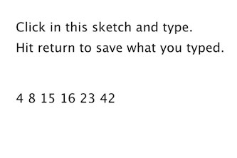

.. code:: python

	from p5 import *

	f = None 
	# Variable to store text currently being typed
	typing = ""
	# Variable to store saved text when return is hit
	saved = ""

	def setup():
		global f
		size(300,200)
		f = create_font("Arial.ttf", 16)

	def draw():
		global f
		background(255)

		indent = 25

		# Set the font and fill for text
		text_font(f)
		fill(0)

		# Display everything  
		text("Click in this sketch and type. \nHit return to save what you typed.", (indent, 40))
		text(typing, (indent, 90))
		text(saved, (indent, 130))

	def key_pressed():
		global typing, saved
		# If the return key is pressed, save the String and clear it 
		if key == "ENTER":
			saved = typing
			typing = ""
		else: # Otherwise, concatenate the String 
			typing = typing + str(key)

	if __name__ == '__main__':
		run()

Processing has two additional functions that make joining strings (or the reverse, splitting them up) easy. In sketches that involve parsing data from a file or the web, you might get hold of that data in the form of an array of strings or as one long string. Depending on what you want to accomplish, it’s useful to know how to switch between these two modes of storage. This is where these two new functions, split() and join(), will come in handy.

**"one long string or array of strings" ←→ {"one", "long", "string", "or" ,"array", "of", "strings"}**

Let’s take a look at the split() function. split() separates a longer string into an array of strings, based on a split character known as the delimiter. It takes the delimiter as the argument. (The delimiter can be a single character or a string.) In the code below, the period is not set as a delimiter and therefore will be included in the last string in the array: “dog.” Note how printArray() can be used to print the contents of an array and their corresponding indices to the message console.	

.. code:: python

	# Splitting a string based on spaces
	spaceswords = "The quick brown fox jumps over the lazy dog."
	list = spaceswords.split(" ")
	print(list)

Here is an example using a comma as the delimiter (this time passing in a single character: ','.)	

.. code:: python

	# Splitting a string based on commas
	commaswords = "The,quick,brown,fox,jumps,over,the,lazy,dog."
	list = commaswords.split(",")

If you are splitting numbers in a string, the resulting elements of the array can be converted into an integer array with Python's int() function. Numbers in a string are not numbers and cannot be used in mathematical operations unless you convert them first.

.. code:: python

	# Calculate sum of a list of numbers in a String
	numbers = "8,67,5,309"
	# Converting the String array to an int array
	list = numbers.split(",")
	sum = 0
	for i in list:
		sum += int(i)

	print(sum)

The reverse of split() is join(). join() takes an array of strings and joins them together into one long String object. The join() function also takes two arguments, the array to be joined and a separator. The separator can either be a single character or a string of characters.

.. code:: python

	 lines = ["It", "was", "a", "dark", "and", "stormy", "night."]

Using the “+” operator along with a for loop, you can join a string together as follows:

.. code:: python

	# Manual Concatenation
	onelongstring = ""

	for i in lines:
		onelongstring += i + " "

The join() function, however, allows you to bypass this process, achieving the same result in only one line of code.

.. code:: python

	onelongstring = " ".join(lines)

Dealing with Data
=================

Data can come from many different places: websites, news feeds, spreadsheets, databases, and so on. Let's say you've decided to make a map of the world's flowers. After searching online you might find a PDF version of a flower encyclopedia, or a spreadsheet of flower genera, or a JSON feed of flower data, or a REST API that provides geolocated lat/lon coordinates, or some web page someone put together with beautiful flower photos, and so on and so forth. The question inevitably arises: “I found all this data; which should I use, and how do I get it into Processing?”

If you are really lucky, you might find a Processing library that hands data to you directly with code. Maybe the answer is to just download this library and write some code like:

.. code:: python

	import flowers

	void setup():
		fdb = FlowerDatabase()
		sunflower = fdb.findFlower("sunflower")
		h = sunflower.getAverageHeight()

In this case, someone else has done all the work for you. They've gathered data about flowers and built a Processing library with a set of functions that hands you the data in an easy-to-understand format. This library, sadly, does not exist (not yet), but there are some that do. For example, YahooWeather is a library by Marcel Schwittlick that grabs weather data from Yahoo for you, allowing you to write code like weather.getWindSpeed() or weather.getSunrise() and more. There is still plenty of work to do in the case of using a library.

Let's take another scenario. Say you’re looking to build a visualization of Major League Baseball statistics. You can't find a Processing library to give you the data but you do see everything you’re looking for at mlb.com. If the data is online and your web browser can show it, shouldn't you be able to get the data in Processing? Passing data from one application (like a web application) to another (say, your Processing sketch) is something that comes up again and again in software engineering. A means for doing this is an API or “application programming interface”: a means by which two computer programs can talk to each other. Now that you know this, you might decide to search online for “MLB API”. Unfortunately, mlb.com does not provide its data via an API. In this case you would have to load the raw source of the website itself and manually search for the data you’re looking for. While possible, this solution is much less desirable given the considerable time required to read through the HTML source as well as program algorithms for parsing it.

Each means of getting data comes with its own set of challenges. The ease of using a Processing library is dependent on the existence of clear documentation and examples. But in just about all cases, if you can find your data in a format designed for a computer (spreadsheets, XML, JSON, etc.), you'll be able to save some time in the day for a nice walk outside.

One other note worth a mention about working with data. When developing an application that involves a data source, such as a data visualization, it’s sometimes useful to develop with “dummy” or “fake” data. You don't want to be debugging your data retrieval process at the same time as solving problems related to algorithms for drawing. In keeping with my one-step-at-a-time mantra, once the meat of the program is completed with dummy data, you can then focus solely on how to retrieve the actual data from the real source. You can always use random or hard-coded numbers into your code when you’re experimenting with a visual idea and connect the real data later.

Working with Text Files
=======================

Let's begin by working with the simplest means of data retrieval: reading from a text file. Text files can be used as a very simple database (you could store settings for a program, a list of high scores, numbers for a graph, etc.) or to simulate a more complex data source.

In order to create a text file, you can use any simple text editor. Windows Notepad or Mac OS X TextEdit will do; just make sure you format the file as “plain text.” It is also advisable to name the text files with the “.txt” extension, to avoid any confusion. And just as with image files, these text files should be placed in the sketch’s “data” directory in order for them to be recognized by the Processing sketch.

Once the text file is in place, Python's open() function is used to read the content of the file into a String array.

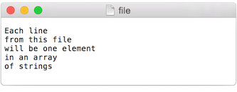

.. code:: python
	
	# This code will print all the lines from the source text file.
	file = open('words.txt', 'r').read()
	lines = file.split('\n') # split the string at \n
	print("There are " + str(len(lines)) + " lines")
	print(lines)

To run the code, create a text file called “file.txt,” type a bunch of lines in that file, and place it in your sketch’s data directory.

Text from a file can be used to generate a simple visualization. Take the following data file. 

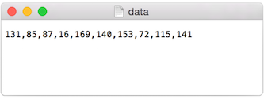

The results of visualizing this data are shown below.
**Graphing Comma-Separated Numbers from a Text File**

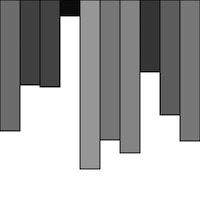

.. code:: python

	from p5 import *
	data = []

	def setup():
		global data
		size(200, 200)
		# Load the text file as a string
		file = open('data.csv', 'r').read()
		stuff = file.split(',') # split the string at ,
		# Convert the string into an array of integers
		for number in stuff:
			data.append(int(number))

	def draw():
		global data
		background(255)
		stroke(0)
		for i in range(len(data)):
			# Use array of ints to set the color and height of each rectangle.
			rect((i*29, 0), 20, data[i])

	if __name__ == '__main__':
		run()

Looking at how to parse a csv file with ``split()`` was a nice learning exercise. In truth, dealing with csv files (which can easily be generated from spreadsheet software such as Google docs) is such a common activity. Python's inbuilt csv library can be used to parse csv files.

Tabular Data
============

A table consists of data arranged as a set of rows and columns, also called “tabular data.” If you've ever used a spreadsheet, this is tabular data. Python's csv takes the file and parses the values and automatically places the contents into a Table object storing the data in columns and rows. This is a great deal more convenient than struggling to manually parse large data files with split(). It works as follows. Let's say you have a data file that looks like:

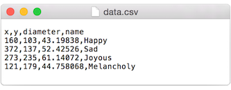

We can now use:

.. code:: python

	with open("data.csv") as f:
		table = csv.DictReader(f) 
		table = list(table) # Convert DictReader object to list

Now I've missed an important detail. Take a look again at the data.csv text file above. Notice how the first line of text is not the data itself, but rather a header row. This row includes labels that describe the data included in each subsequent row. The good news is that Processing can automatically interpret and store the headers for you, if you pass in the option "header" when loading the table. (In addition to "header", there are other options you can specify. For example, if your file is called data.txt but is comma separated data you can pass in the option "csv". If it also has a header row, then you can specifiy both options like so: "header,csv").

.. code:: python

	 table = loadTable("data.csv", "header");

Now that the table is loaded, I can show how you grab individual pieces of data or iterate over the entire table. Let's look at the data visualized as a grid. 

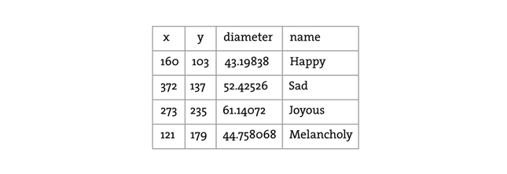

In the above grid you can see that the data is organized in terms of rows and columns. Python's `csv.DictReader` converts the csv file into a list of dictionaries. To assess a particular element from the csv file, we need to specify the number of row in the list and the name of the attribute.

.. code:: python

	val1 = table[2]["y"] # val now has the value 235
	
	val2 = table[3]["diameter"] # val2 now has the value 44.758068

	s = table[0]["name"] # s now has the value “Happy”

To access the entire row, the index of the row can be used as follows:

.. code:: python
	
	row = table[2]

One I have the row object, I can ask for data from some or all the columns
	
.. code:: python

	x = row["x"] # x has the value 273
	y = row["y"] # y has the value 235
	d = row["diameter"] # d has the value 61.14072
	s = row["name"] # s has the value “Joyous”

If you want to grab all the rows and iterate over them you can do so in a loop with a counter accessing each row one at a time. 

.. code:: python

	for i in range(len(table)):
		# Access each row of the table one at a time, in a loop.
		row = table[i]
		x = row["x"]
		y = row["y"]
		d = row["diameter"]
		s = row["name"]

		# do something with the data

To add a new row to a Table, simply add new row to the array with dictionary of column

.. code:: python

	table.append({
		"x": mouse_x,
		"y": mouse_y,
		"diameter": random_uniform(40, 80),
		"name": "new label"
	})

To delete a row, simply call the method `del` and pass in the numeric index of the row you would like removed. For example, the following code removes the first row whenever the size of the table is greater than ten rows.

.. code:: python

	if len(table) > 10:
		del table[0]

The following example puts all of the above code together. Notice how each row of the table contains the data for a Bubble object.

**Loading and Saving Data**

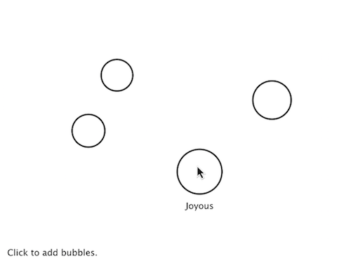

.. code:: python

	from p5 import *
	import csv

	table = []
	bubbles = []

	def setup():
		size(480, 360)
		loadData()

	def draw():
		global bubbles
		background(255)
		# Display all bubbles
		for i in range(len(bubbles)):
			bubbles[i].display()

	def loadData():
		global table, bubbles
		table = []
		bubbles = []
		with open("data.csv") as f:
			table = csv.DictReader(f) 
			table = list(table) # Convert DictReader object to list

		for i in range(len(table)):
			#  Iterate over all the rows in a table.
			row = table[i]

			# Access the fields via their column name (or index).
			bubbles.append(Bubble(float(row["x"]), float(row["y"]), float(row["diameter"]), row["name"]))

	def mouse_pressed():
		global table
		# When the mouse is pressed, create a new row and set the values for each column of that row.
		table.append({
			"x": mouse_x,
			"y": mouse_y,
			"diameter": random_uniform(40, 80),
			"name": "Blah!"
		})

		# If the table has more than 10 rows, delete the oldest row.
		if len(table) > 10:
			del table[0]

		# This writes the table back to the original CSV file
		# and reloads the file so that what's drawn matches.
		with open("data.csv", "w") as f:
			dict_writer = csv.DictWriter(f, table[0].keys())
			dict_writer.writeheader()
			dict_writer.writerows(table)

		loadData()

	class Bubble:
		def __init__(self, tempX, tempY, tempD, s):
			self.x = tempX
			self.y = tempY
			self.diameter = tempD
			self.name = s

		def rollover(self, px, py):
			d = dist((px, py), (self.x, self.y))
			if d < self.diameter / 2:
				return True
			else:
				return False

		def display(self):
			stroke(0)
			stroke_weight(2)
			no_fill()
			ellipse((self.x, self.y), self.diameter, self.diameter)
			if self.rollover(self.x, self.y):
				fill(0)
				text_align("CENTER")
				text(self.name, self.x, self.y + self.diameter/2 + 20)

	if __name__ == '__main__':
		run()

Here, the distance between a given point and a circle's center is compared to that circle's radius as depicted:

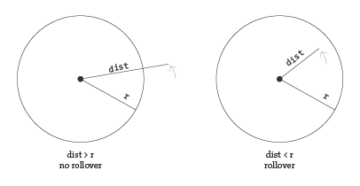

In the code below, the function returns a boolean value (true or false) depending on whether the point (mx,my) is inside the circle. Notice how radius is equal to half the diameter.

.. code:: python

	def rollover(px, py):
		d = dist((px, py), (x, y))
		if d < self.diameter / 2:
			return True
		else:
			return False

Data that is not in a Standardized Format
=========================================

What if your data is not in a standard format like a table, how do you deal with it then? Python's requests library can be used to pull text from an URL.

.. code:: python

	lines = requests.get("http://www.yahoo.com")

When you send a URL path into `urllib.request.urlopen()`, you get back the raw HTML (Hypertext Markup Language) source of the requested web page. It’s the same stuff that appears upon selecting “View Source” from a browser’s menu options. You don’t need to be an HTML expert to follow this section, but if you are not familiar at all with HTML, you might want to read http://en.wikipedia.org/wiki/HTML.

Unlike with the comma-delimited data from a text file that was specially formatted for use in a Processing sketch, it’s not practical to have the resulting raw HTML stored in an array of strings (each element representing one line from the source). Converting the array into one long string can make things a bit simpler. As you saw earlier in the chapter, this can be achieved using join().

.. code:: python

	onelongstring = " ".join(lines)

When pulling raw HTML from a web page, it’s likely you do not want all of the source, but just a small piece of it. Perhaps you’re looking for weather information, a stock quote, or a news headline. You can take advantage of the text manipulation functions you learned — index(), substring(), and len() — to find pieces of data within a large block of text. Take, for example, the following String object:

.. code:: python

	stuff = "Number of apples:62. Boy, do I like apples or what!"

Let’s say I want to pull out the number of apples from the above text. My algorithm would be as follows:

1. Find the end of the substring “apples:” Call it start.

2. Find the first period after “apples:” Call it end.

3. Make a substring of the characters between start and end.

4. Convert the string to a number (if I want to use it as such).

In code, this looks like:

.. code:: python

	stuff = "Number of apples:62. Boy, do I like apples or what!"
	start = stuff.index("apples:" ) + 7 # STEP 1 
	# The index where a string ends can be found by 
	# searching for that string and adding its length (here, 8).
	end = stuff.index(".", start) # STEP 2
	apples = stuff[start: end] # STEP 3
	apple_no = int(apples) # STEP 4

The above code will do the trick, but I should be a bit more careful to make sure I don’t run into any errors if I do not find the string I am searching for. I can add some error checking and generalize the code into a function:

.. code:: python

	# A function that returns a substring between two substrings. 
	# If the beginning of end "tag" is not found, the function returns an empty string.
	def giveMeTextBetween(s, startTag, endTag):
		# Find the index of the beginning tag
		try:
			startIndex = s.index(startTag) # STEP 1 
		except ValueError:
			return ""
		# Move to the end of the beginning tag
		startIndex += len(startTag)
		try:
			# Find the index of the end tag
			endIndex = s.index(endTag, startIndex)
		except ValueError:
			return""
			
		return s[startIndex: endIndex]

	stuff = "Number of apples:62. Boy, do I like apples or what!"
	print(giveMeTextBetween(stuff, "apples:", '.'))

With this technique, you are ready to connect to a website from within Processing and grab data to use in your sketches. For example, you could read the HTML source from nytimes.com and look for today’s headlines, search finance.yahoo.com for stock quotes, count how many times the word “flower” appears on your favorite blog, and so on. However, HTML is an ugly, scary place with inconsistently formatted pages that are difficult to reverse engineer and parse effectively. Not to mention the fact that companies change the source code of web pages rather often, so any example that I might make while I am writing this paragraph might break by the time you read this paragraph.

For grabbing data from the web, an XML (Extensible Markup Language) or JSON (JavaScript Object Notation) feed will prove to be more reliable and easier to parse. Unlike HTML (which is designed to make content viewable by a human’s eyes) XML and JSON are designed to make content viewable by a computer and facilitate the sharing of data across different systems. Most data (news, weather, and more) is available this way, and I will look at examples in #beginner_xml and #JSON. Though much less desirable, manual HTML parsing is still useful for a couple reasons. First, it never hurts to practice text manipulation techniques that reinforce key programming concepts. But more importantly, sometimes there is data you really want that is not available in an API format, and the only way to get it is with such a technique. (I should also mention that regular expressions, an incredibly powerful techinque in text pattern matching, could also be employed here. As much as I love regex, it’s unfortunately beyond the scope of this tutorial.)

An example of data only available as HTML is the Internet Movie Database. IMDb contains information about movies sorted by year, genre, ratings, etc. For each movie, you can find the cast and crew list, a plot summary, running time, a movie poster image, the list goes on. However, IMDb has no API and does not provide its data as XML or JSON. Pulling the data into Processing therefore requires a bit of detective work. Let's look at the page for the Shaun the Sheep Movie

Looking in the HTML source from the above URL, I find a giant mess of markup.

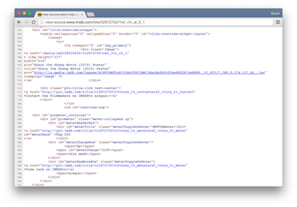

It’s up to me to pore through the raw source and find the data I am looking for. Let's say I want to know the running time of the movie and grab the movie poster image. After some digging, I find that the movie is 139 minutes long as listed in the following HTML.

.. code:: html

	

	  <h4 class="inline">Runtime:</h4> 
	    <time itemprop="duration" datetime="PT139M">139 min</time>
	

For any given movie, the running time itself will be variable, but the HTML structure of the page will stay the same. I can therefore deduce that running time will always appear in between:

.. code:: html

	<time itemprop="duration" datetime="PT139M">

and 

.. code:: html

	</time>

Knowing where the data starts and ends, I can use giveMeTextBetween() to pull out the running time. A quote in Java marks the beginning or end of a string. So how do you include an actual quote in a String object? The answer is via an “escape” sequence. A quote can be included using a backward slash, followed by a quote. For example: String q = "This String has a quote \"in it";

.. code:: python

	import urllib.request

	q = "This String has a quote \"in it"
	url = "http://www.imdb.com/title/tt0058331"
	response = urllib.request.urlopen(url)
	lines = []
	for line in response.readlines():
		lines.append(line.decode("utf-8"))

	html = " ".join(lines)

	start = ""
	end = ""
	runningtime = giveMeTextBetween(html, start, end)
	print(runningtime)

The following code retrieves both the running time and movie poster iamge from IMDb and displays it onscreen.

**Parsing IMDb Manually **

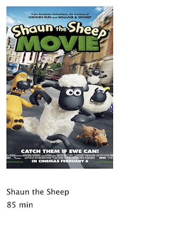

.. code:: python

	import requests
	from p5 import *

	poster = None
	runningtime = None

	def setup():
		size(300, 350)
		loadData()

	def draw():
		global poster, runningtime
		# Display all the stuff I want to display
		background(255)
		image(poster, (10, 10), 164, 250)
		fill(0)
		text("Shaun the Sheep", (10, 300))
		text(runningtime, (10, 320))

	def loadData():
		global poster, runningtime
		url = "http://www.imdb.com/title/tt2872750/"
		# Get the raw HTML source into an array of strings (each line is one element in the array).
		# The next step is to turn array into one long string with join().
		
		html = requests.get(url).text
		start = ""
		end = ""
		runningtime = giveMeTextBetween(html, start, end) # Searching for running time.

		start = ""
		# Search for the URL of the poster image.
		imgUrl = giveMeTextBetween(html, start, end)
		# Now, load that image!
		poster = load_image(imgUrl)

	# A function that returns a substring between two substrings. 
	# If the beginning of end "tag" is not found, the function returns an empty string.
	def giveMeTextBetween(s, startTag, endTag):
		# Find the index of the beginning tag
		try:
			startIndex = s.index(startTag) # STEP 1 
		except ValueError:
			return ""
		# Move to the end of the beginning tag
		startIndex += len(startTag)
		try:
			# Find the index of the end tag
			endIndex = s.index(endTag, startIndex)
		except ValueError:
			return""

		return s[startIndex: endIndex]

	if __name__ == '__main__':
		run()

Text Analysis
=============

Loading text from a URL need not only be an exercise in parsing out small bits of information. It’s possible with Processing to analyze large amounts of text found on the web from news feeds, articles, and speeches, to entire books. A nice source is Project Gutenberg which makes available thousands of public domain texts. Algorithms for analyzing text merits an entire book itself, but let’s look at some basic techniques.

A text concordance is an alphabetical list of words that appear in a book or body of text along with contextual information. A sophisticated concordance might keep a list of where each word appears (like an index) as well as which words appear next to which other words. In this case, I'm going to create a simple concordance, one that simply stores a list of words and their corresponding counts, i.e., how many times they appeared in the text. Concordances can be used for text analysis applications such as spam filtering or sentiment analysis. To accomplish this task, I am going to use the Processing built-in class IntDict.

As you learned earlier, an array is an ordered list of variables. Each element of the array is numbered and be accessed by its numeric index.

.. image:: ./data-res/fig_18_12_traditional_arra.png
   :align: center

However, what if instead of numbering the elements of an array you could name them? This element is named “Sue,” this one “Bob,” this one “Jane,” and so on and so forth. In programming, this kind of data structure is often referred to as an associative array, map, or dictionary. It’s a collection of (key, value) pairs. Imagine you had a dictionary of people's ages. When you look up “Sue” (the key), the definition, or value, is her age, 24.

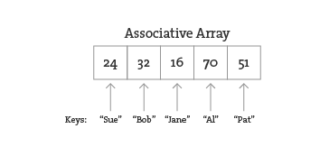

Associative arrays can be incredibly convenient for various applications. For example, you could keep a list of student IDs (student name, id) or a list of prices (product name, price) in a dictionary. Here a dictionary is the perfect data structure to hold the concordance. Each element of the dictionary is a word paired with its count.

Creating an IntDict is as easy as calling an empty constructor. Let's say you want a dictionary to keep track of an inventory of supplies.

.. code:: python

	inventory = {}

Values can be paired with their keys using the following syntax:

.. code:: python
	
	inventory["pencils"] = 10
	inventory["paper clips"] = 128
	inventory["pens"] = 16

**Text Concordance Using IntDict **

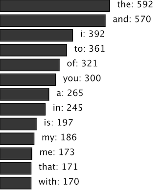

If your data is available via a standardized format such as XML or JSON, the process of manually searching through text for individual pieces of data is no longer required. XML is designed to facilitate the sharing of data across different systems, and you can retrieve that data using the built-in Processing XML class.

XML organizes information in a tree structure. Let’s imagine a list of students. Each student has an ID number, name, address, email, and telephone number. Each student’s address has a city, state, and zip code. An XML tree for this dataset might look like the following:

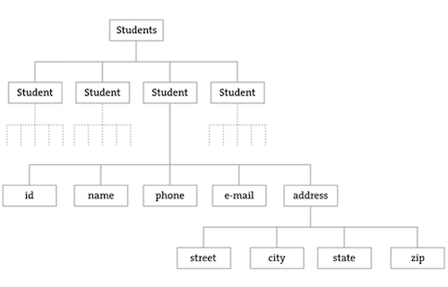

.. code:: XML

	<?xml version = "1.0" encoding = "UTF-8 "?>
	<students>
	  <student>
	    <id>001</id>
	    <name>Daniel Shiffman</name>
	    <phone>555-555-5555</phone>
	    <email>daniel@shiffman.net</email>
	    <address>
	      <street>123 Processing Way</street>
	      <city>Loops</city>
	      <state>New York</state>
	      <zip>01234</zip>
	    </address>
	  </student>
	  <student>
	    <id>002</id>
	    <name>Zoog</name>
	    <phone>555-555-5555</phone>
	    <email>zoog@planetzoron.uni</email>
	    <address>
	      <street>45.3 Nebula 5</street>
	      <city>Boolean City</city>
	      <state>Booles</state>
	      <zip>12358</zip>
	    </address>
	  </student>
	</students>

Note the similarities to object-oriented programming. You can think of the XML tree in the following terms. The XML document represents an array of student objects. Each student object has multiple pieces of information, an ID, a name, a phone number, an email address, and a mailing address. The mailing address is also an object that has multiple pieces of data, such as street, city, state, and zip.

Let's look at some data made available from a web service such as Yahoo Weather. Here is the raw XML source. (Note I have edited it slightly for simplification purposes.)

.. code:: XML

	<?xml version="1.0" encoding="UTF-8" standalone="yes" ?>
	<rss version="2.0" xmlns:yweather="http://xml.weather.yahoo.com/ns/rss/1.0">
	  <channel>
	    <item>
	      <title>Conditions for New York, NY at 12:49 pm EDT</title>
	      <geo:lat>40.67</geo:lat>
	      <geo:long>-73.94</geo:long>
	      <link>http://us.rd.yahoo.com/dailynews/rss/weather/New_York__NY//link>
	      <pubDate>Thu, 24 Jul 2014 12:49 pm EDT</pubDate>
	      <yweather:condition text="Partly Cloudy" code="30" temp="76"/>
	      <yweather:forecast day="Thu" low="65" high="82" text="Partly Cloudy"/>
	    </item>
	  </channel>
	</rss>

The data is mapped in the tree stucture shown below:

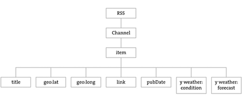

You may be wondering what the top level “RSS” is all about. Yahoo’s XML weather data is provided in RSS format. RSS stands for “Really Simple Syndication” and is a standardized XML format for syndicating web content (such as news articles, etc.). You can read more about `RSS on Wikipedia <https://en.wikipedia.org/wiki/RSS>`_

Now that you have a handle on the tree structure, let's look at the specifics inside that structure. With the exception of the first line (which simply indicates that this page is XML formatted), this XML document contains a nested list of elements, each with a start tag, that is, <channel>, and an end tag, that is, </channel>. Some of these elements have content between the tags:

.. code:: XML

	<title>Conditions for New York, NY at 12:49 pm EDT</title>

and some have attributes (formatted by Attribute Name equals Attribute Value in quotes):

.. code:: XML

	<yweather:forecast day="Thu" low="65" high="82" text="Partly Cloudy"/>

Using the Processing XML Class
==============================

Since the syntax of XML is standardized, I could certainly use split(), indexof(), and substring() to find the pieces I want in the XML source. The point here, however, is that because XML is a standard format, I don't have to do this. Rather, I can use an XML parser. In Processing, XML can be parsed using the built-in Processing class XML.

.. code:: XML

	xml = loadXML("http://xml.weather.yahoo.com/forecastrss?p=10003")

