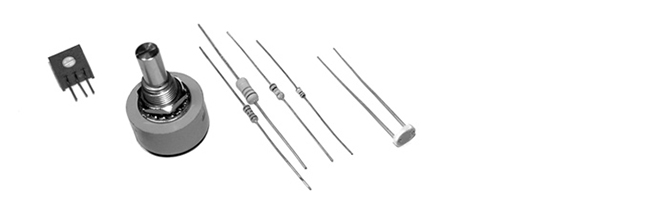
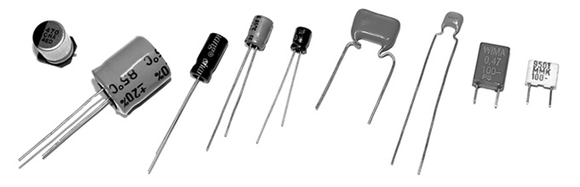
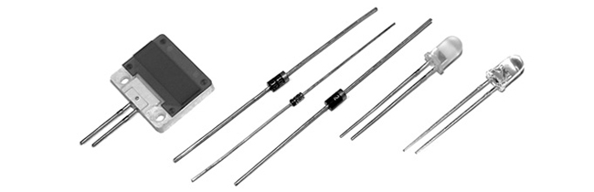
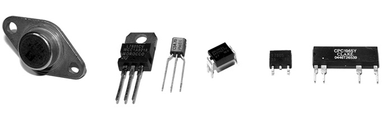
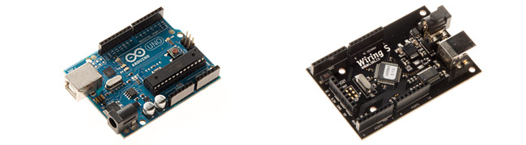
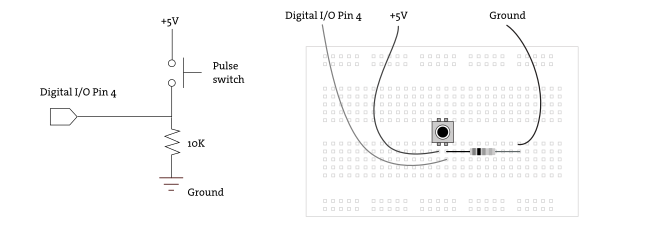
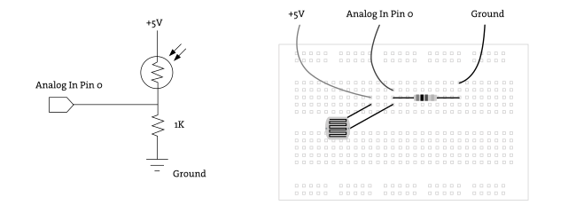
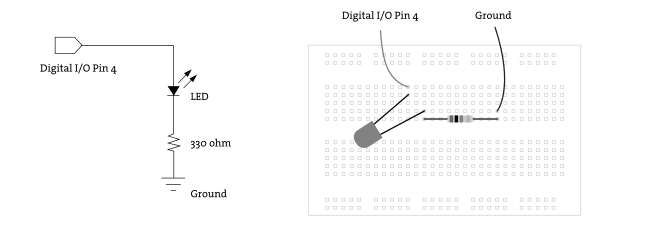
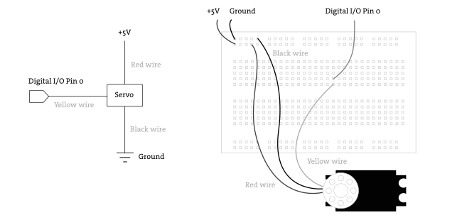
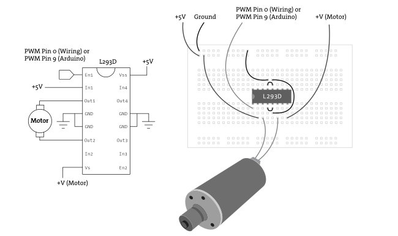

***********
Electronics
***********

:Authors: Hernando Barragán; Casey Reas; Abhik Pal (p5 port)
:Copyright: This tutorial is "Extension 5" from `Processing: A
   Programming Handbook for Visual Designers and Artists, Second
   Edition <https://processing.org/handbook>`_, published by MIT
   Press. © 2014 MIT Press. If you see any errors or have comments,
   please let us know. The tutorial was ported to p5 by Abhik Pal. If
   you see any errors or have comments, open an issue on either the
   `p5 <https://github.com/p5py/p5/issues>`_ or `Processing
   <https://github.com/processing/processing-docs/issues?q=is%3Aopen>`_
   repositories.

Software is not limited to running on desktop computers, laptops,
tablets, and phones. Contemporary cameras, copiers, elevators, toys,
washing machines, and artworks found in galleries and museums are
controlled with software. Programs written to control these objects
use the same concepts discussed earlier in this book (variables,
control structures, arrays, etc.), but building the physical parts
requires learning about electronics. This text introduces the
potential of electronics with examples from art and design and
discusses basic terminology and components. Examples written with
Wiring and Arduino (two electronics toolkits related to Processing)
are presented and explained.

Electronics in the arts
=======================

Electronics emerged as a popular material for artists during the
1960s. Artists such as Naum Gabo and Marcel Duchamp used electrical
motors in prior decades, but the wide interest in kinetic sculpture
and the foundation of organizations such as Experiments in Art and
Technology (E.A.T.) are evidence of a significant new emphasis. For
instance, in *The Machine* exhibition at The Museum of Modern
Art in 1968, Wen-Ying Tsai exhibited *Cybernetic Sculpture*, a
structure made of vibrating steel rods illuminated by strobe lights
flashing at high frequencies. Variations in the vibration frequency
and the light flashes produced changes in the perception of the
sculpture. The sculpture responded to sound in the surrounding
environment by changing the frequency of the strobe lights. Peter
Vogel, another kinetic sculpture pioneer, created sculptures that
generate sound. The sculptures have light sensors (photocells) that
detect and respond to a person’s shadow when she approaches the
sculpture. The sculptures are built almost entirely with electrical
components. The organization of these components forms both the shape
of the sculpture and its behavior. Other pioneers during the 1960s
include Nam June Paik, Nicolas Schöffer, James Seawright, and Takis.

The range of electronic sculpture created by contemporary artists is
impressive. Tim Hawkinson produces sprawling kinetic installations
made of cardboard, plastic, tape, and electrical components. His
*Überorgan* (2000) uses mechanical principles inspired by a
player piano to control the flow of air through balloons the size of
whales. The air is pushed through vibrating reeds to create tonal
rumbles and squawks. This physical energy contrasts with the
psychological tension conveyed through Ken Feingold’s sculptures. His
*If/Then* (2001) is two identical, bald heads protruding from a
cardboard box filled with packing material. These electromechanical
talking heads debate their existence and whether they are the same
person. Each head listens to the other and forms a response from what
it understands. Speech synthesis and recognition software are used in
tandem with mechanisms to animate the faces -- the result is uncanny.
       
The works of Maywa Denki and Crispin Jones are prototypical of a
fascinating area of work between art and product design. Maywa Denki
is a Japanese art unit that develops series of products (artworks)
that are shown in product demonstrations (live performances). Over the
years, they have developed a progeny of creatures, instruments,
fashion devices, robots, toys, and tools -- all animated by motors and
electricity. Devices from the *Edelweiss Series* include *Marmica*, a
self-playing marimba that opens like a flower, and *Mustang*, a
gasoline-burning aroma machine for people who love exhaust fumes.
Crispin Jones creates fully functioning prototypes for objects that
are critical reflections of consumer technologies. *Social Mobiles
(SoMo)*, developed in collaboration with IDEO, is a set of mobile
phones that address the frustration and anger caused by mobile phones
in public places. The project humorously explores ways mobile phone
calls in public places could be made less disruptive. The *SoMo 1*
phone delivers a variable electrical shock to the caller depending on
how loud the person at the other end of the conversation is speaking.
The ringtone for *SoMo 4* is created by the caller knocking on their
phone. As with a knock on a door, the attitude or identity of the
caller is revealed through the sound. Related artists include the
Bureau of Inverse Technology, Ryota Kuwakubo, and the team of Tony
Dunne and Fiona Raby.
       
As electronic devices proliferate, it becomes increasingly important
for designers to consider new ways to interact with these machines.
Working with electronics is an essential component of the emerging
interaction design community. The Tangible Media Group (TMG) at the
MIT Media Laboratory, led by Hiroshi Ishii, pioneered research into
tangible user interfaces to take advantage of human senses and
dexterity beyond screen GUIs and clicking a mouse. *Curlybot* is a toy
that can record and play back physical movement. It remembers how it
was moved and can replay the motion including pauses, changes in
speed, and direction. *MusicBottles* are physical glass bottles that
trigger sounds when they are opened. To the person who opens the
bottles, the sounds appear to be stored within the bottles, but
technically, custom-designed electromagnetic tags allow a special
table to know when a bottle has been opened, and the sound is played
through nearby speakers. These and other projects from the TMG were
instrumental in moving research in interface design away from the
screen and into physical space. Research labs at companies like Sony
and Philips are other centers for research and innovation into
physical interaction design. Academic programs such as New York
University’s Interactive Telecommunication Program, the Design
Interactions course at the Royal College of Art, and the former
Interaction Design Institute Ivrea have pioneered educational
strategies within in this area.

Electricity
===========

Electricity is something we use daily, but it is difficult to
understand. Its effect is experienced in many ways, from observing a
light turn on to noticing the battery charge deplete on a laptop
computer.

Electrical current is a stream of moving electrons. They flow from one
point to another through a *conductor*. Some materials are better
conductors than others. Sticking a fork in a light socket is dangerous
because metal is a good conductor and so is your body. The best
conductors are copper, silver, and gold. A resistor is the opposite of
a conductor. Resistance is the capability of a material to resist the
flow of electrons. A substance with a very high resistance is an
*insulator*. Plastic and rubber are excellent insulators, and for this
reason they are used as the protective covering around wires.
Electrical energy, the difference of electrical potential between two
points, is called *voltage*. The amount of electrical charge per
second that flows through a point is the *current*. Resistance is
measured in units called ohms, voltage is measured in volts, and
current is measured in amperes (amps). The relation between the three
is easiest to understand through an analogy of water flowing through a
hose. As explained by the educators Dan O’Sullivan and Tom Igoe:
       
    The flow of water through a hose is like the flow of electricity
    through a circuit. Turning the faucet increases the amount of
    water coming through the hose, or increases the current (amps).
    The diameter of the hose offers resistance to the current,
    determining how much water can flow. The speed of the water is
    equivalent to voltage. When you put your thumb over the end of the
    hose, you reduce the diameter of the pathway of the water. In
    other words, the resistance goes up. The current (that is, how
    much water is flowing) doesn’t change, however, so the speed of
    the water, or voltage, has to go up so that all the water can
    escape... [#ref1]_

Electrical current flows in two ways: direct current (DC) and
alternating current (AC). A DC signal always flows in the same
direction and an AC signal reverses the direction of flow at regular
intervals. Batteries and solar cells produce DC signals, and the power
that comes from wall sockets is an AC signal:

Depending on your country, the AC power source coming into your home
is between 100 and 240 volts. Most home appliances can directly use AC
current to operate, but some use a power supply to convert the
higher-potential AC current into DC current at smaller voltages. A
common example of this type of power supply are the black plastic
boxes (a k a power bricks, power adapters, wall warts) that are used
to power laptops or mobile phones from the home AC power source. Most
desktop computers have an internal power supply to convert the AC
source to the 12-volt and 5-volt DC supply necessary to run the
internal electronics. Low voltages are generally safer than high
voltages, but it’s the amount of current (amps) that makes electricity
dangerous.

Components
==========

Electronic components are used to affect the flow of electricity and
to convert electrical energy into other forms such as light, heat, and
mechanical energy. There are many different components, each with a
specific use, but here we introduce four of the most basic types:
resistor, capacitor, diode, and transistor.

Resistor
--------

A resistor limits (provides resistance to) the flow of electricity.
Resistors are measured in units called ohms. The value 10 ohms is less
resistance than 10,000 (10K) ohms. The value of each resistor is
marked on the component with a series of colored bands. A variable
resistor that changes its resistance when a slider, knob, or dial
attached to it is turned is called a potentiometer or trimmer.
Variable resistors are designed to change in response to different
environmental phenomena. For example, one that changes in response to
light is called a photoresistor or photocell, and one that changes in
response to heat is called a thermistor. Resistors can be used to
limit current, reduce voltage, and perform many other essential tasks.

Capacitor
---------

A capacitor stores electrons i.e. electrical charge; it gains charge
when current flows in, and it releases charge (discharges) when the
current flows out. This can smooth out the dips and spikes in a
current signal. Capacitors are combined with resistors to create
filters, integrators, differentiators, and oscillators. A simple
capacitor is two parallel sheets of conductive materials, separated by
an insulator. Capacitors are measured in units called farads. A farad
is a large measurement, so most capacitors you will use will be
measured in microfarads (µF), picofarads (pF), or nanofarads (nF).

Diode
-----

Current flows only in one direction through a diode. One side is
called the cathode (marked on the device with a line) and the other is
the anode. Current flows when the anode is more positive than the
cathode. Diodes are commonly used to block or invert the negative part
of an AC signal. A light-emitting diode (LED) is used to produce
light. The longer wire coming out of the LED is the anode and the
other is the cathode. LEDs come in many sizes, forms, colors, and
brightness levels.

Transistor
----------

A transistor can be used as an electrical switch or an amplifier. A
bipolar transistor has three leads (wires) called the base, collector,
and emitter. Depending on the type of transistor, applying current to
the base either allows current to flow or stops it from flowing
through the device from the collector to the emitter. Transistors make
it possible for the low current from a microcontroller to control the
much higher currents necessary for motors and other power-hungry
devices, and thus to turn them on and off.

Circuits
========
       
An electrical circuit is a configuration of components, typically
designed to produce a desired behavior such as decreasing the current,
filtering a signal, or turning on an LED. The following simple circuit
can be used to turn a light on and off:
       

This simple electric circuit is a closed loop with an energy source
(battery), a load (lightbulb) that offers a resistance to the flow of
electrons and transforms the electric energy into another form of
energy (light), wires that carry the electricity, and a switch to
connect and disconnect the wires. The electrons move from one end of
the battery, through the load, and to the other end.

Circuits are usually represented with diagrams. A circuit diagram uses
standardized symbols to represent specific electrical components. It
is easier to read the connections on a diagram than on photographs of
the components. A diagram of the simple circuit above could look like
this:

Circuits are often prototyped on a "breadboard," a rectangular piece
of plastic with holes for inserting wires. A breadboard makes it easy
to quickly make variations on a circuit without soldering (fusing
components together with a soft metal). Conductive strips underneath
the surface connect the long horizontal rows at the top and bottom of
the board and the short vertical rows within the middle:

Circuits are tested with a multimeter, an instrument to measure volts,
current, resistance, and other electrical properties. A multimeter
allows the electrical properties of the circuit to be read as numbers
and is necessary for debugging. Analog multimeters have a small needle
that moves from left to right, and digital multimeters have a screen
that displays numbers. Most multimeters have two metal prongs to probe
the circuit and a central dial to select between different modes.

Commonly used circuits are often condensed into small packages. These
integrated circuits (ICs, or chips) contain dense arrangements of
miniaturized components. They are typically small, black plastic
rectangles with little metal pins sticking out of the sides. Like
objects in software, these devices are used as building blocks for
creating more complicated projects. ICs are produced to generate
signals, amplify signals, control motors, and perform hundreds of
other functions. They fit neatly into a breadboard by straddling the
gap in the middle.

Microcontrollers and I/O boards
===============================

Microcontrollers are small and simple computers. They are the tiny
computer brains that automate many aspects of contemporary life,
through their activities inside devices ranging from alarm clocks to
airplanes. A microcontroller has a processor, memory, and input/output
interfaces enclosed within a single programmable unit. They range in
size from about 1 × 1 cm to 5 × 2 cm. Like desktop computers, they
come in many different configurations. Some have the same speed and
memory as a personal computer from twenty years ago, but they are much
less powerful than current machines, as this comparison tables shows:

+--------------------------------------+----------+------------+-------+
| Model                                | Speed    | Memory     | Cost  |
+======================================+==========+============+=======+
| Apple Macintosh (1984)               |  8MHz    | 128 Kb     | $2500 |
+--------------------------------------+----------+------------+-------+
| Atmel ATmega128-8AC Microcontroller  | 8MHz     | 128 Kb     | $15   |
+--------------------------------------+----------+------------+-------+
| Apple Mac Mini (2006)                | 1500 MHz | 512,000 Kb | $600  |
+--------------------------------------+----------+------------+-------+

Small metal pins poking out from a microcontroller’s edges allow
access to the circuits inside. Each pin has its own role. Some are
used to supply power, some are for communication, some are inputs, and
others can be set to either input or output. The relative voltage at
each input pin can be read through software, and the voltage can be
set at each output pin. Some pins are reserved for communication. They
allow a microcontroller to communicate with computers and other
microcontrollers through established communication protocols such as
RS-232 serial.

Microcontrollers can be used to build projects directly, but they are
often packaged with other components onto a printed circuit board
(PCB) to make them easier to use for beginners and for rapid
prototyping. We call these boards I/O boards (input/output boards)
because they are used to get data in and out of a microcontroller.
They are also called microcontroller modules. We’ve created three
informal groups -- bare microcontrollers, programmable I/O boards, and
tethered I/O boards -- to discuss different ways to utilize
microcontrollers in a project.

Bare microcontrollers
---------------------

Working directly with a bare microcontroller is the most flexible but
most difficult way to work. It also has the potential to be the least
expensive way of building with electronics, but this economy can be
offset by initial development costs and the extra time spent learning
how to use it. Microchip PIC and Atmel AVR are two popular families of
microcontrollers. Each has variations ranging from simple to elaborate
that are appropriate for different types of projects. The memory,
speed, and other features effect the cost, the number of pins, and the
size of the package. Both families feature chips with between eight
and 100 pins with prices ranging from under $1 to $20. PIC
microcontrollers have been on the market for a longer time, and more
example code, projects, and books are available for beginners. The AVR
chips have a more modern architecture and a wider range of open-source
programming tools. Microcontrollers are usually programmed in the C
language or their assembly language, but it’s also possible to program
them in other languages such as BASIC. If you are new to electronics
and programming, we don’t recommend starting by working directly with
PIC or AVR chips. In our experience, beginners have had more success
with the options introduced below.

Programmable I/O boards
-----------------------

A programmable I/O board is a microcontroller situated on a PCB with
other components to make it easier to program, attach/detach
components, and turn on and off. These boards typically have
components to regulate power to protect the microcontroller and a USB
or RS-232 serial port connector to make it easy to attach cables for
communication. The small pins on the microcontroller are wired to
larger pins called headers, which make it easy to insert and remove
sensors and motors. Small wires embedded within the PCB connect pins
to a corresponding header. Small reset switches make it easy to
restart the power without having to physically detach the power supply
or battery.

Within the context of this book, the most relevant I/O boards are
Wiring and Arduino. Both were created as tools for designers and
artists to build prototypes and to learn about electronics. Both
boards use the Wiring language to program their microcontrollers and
use a development environment built from the Processing environment.
In comparison to the Processing language, the Wiring language provides
a similar level of control and ease of use within its domain. They
share common language elements when possible, but Wiring has some
functions specific to programming microcontrollers and omits the
graphics programming functions within Processing. Like Processing
programs, Wiring programs are translated into another language before
they are run. When a program written with the Wiring language is
compiled, it’s first translated into the C/C++ language and then
compiled using a C/C++ compiler.
       

Tethered I/O boards
-------------------

A tethered I/O board is used to get sensor data into a computer and to
control physical devices (motors, lights, etc.) without the need to
program the board. A computer already has many input and output
devices such as a monitor, mouse, and keyboard; and tethered I/O
boards provide a way to communicate between more exotic input devices
such as light sensors and video cameras, and output devices such as
servomotors and lights. These boards are designed to be easy to use.
They often do not require knowledge of electronics because sensors and
motors can be plugged directly into the board and do not need to
interface with other components. Messages are sent and received from
the boards through software such as Processing, Max, Flash, and many
programming languages. This ease of use often comes at a high price.

Sensors
=======

Physical phenomena are measured by electronic devices called sensors.
Different sensors have been invented to acquire data related to touch,
force, proximity, light, orientation, sound, temperature, and much
more. Sensors can be classified into groups according to the type of
signals they produce (analog or digital) and the type of phenomena
they measure. Analog signals are continuous, but digital signals are
constrained to a range of values (e.g., 0 to 255):

Most basic analog sensors utilize resistance. Changes in a physical
phenomenon modify the resistance of the sensor, therefore varying the
voltage output through the sensor. An analog-to-digital converter can
continuously measure this changing voltage and convert it to a number
that can be used by software. Sensors that produce digital signals
send data as binary values to an attached device or computer. These
sensors use a voltage (typically between 3.5 and 5 volts) as ON
(binary digit 1 or TRUE) and no voltage as a OFF (binary digit 0 or
FALSE). More complex sensors include their own microcontrollers to
convert the data to digital signals and to use established
communication protocols for transmitting these signals to another
computer.

Touch and Force
----------------

Sensing of touch and force is achieved with switches, capacitive
sensors, bend sensors, and force-sensitive resistors. A switch is the
simplest way to detect touch. A switch is a mechanism that stops or
allows the flow of electricity depending on its state, either open
(OFF) or closed (ON). Some switches have many possible positions, but
most can only be ON or OFF. Touch can also be detected with capacitive
sensors. These sensors can be adjusted to detect the touch and
proximity (within a few millimeters) of a finger to an object. The
sensor can be positioned underneath a nonconductive surface like
glass, cardboard, or fabric. This type of sensor is often used for the
buttons in an elevator. A bend (flex) sensor is a thin strip of
plastic that changes its resistance as it is bent. A force-sensitive
resistor (FSR or force sensor) changes its resistance depending on the
magnitude of force applied to its surface. FSRs are designed for small
amounts of force like the pressure from a finger, and they are
available in different shapes including long strips and circular pads.

Presence and distance
----------------------

There are a wide variety of sensors to measure distance and determine
whether a person is present. The simplest way to determine presence is
a switch. A switch attached to a door, for example, can be used to
determine whether it is open or closed. A change in the state (open or
closed) means someone or something is there. Switches come in many
different shapes and sizes, but the category of small ones called
*microswitches* are most useful for this purpose. The infrared (IR)
motion detectors used in security systems are another simple way to
see if something is moving in the environment. They can’t measure
distance or the degree of motion, but they have a wide range, and some
types can be purchased at hardware stores. IR distance sensors are
used to calculate the distance between the sensor and an object. The
distance is converted into a voltage between 0 and 5 volts that can be
read by a microcontroller. Ultrasonic sensors are used for measuring
up to 10 meters. This type of device sends a sound pulse and
calculates how much time it takes to receive the echo.

Light
-----

Sensors for detecting light include photoresistors, phototransistors,
and photodiodes. A photoresistor (also called a photocell) is a
component that changes its resistance with varying levels of light. It
is among the easiest sensors to use. A phototransitor is more
sensitive to changes in light and is also easy to use. Photodiodes are
also very sensitive and can respond faster to changing light levels,
but they are more complex to interface with a microcontroller.
Photodiodes are used in the remote control receivers of televisions
and stereos.

Position and orientation
------------------------

A potentiometer is a variable resistor that works by twisting a rotary
knob or by moving a slider up and down. The potentiometer’s resistance
changes with the rotation or up/down movement, and this can affect the
voltage level within a circuit. Most rotary potentiometers have a
limited range of rotation, but some are able to turn continuously. A
tilt sensor is used to crudely measure orientation (up or down). It is
a switch with two or more wires and a small metal ball or mercury in a
box that touches wires in order to complete a circuit when it is in a
certain orientation. An accelerometer measures the change in movement
(acceleration) of an object that it is mounted to. Tiny structures
inside the device bend as a result of momentum, and the amount of
bending is measured. Accelerometers are used in cameras to control
image stabilization and in automobiles to detect rapid deceleration
and release airbags. A digital compass calculates orientation in
relation to the earth’s magnetic field. The less expensive sensors of
this type have a lower accuracy, and they may not work well when
situated near objects that emit electromagnetic fields (e.g., motors).

Sound
-----

A microphone is the simplest and most common device used to detect and
measure sound. Sudden changes in volume are the easiest sound elements
to read, but processing the sound wave with software (or special
hardware) makes it possible to detect specific frequencies or rhythms.
A microphone usually requires extra components to amplify the signal
before it can be read by a microcontroller. Piezo electric film
sensors, commonly used in speakers and microphones, can also be used
to detect sound. Sampling a sound wave with a microcontroller can
dramatically reduce the quality of the audio signal. For some
applications, it’s better to sample and analyze sound through a
desktop computer and to communicate the desired analysis information
to an attached microcontroller.

Temperature
-----------

A thermistor is a device that changes its resistance with temperature.
These sensors are easy to interface, but they respond slowly to
changes. To quantitatively measure temperature, a more sophisticated
device is needed. Flame sensors are tuned to detect open flames such
as lighters and candles.

Sensors and communication
=========================

Analog voltage signals from sensors can’t be directly interpreted by a
computer, so they must be converted to a digital value. Some
microcontrollers provide analog-to-digital converters (ADC or A/D)
that measure variations in voltage at an input pin and convert it to a
digital value. The range of values depends on the resolution of the
ADC; common resolutions are 8 and 10 bits. At 8-bit resolution, an ADC
can represent :math:`2^8` (256) different values, where 0 volts
corresponds to the value 0 and 5 volts corresponds to 255. A 10-bit
ADC provides 1024 different values, where 5 volts corresponds to the
value 1023.

Data is sent and received between microcontrollers and computers
according to established data protocols such as RS-232 serial, USB,
MIDI, TPC/IP, Bluetooth, and other proprietary formats like I2C or
SPI. Most electronics prototyping kits and microcontrollers include an
RS-232 serial port, and this is therefore a convenient way to
communicate. This standard has been around for a long time (it was
developed in the late 1960s) and it defines signal levels, timing,
physical plugs, and information exchange protocols. The physical
RS-232 serial port has largely been replaced in computers by the
faster and more flexible (but more complex) universal serial bus
(USB), but the protocol is still widely used when combining the USB
port with software emulation.

Because a device can have several serial ports, a user must specify
which serial port to use for data transmission. On most Windows
computers, serial port names are ``COMx``, where ``x`` can be 1, 2, 3,
etc. On UNIX-based systems (Mac OS X and Linux), serial devices are
accessed through files in the ``/dev/`` directory. After the serial
port is selected, the user must specify the settings for the port.
Communication speed will vary with devices, but typical values are
9600, 19,200, and 115,200 bits per second. Once the ports are open for
communication on both devices, it is possible to send and receive
data.

The following examples connect sensors and actuators to a Wiring or
Arduino board and communicate the data between the I/O board and a
Processing application. When the Wiring and Arduino boards are plugged
into a computer’s USB port, it appears on the computer as a serial
port, making it possible to send/receive data on it. The Wiring board
has two serial ports called *Serial* and *Serial1*; the Arduino board
has one called Serial. Serial is directly available on the USB
connector located on the board surface. *Serial1* is available through
the Wiring board digital pin numbers 2(Rx) and 3(Tx) for the user’s
applications.

Example 1: Switch (Code below)
==============================

This example sends the status of a switch (ON or OFF) connected to the
Wiring or Arduino board to a Processing application running on a
computer. Software runs on the board to read the status of a switch
connected on digital pin 4. This value 1 is sent to the serial port
continuously while the switch is pressed and 0 is sent continuously
when the switch is not pressed. The Processing application
continuously receives data from the board and assigns the color of a
rectangle on the screen depending on the value of the data. When the
switch is pressed the rectangle’s color changes from black to light
gray.

Example 2:  Light sensor (Code below)
=====================================

This example brings data from a light sensor (photoresistor) connected
to the Wiring or Arduino board’s analog input pin 0 into a Processing
application running on a computer. Software runs on the board to send
the value received from the light sensor to the serial port. Because
the light sensor is plugged into an analog input pin, the analog
voltage coming into the board is converted into a digital number
before it is sent over the serial port. The Processing application
changes the color of a rectangle on-screen according to the value sent
from the board. The rectangle exhibits grays from black to white
according to the amount of light received by the sensor. Cover and
uncover the sensor with your hand to see a large change.
       
Controlling physical media
==========================

Actuators are devices that act on the physical world. Different types
of actuators can create light, motion, heat, and magnetic fields. The
digital output pin on a microcontroller can be set to a voltage of 0
or 5 volts. This value can be used to turn a light or motor on or off,
but finer control over brightness and speed requires an analog output.
By using a digital to analog converter (DAC), a discretized signal can
be directly generated as illustrated in the previous figure. If
desired, some smoothing can be added to obtain the desired analog
signal. When a DAC is not available or not justified in terms of cost
or conversion speed, another approach is to use a technique called
pulse-width modulation (PWM). This is turning a digital output ON and
OFF very quickly to simulate values between 0 and 5 volts. If the
output is 0 volts for 90% of the time and 5 volts for 10%, this is
called a 10% duty cycle. Following smoothing, it emulates an analog
voltage of 0.5 volts. An 80% duty cycle with smoothing emulates a
4-volt signal:

.. figure:: ./electronics-res/fg39-12.svg
   :align: center

The PWM technique can be used to dim a light, run a motor at a slow
speed, and control the frequency of a tone through a speaker. In some
applications, any necessary smoothing is obtained for free e.g. the
inertia in a motor can average out the PWM duty cycle and result in
smooth motion.

Light
-----

Sending current through a light-emitting diode (LED) is the simplest
way to get a microcontroller to control light. An LED is a
semiconductor device that emits monochromatic light when a current is
applied to it. The color (ranging from ultraviolet to infrared)
depends on the semiconductor material used in its construction. LEDs
have a wide range of applications from simple blinking indicators and
displays to street lamps. They have a long life and are very
efficient. Some types of LEDs and high-power LEDs require special
power arrangements and interfacing circuits before they can be used
with microcontrollers. Incandescent, fluorescent, and
electroluminescent light sources always require special interfacing
circuits before they can be controlled.
             
Motion
------

Motors are used to create rotational and linear movement. The rated
voltage, the current drawn by the motor, internal resistance, speed,
and torque (force) are factors that determine the power and efficiency
of the motor. Direct current (DC) motors turn continuously at very
high speeds and can switch between a clockwise and counterclockwise
direction. They are usually interfaced with a gearbox to reduce the
speed and increase the power. Servomotors are modified DC motors that
can be set to any position within a 180-degree range. These motors
have an internal feedback system to ensure they remain at their
position. Stepper motors move in discrete steps in both directions.
The size of the steps depends on the resolution of the motor.
Solenoids move linearly (forward or back instead of in circles). A
solenoid is a coil of wire with a shaft in the center. When current is
applied to the coil, it creates a magnetic field that pulls or pushes
the shaft, depending on the type. Muscle wire (shape memory alloy or
nitinol) is a nickel-titanium alloy that contracts when power is
applied. It is difficult to work with and is slower than motors, but
requires less current and is smaller. DC and stepper motors need
special interfacing circuits because they require more current than a
microcontroller can supply through its output pins. H-bridge chips
simplify this interface.

Switches
----------

Relays and transistors are used to turn on and off electric current. A
relay is an electromechanical switch. It has a coil of wire that
generates a magnetic field when an electrical current is passed
through. The magnetic field pulls together the two metal contacts of
the relay’s switch. Solid-state relays without moving parts are faster
than electromechanical relays. Using relays makes it possible to turn
ON and OFF devices that can’t be connected directly to a
microcontroller. These devices include home appliances, 120-volt light
bulbs, and all other devices that require more power than the
microcontroller can provide. Transistors can also behave like
switches. Because they operate electronically and not mechanically,
they are much faster than relays.
       
Sound
-----

Running a signal from a digital out or PWM pin to a small speaker is
the easiest way to produce a crude, buzzing noise. For more
sophisticated sounds, attach these pins to tone-generator circuits
created with a 555 timer IC, capacitors, and resistors. Some chips are
designed specifically to record and play back sound. Others are sound
synthesizers that can synthesize speech by configuring stored
phonemes.
       
Temperature
-----------

Temperature can be controlled by a Peltier junction, a device that
works as a heat pump. It transforms electricity into heat and cold at
the same time by extracting thermal energy from one side (cooling)
into the other side (heating). It can also work in reverse, applying
heat or cold to the proper surface to produce an electrical current.
Because this device consumes more current than a microcontroller can
handle in an output pin, it must be interfaced using transistors,
relays, or digital switches like the ones described above.

The following examples demonstrate how to control lights and motors
attached to an I/O board through a Processing program:

Example 3:  Turn a light on and off (Code below)
================================================
       
This example sends data from a Processing program running on a
computer to a Wiring or Arduino board to turn a light ON or OFF. The
program continually writes an *H* to the serial port if the cursor is
inside the rectangle and writes a *L* if it’s not. Software running on
the board receives the data and checks for the value. If the value is
*H*, it turns on a light connected to the digital I/O pin number 4,
and if the value is *L*, it turns off the light. The light always
reflects the status of the rectangle on the computer’s screen.

Example 4:  Control a servomotor (Code below)
=============================================

This example controls the position of a servomotor through an
interface within a Processing program. When the mouse is dragged
through the interface, it writes the position data to the serial port.
Software running on a Wiring or Arduino board receives data from the
serial port and sets the position of a servomotor connected to the
digital I/O pin number 4.

Example 5:  Turn a DC motor on and off (Code below)
===================================================

This example controls a DC motor from a Processing program. The
program displays an interface that responds to a mouse click. When the
mouse is clicked within the interface, the program writes data to the
serial port. Software running on the board receives data from the
serial port and turns the DC motor connected to the PWM pin ON and
OFF. The DC motor is connected to the board through an L293D chip to
protect the microcontroller from current spikes caused when the motor
turns on.

Conclusion
==========
       
Electronic components and microcontrollers are becoming more common in
designed objects and interactive artworks. Although the programming
and electronics skills required for many projects call for an advanced
understanding of circuits, a number of widely used and highly
effective techniques can be implemented and quickly prototyped by
novices. The goal of this text is to introduce electronics and to
provide enough information to encourage future exploration. As you
pursue electronics further, we recommend that you read *CODE* by
Charles Petzold to gain a basic understanding of how electronics and
computers work, and we recommend that you read *Physical Computing* by
Dan O’Sullivan and Tom Igoe for a pragmatic introduction to working
with electronics. *Practical Electronics for Inventors* by Paul Scherz
is an indispensable resource, and the *Engineer’s Mini Notebook*
series by Forrest M. Mims III is an excellent source for circuit
designs. The Web is a deep resource for learning about electronics,
and there are many excellent pages listed below in Resources. The best
way to learn is by making projects. Build many simple projects and
work through the examples in *Physical Computing* to gain familiarity
with the different components.

Code
====

To run these examples, unlike the other examples in this book, you
will need additional equipment. They require either a Wiring
(wiring.org.co) or Arduino (www.arduino.cc) board and the following:

#. USB cable (used to send data between board and computer)
#. 9--15V 1000mA power supply or 9V battery
#. 22-gauge solid core wire (get different colors)
#. Breadboard
#. Switch
#. Resistors (10K ohm for the switch circuits, 330 ohm for the LEDs,
   1K ohm for the photoresistor)
#. LEDs
#. Servo motor (Futaba or Hi-Tech)
#. DC motor (a generic DC motor like the ones in toy cars)
#. L293D or SN754410 H-Bridge Integrated Circuit
#. Wire cutters
#. Wire strippers
#. Needlenose pliers

This equipment can be purchased from an electronics store such as
Radio Shack or from an online vendor.

Each example presents two programs: code for the I/O board and code
for Processing. Diagrams and breadboard illustrations for the examples
are presented side by side in this tutorial to reinforce the
connections between the two representations. Learning to translate a
circuit diagram into a physical circuit is one of the most difficult
challenges when starting to work with electronics.
       
The Wiring or Arduino software environment is necessary to program
each board. These environments are built on top of the Processing
environment, but they have special features for uploading code to the
board and monitoring serial communication. Both can be downloaded at
no cost from their respective websites and both are available for
Linux, Macintosh, and Windows.

The pySerial library is also required to communicate with the
Arduino/Wiring boards with p5. Refer to the installation instructions
on the `pySerial documentation
<https://pyserial.readthedocs.io/en/latest/index.html>`_
       
The examples that follow assume the I/O board is connected to your
computer and serial communication is working. Before working with
these examples, get one of the simple `pySerial library examples
<https://pyserial.readthedocs.io/en/latest/index.html>`_ to work. For
the most up-to-date information and troubleshooting tips, refer to the
pySerial documentation. The Wiring and Arduino websites have
additional information.
       

Example 1A:  Switch (Wiring/Arduino)
------------------------------------

.. code:: cpp

   // Code for sensing a switch status and writing the value to the serial port

   int switchPin = 4;  // Switch connected to pin 4 

   void setup() { 
     pinMode(switchPin, INPUT);  // Set pin 0 as an input 
     Serial.begin(9600);         // Start serial communication at 9600 bps 
   } 

   void loop() { 
     if (digitalRead(switchPin) == HIGH) {  // If switch is ON, 
       Serial.write(1);                     // send 1 to Processing
     } else {                               // If the switch is not ON,
       Serial.write(0);                     // send 0 to Processing 
     } 
     delay(100);                            // Wait 100 milliseconds 
   } 

Example 1B:  Switch (p5)
------------------------

.. code:: python

    from p5 import *
    from serial import Serial

    # Create object from Serial class. Here wer open the port that the
    # board is connected to and use the same speed (9600 bps). 
    port = Serial('/dev/ttyUSB0', 9600)

    def setup():
        size(200, 200)

    def draw():
        # read one byte of raw data from the serial port
        raw_data = port.read()

        # next convert the data (sent as a single byte) into an integer
        data = int.from_bytes(raw_data, byteorder='little', signed=True)
        # print(data)

        if (data == 0):
            fill(0)
        else:
            fill(204)

        rect((50, 50), 100, 100)

    if __name__ == '__main__':
        run(frame_rate=10)

Example 2A:  Light sensor (Wiring/Arduino)
------------------------------------------

.. code:: cpp

   // Code to read an analog value and write it to the serial port

   int val; 
   int inputPin = 0;                // Set the input to analog in pin 0

   void setup() { 
     Serial.begin(9600);            // Start serial communication at 9600 bps 
   } 

   void loop() { 
     val = analogRead(inputPin)/4;  // Read analog input pin, put in range 0 to 255
     Serial.write(val);             // Send the value
     delay(100);                    // Wait 100ms for next reading 
   }

Example 2B:  Light sensor (p5)
------------------------------

.. code:: python

    from p5 import *
    from serial import Serial

    # Create object from Serial class. Here wer open the port that the
    # board is connected to and use the same speed (9600 bps). 
    port = Serial('/dev/ttyUSB0', 9600)

    def setup():
        size(200, 200)
        no_stroke()

    def draw():
        # read one byte of raw data from the serial port
        raw_data = port.read()

        # next convert the data (sent as a single byte) into an integer
        data = int.from_bytes(raw_data, byteorder='little', signed=True)
        # print(data)

        # set fill color to the value just read.
        fill(data)
        rect((50, 50), 100, 100)

    if __name__ == '__main__':
        run(frame_rate=10)

Example 3A: Turning a light on and off
--------------------------------------

..  code:: cpp

    // Read data from the serial and turn ON or OFF a light depending on the value

    char val;                          // Data received from the serial port 
    int ledPin = 4;                    // Set the pin to digital I/O 4

    void setup() { 
      pinMode(ledPin, OUTPUT);         // Set pin as OUTPUT 
      Serial.begin(9600);              // Start serial communication at 9600 bps 
    } 

    void loop() { 
      if (Serial.available()) {        // If data is available to read, 
        val = Serial.read();           // read it and store it in val 
      } 
      if (val == 'H') {                // If H was received
        digitalWrite(ledPin, HIGH);    // turn the LED on 
      } else { 
        digitalWrite(ledPin, LOW);     // Otherwise turn it OFF
      } 
      delay(100);                      // Wait 100 milliseconds for next reading 
    }

Example 3B: Turning a light on and off (p5)
-------------------------------------------

.. code:: python

    from p5 import *
    from serial import Serial

    # Create object from Serial class. Here we open the port that the
    # board is connected to and use the same speed (9600 bps).
    port = Serial('/dev/ttyUSB0', 9600)

    def setup():
        size(200, 200)

    def draw():
        background(255)
        if mouse_over_rect():
            # if the mouse is over the rectangle, then change fill color
            # and send an H
            fill(204)
            port.write(b'H')
        else:
            # otherwise, change color and send an L
            fill(0)
            port.write(b'L')

        # draw a square
        square((50, 50), 100)

    def mouse_over_rect():
        """Test if the mouse is over a square.
        """
        correct_x = (mouse_x >= 50) and (mouse_x <= 150)
        correct_y = (mouse_y >= 50) and (mouse_y <= 150)
        return correct_x and correct_y

    if __name__ == '__main__':
        # run at 10 frames per second
        run(frame_rate=10)

Example 4A: Controlling a servomotor(Wiring/Arduino)
----------------------------------------------------

.. code:: cpp

   // Read data from the serial port and set the position of a servomotor 
   // according to the value

   Servo myservo;                   // Create servo object to control a servo
   int servoPin = 4;                // Connect yellow servo wire to digital I/O pin 4 
   int val = 0;                     // Data received from the serial port

   void setup() {
     myservo.attach(servoPin);      // Attach the servo to the PWM pin
     Serial.begin(9600);    	     // Start serial communication at 9600 bps
   }

   void loop() {
     if (Serial.available()) {      // If data is available to read,
       val = Serial.read();         // read it and store it in val 
     } 
     myservo.write(val);            // Set the servo position
     delay(15);                     // Wait for the servo to get there
   }

Example 4B: Controlling a servomotor (p5)
-----------------------------------------

.. code:: python

    from p5 import *
    from serial import Serial

    # Create and initialize the port that the board is connected to and
    # use the same speed (9600 bps)
    port = Serial('/dev/ttyUSB0', 9600)

    mx = 0

    def setup():
        size(200, 200)
        no_stroke()

    def draw():
        global mx

        # clear background, set fill color
        background(0)
        fill(204)

        rect((40, height / 2 - 15), 120, 25)

        dif = mouse_x - mx
        if (abs(dif) > 1):
            mx = mx + (dif / 4.0)

        # keeps marker on the screen
        mx = constrain(mx, 50, 149)

        no_stroke()
        fill(255)
        rect((50, (height / 2) - 5), 100, 5)
        fill(204, 102, 0)

        # draw the position
        rect((mx - 2, height / 2 - 5), 4, 5)

        # scale the value to the range 0 to 180
        angle = int(remap(mx, (50, 149), (0, 180)))

        # print the current angle (debug)
        # print(angle)

        # write out to the port (note that we first need to convert the
        # data to bytes)
        port.write(bytes([angle]))

    if __name__ == '__main__':
        run(frame_rate=10)

Example 5A: Turning a DC Motor on and off (Wiring/Arduino)
----------------------------------------------------------

.. code:: cpp
  
   // Read data from the serial and turn a DC motor on or off according to the value

   char val;             // Data received from the serial port
   int motorpin = 0;     // Wiring: Connect L293D Pin En1 connected to Pin PWM 0          
   // int motorpin = 9;  // Arduino: Connect L293D Pin En1 to Pin PWM 9

   void setup() { 
     Serial.begin(9600);                  // Start serial communication at 9600 bps 
   } 

   void loop() { 
     if (Serial.available()) {            // If data is available,  
       val = Serial.read();               // read it and store it in val* 
     } 
     if (val == 'H') {                    // If 'H' was received, 
       analogWrite(motorpin, 125);        // turn the motor on at medium speed 
     } else { 			                  // If 'H' was not received
       analogWrite(motorpin, 0);          // turn the motor off 
     } 
     delay(100);                          // Wait 100 milliseconds for next reading
   }

Example 5B: Turning a DC Motor on and off (p5)
----------------------------------------------

.. code:: python

    # Write data to the serial port according to the status of a button
    # controlled by the mouse

    from p5 import *
    from serial import Serial

    # Create object from Serial class. Here we open the port that the
    # board is connected to and use the same speed (9600 bps).
    port = Serial('/dev/ttyUSB0', 9600)

    rect_over = False

    # position, diameter, and color of the button
    rect_location = None
    rect_size = 100
    rect_color = Color(100)

    # status of the button
    button_on = False

    def mouse_over_rect(location, dimensions):
        w, h = dimensions
        x, y = location.x, location.y

        correct_x = (mouse_x >= x) and (mouse_x <= (x + w))
        correct_y = (mouse_y >= y) and (mouse_y <= (y + h))

        return correct_x and correct_y

    def setup():
        global rect_location
        size(200, 200)
        no_stroke()
        rect_location = Vector((width / 2) - (rect_size / 2), 
                               (height / 2) - (rect_size / 2))

    def draw():
        global rect_over
        rect_over = mouse_over_rect(rect_location, (rect_size, rect_size))

        # clear background to black
        background(0)

        fill(rect_color)
        square(rect_location, rect_size)

    def mouse_released():
        global rect_color
        global button_on

        if rect_over:
            if button_on:
                rect_color = Color(100)
                button_on = False

                # send an L to indicate button is OFF
                port.write(b'L')
            else:
                rect_color = Color(180)
                button_on = True

                # send an H to indicate button is ON
                port.write(b'H')

    if __name__ == '__main__':
        # run at 10 frames per second
        run(frame_rate=10)

.. [#ref1] Dan O’Sullivan and Tom Igoe, *Physical Computing: Sensing
           and Controlling the Physical World with Computers* (Thomson
           Course Technology PTR, 2004), p. 5
