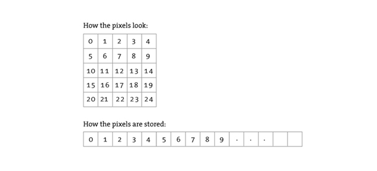
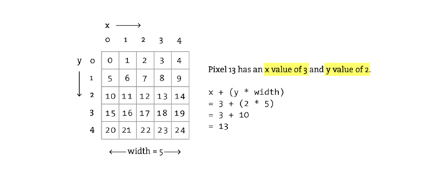

*****************
Images and Pixels
*****************

:Authors: Daniel Shiffman Arihant Parsoya (p5 port)
:Copyright: This tutorial is from the book `Learning Processing
   <https://processing.org/books/#shiffman>`_ by Daniel Shiffman,
   published by Morgan Kaufmann, © 2008 Elsevier Inc. All rights
   reserved. The tutorial was ported to p5 by Arihant Parsoya. If you see
   any errors or have comments, open an issue on either the `p5
   <https://github.com/p5py/p5/issues>`_ or `Processing
   <https://github.com/processing/processing-docs/issues?q=is%3Aopen>`_
   repositories.

A digital image is nothing more than data—numbers indicating variations of red, green, and blue at a particular location on a grid of pixels. Most of the time, we view these pixels as miniature rectangles sandwiched together on a computer screen. With a little creative thinking and some lower level manipulation of pixels with code, however, we can display that information in a myriad of ways. This tutorial is dedicated to breaking out of simple shape drawing in Processing and using images (and their pixels) as the building blocks of Processing graphics.

Getting started with images
===========================

Hopefully, you are comfortable with the idea of data types. You probably specify them often—a float variable "speed", an int "x", etc. These are all primitive data types, bits sitting in the computer's memory ready for our use. Though perhaps a bit trickier, you hopefully also use objects, complex data types that store multiple pieces of data (along with functionality)—a "Ball" class, for example, might include floating point variables for location, size, and speed as well as methods to move, display itself, and so on.

In addition to user-defined objects (such as Ball), Processing has a bunch of handy classes all ready to go without us writing any code. In this tutorial, we'll examine PImage, a class for loading and displaying an image as well as looking at its pixels.

.. code:: python

	from p5 import *

	img = None # Declare a variable of type PImage

	def setup():
		size(320,240)
		# Make a new instance of a PImage by loading an image file
		img = loadImage("mysummervacation.jpg")

	def draw():
		background(0)
		# Draw the image to the screen at coordinate (0,0)
		image(img, 0, 0)

	if __name__ == '__main__':
		run()

Using an instance of a PImage object is no different than using a user-defined class. First, a variable of type PImage, named "img," is declared. Second, a new instance of a PImage object is created via the ``load_image()`` method. ``load_image()`` takes one argument, a String indicating a file name, and loads the that file into memory. ``load_image()`` looks for image files stored in your current terminal directory.

In the above example, it may seem a bit peculiar that we never called a "constructor" to instantiate the PImage object, saying "PImage()". After all, in most object-related examples, a constructor is a must for producing an object instance.

.. code:: python

	ss = Spaceship()
	flr = Flower(25)

yet: 

.. code:: python

	img = load_image("file.jpg")

In fact, the ``load_image()`` function performs the work of a constructor, returning a brand new instance of a PImage object generated from the specified filename. We can think of it as the PImage constructor for loading images from a file. For creating a blank image, the ``create_image()`` function is used.

We should also note that the process of loading the image from the hard drive into memory is a slow one, and we should make sure our program only has to do it once, in ``setup()``. Loading images in ``draw()`` may result in slow performance as well as "Out of Memory" errors.

Once the image is loaded, it is displayed with the ``image()`` function. The ``image()`` function must include 3 arguments—the image to be displayed, the x location, and the y location. Optionally two arguments can be added to resize the image to a certain width and height.

.. code:: python

	image(img, 10,20, 90,60)

Your very first image processing filter
=======================================

When displaying an image, you might like to alter its appearance. Perhaps you would like the image to appear darker, transparent, blue-ish, etc. This type of simple image filtering is achieved with Processing's ``tint()`` function. ``tint()`` is essentially the image equivalent of shape's ``fill()``, setting the color and alpha transparency for displaying an image on screen. An image, nevertheless, is not usually all one color. The arguments for ``tint()`` simply specify how much of a given color to use for every pixel of that image, as well as how transparent those pixels should appear.

For the following examples, we will assume that two images (a sunflower and a dog) have been loaded and the dog is displayed as the background (which will allow us demonstrate transparency.)

.. code:: python

	sunflower = load_image("sunflower.jpg")
	dog = loadImage("dog.jpg")
	background(dog)

If ``tint()`` receives one argument, only the brightness of the image is affected.

.. image:: ./images_and_pixels-res/tint1.jpg
   :align: left

.. code:: python

	# The image retains its original state.
	tint(255)
	image(sunflower, 0, 0)

.. image:: ./images_and_pixels-res/tint2.jpg
   :align: left

.. code:: python

	# The image appears darker
	tint(100)
	image(sunflower, 0, 0)

A second argument will change the image's alpha transparency.

.. image:: ./images_and_pixels-res/tint3.jpg
   :align: left

.. code:: python

	# The image is at 50% opacity.
	tint(100, 127)
	image(sunflower, 0, 0)

Three arguments affect the brightness of the red, green, and blue components of each color.

.. image:: ./images_and_pixels-res/tint4.jpg
   :align: left

.. code:: python

	# None of its red, most of its green, and all of its blue.
	tint(0, 200, 255)
	image(sunflower, 0, 0)

Finally, adding a fourth argument to the method manipulates the alpha (same as with 2). Incidentally, the range of values for tint() can be specified with colorMode().

.. image:: ./images_and_pixels-res/tint5.jpg
   :align: left

.. code:: python

	# The image is tinted red and transparent.
	tint(255, 0, 0, 100)
	image(sunflower, 0, 0)

Pixels, pixels, and more pixels
===============================

If you've just begun using Processing you may have mistakenly thought that the only offered means for drawing to the screen is through a function call. "Draw a line between these points" or "Fill an ellipse with red" or "load this JPG image and place it on the screen here." But somewhere, somehow, someone had to write code that translates these function calls into setting the individual pixels on the screen to reflect the requested shape. A line doesn't appear because we say line(), it appears because we color all the pixels along a linear path between two points. Fortunately, we don't have to manage this lower-level-pixel-setting on a day-to-day basis. We have the developers of Processing (and Java) to thank for the many drawing functions that take care of this business.

Nevertheless, from time to time, we do want to break out of our mundane shape drawing existence and deal with the pixels on the screen directly. Processing provides this functionality via the pixels array.

We are familiar with the idea of each pixel on the screen having an X and Y position in a two dimensional window. However, the array pixels has only one dimension, storing color values in linear sequence.

Take the following simple example. This program sets each pixel in a window to a random grayscale value. The pixels array is just like an other array, the only difference is that we don't have to declare it since it is a Processing built-in variable.

.. code:: python

	size(200, 200)
	# Before we deal with pixels
	load_pixels()  
	# Loop through every pixel
	for i in range(pixels.length):
		# Pick a random number, 0 to 255
		rand = random(255)
		# Create a grayscale color based on random number
		c = color(rand)
		# Set pixel at that location to random color
		pixels[i] = c
		
	# When we are finished dealing with pixels

First, we should point out something important in the above example. Whenever you are accessing the pixels of a Processing window, you must alert Processing to this activity. This is accomplished with two functions:

* ``load_pixels()``: This function is called before you access the pixel array, saying "load the pixels, I would like to speak with them!"

In the above example, because the colors are set randomly, we didn't have to worry about where the pixels are onscreen as we access them, since we are simply setting all the pixels with no regard to their relative location. However, in many image processing applications, the XY location of the pixels themselves is crucial information. A simple example of this might be, set every even column of pixels to white and every odd to black. How could you do this with a one dimensional pixel array? How do you know what column or row any given pixel is in? In programming with pixels, we need to be able to think of every pixel as living in a two dimensional world, but continue to access the data in one (since that is how it is made available to us). We can do this via the following formula:

#. Assume a window or image with a given WIDTH and HEIGHT.
#. We then know the pixel array has a total number of elements equaling WIDTH * HEIGHT.
#. For any given X, Y point in the window, the location in our 1 dimensional pixel array is: LOCATION = X + Y*WIDTH

This may remind you of our two dimensional arrays tutorial. In fact, we'll need to use the same nested for loop technique. The difference is that, although we want to use for loops to think about the pixels in two dimensions, when we go to actually access the pixels, they live in a one dimensional array, and we have to apply the formula from the above illustration.

Let's look at how it is done.

.. code:: python

	size(200, 200)
	load_pixels() 
	# Loop through every pixel column
	for x in range(width):
		# Loop through every pixel row
		for y in range(height):
		# Use the formula to find the 1D location
		loc = x + y * width
		if (x % 2 == 0): # If we are an even column
			pixels[loc] = color(255)
		else: # If we are an odd column
			pixels[loc] = color(0)

Intro To Image Processing
=========================

The previous section looked at examples that set pixel values according to an arbitrary calculation. We will now look at how we might set pixels according those found in an existing PImage object. Here is some pseudo-code.

#. Load the image file into a PImage object
#. For each pixel in the PImage, retrieve the pixel's color and set the display pixel to that color.

The PImage class includes some useful fields that store data related to the image—width, height, and pixels. Just as with our user-defined classes, we can access these fields via the dot syntax.

.. code:: python

	img = createImage(320,240,RGB) # Make a PImage object
	print(img.width) # Yields 320
	print(img.height) # Yields 240
	img.pixels[0] = color(255,0,0) # Sets the first pixel of the image to red

Access to these fields allows us to loop through all the pixels of an image and display them onscreen.

.. code:: python

	from p5 import *

	img = None

	def setup():
		global img
		size(320,240)
		img = load_image("sunflower.jpg")

	def draw():
		global img

		with load_pixels():
			# Since we are going to access the image's pixels too  
			img.load_pixels()
			for y in range(img.height):
				for x in range(img.width):
					loc = x + y*width

					# The functions red(), green(), and blue() pull out the 3 color components from a pixel.
					r = img._get_pixel((x, y)).red
					g = img._get_pixel((x, y)).green
					b = img._get_pixel((x, y)).blue

					# Image Processing would go here
					# If we were to change the RGB values, we would do it here, 
					# before setting the pixel in the display window.

					# Set the display pixel to the image pixel
					pixels._set_pixel((x, y), Color(r,g,b))

	if __name__ == '__main__':
		run()

