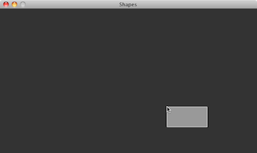
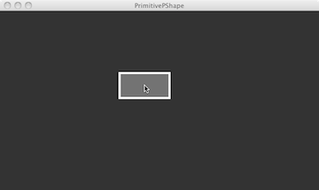
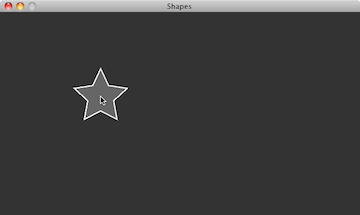
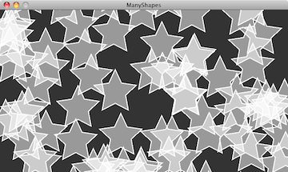

******
PShape
******

:Authors: Daniel Shiffman; Arihant Parsoya (p5 port)
:Copyright: If you see any errors or have comments, please let us know.
	The tutorial was ported to p5 by Arihant Parsoya. If
   	you see any errors or have comments, open an issue on either the
   	`p5 <https://github.com/p5py/p5/issues>`_ or `Processing
   	<https://github.com/processing/processing-docs/issues?q=is%3Aopen>`_
   	repositories.

One of the very first things you learn when programming with Processing is how to draw "primitive" shapes to the screen: rectangles, ellipses, lines, triangles, and more.

.. code:: python

	rect((x,y),w,h)
	ellipse((x,y),w,h)
	line((x1,y1),(x2,y2))
	triangle((x1,y1),(x2,y2),(x3,y3))

A more advanced drawing option is to use ``begin_shape()`` and ``end_shape()`` to specify the vertices of a custom polygon

.. code:: python

	beginShape()
	vertex(x1,y1)
	vertex(x2,y2)
	vertex(x3,y3)
	vertex(x4,y4)
	# etc
	endShape()

And you can build more complex shapes by grouping a set of drawing functions together, even perhaps organizing them into a class.

.. code:: python

	class MyWackyShape:

		# constructor 

		# some functions

		def display(self):
			begin_shape()
			vertex(x1,y1)
			vertex(x2,y2)
			vertex(x3,y3)
			vertex(x4,y4)
			# etc
			end_shape()

This is all well and good and will get you pretty far. There's very little you can't draw just knowing the above. However, there is another step. A step that can, in some cases, improve the speed of your rendering as well as offer a more advanced organizational model for your code—PShape.

PShape is a datatype for storing shapes. These can be shapes that you build out of custom geometry or shapes that you load from an external file, such as an SVG.

Primitive PShapes
=================

Let's begin with one of the simplest cases for use of a PShape. Here's a simple Processing ``draw()`` method that draws an rectangle following the mouse.

.. code:: python

	def draw():
		background(51)
		stroke(255)
		fill(127)
		rect((mouse_x, mouse_y), 100, 50)

Pretty basic stuff. If this was all the code we had, there's not necessarily a good reason for using a PShape instead, but we're going to push ahead and make a PShape rectangle anyway as a demonstration. Our goal here is to have a variable that stores the color and dimensions of that variable, allowing our draw function to look like this.

.. code:: python

	def draw():
		background(51)
		draw_shape(rectangle)

And what is this "rectangle"? It's a PShape.

To initialize a PShape, use the PShape() method. The first argument for PShape() is a constant, and this constant specifies the type of PShape you intend to make. Here we are making a primitive shape, a rectangle. So now our setup() should look like:

.. code:: python

	rectangle = None

	def setup():
		size(640, 360)
		rectangle = PShape()

We can then move the shape according to the mouse with translate.

.. code:: python

	def draw():
		background(51)
		translate(mouse_x, mouse_y)
		draw_shape(rectangle)

One of the nice things about the PShape object is that it can also store color information in addition to geometry. Once a shape has been created in order to alter its fill or stroke, use the methods ``set_fill()``, ``set_stroke()``, ``set_stroke_weight()``, etc.

.. code:: python

	def setup():
		size(640, 260)
		rectangle = PShape()
		with rectangle.edit():
			rectangle.add_vertex((0, 0))
			rectangle.add_vertex((50, 0))
			rectangle.add_vertex((50, 100))
			rectangle.add_vertex((0, 100))

		rectangle.stroke = color(255)
		rectangle.stroke_weight = 4
		rectangle._fill = color(127)

These methods can be called during draw() as well if you want to change the color of the shape dynamically.

.. code:: python

	def draw():
		background(51)
		translate(mouse_x, mouse_y)
		rectangle.set_fill(color(remap(mouse_x, (0, width), (0, 255))))
		draw_shape(rectangle)

It should be noted that unlike with ``fill()`` and ``stroke()`` you must pass a full color as an argument. i.e. instead of saying ``set_fill(255,0,0)`` for a red fill, you'll need to say ``set_fill(color(255,0,0))``. In addition, ``set_fill()`` and ``set_stroke()`` can take a boolean argument (e.g. ``set_fill(false))`` to turn the fill or stroke on or off for a given vertex as well as an integer (e.g. ``set_fill(i,color(255,0,0)))`` to set the fill or stroke for a specific vertex.

Custom PShapes
==============

PShapes also can be configured with custom vertices. You've probably done this before, without PShape, just using ``begin_shape()`` and ``end_shape()``. For example, let's say you wanted to draw a star in Processing. You might have some code as follows:

.. code:: python

	def draw():
		background(51)
		translate(mouse_x, mouse_y)
		fill(102)
		stroke(255)
		stroke_weight(2)
		begin_shape()
		vertex(0, -50)
		vertex(14, -20)
		vertex(47, -15)
		vertex(23, 7)
		vertex(29, 40)
		vertex(0, 25)
		vertex(-29, 40)
		vertex(-23, 7)
		vertex(-47, -15)
		vertex(-14, -20)
		end_shape("CLOSE")

Here, just as in the previous example, our goal will be to draw the shape itself as an object in draw().

.. code:: python

	def draw():
		size(640, 360)
		star = PShape() # First create the shape
		with rectangle.edit():
			# All the vertex information goes here.

Then all the vertices (and colors) can be specified by calling the functions on the new PShape object "star." Note that ``fill()`` and ``stroke`` are not required here, only if you choose to alter the colors after the shape has been initially created.

.. code:: python

	def setup():
		global star
		size(640, 360)

		# First create the shape
		star = PShape()

		with star.edit():
			star.add_vertex((0, -50))
			star.add_vertex((14, -20))
			star.add_vertex((47, -15))
			star.add_vertex((23, 7))
			star.add_vertex((29, 40))
			star.add_vertex((0, 25))
			star.add_vertex((-29, 40))
			star.add_vertex((-23, 7))
			star.add_vertex((-47, -15))
			star.add_vertex((-14, -20))

Many PShapes
============

As we mentioned earlier, one reason to use PShape is just to help you organize your geometry. However, there's another reason. Let's assume for a moment that you have a Star class, with a ``display()`` function that looks like so:

.. code:: python

	def display():
	    with push_matrix():
	        translate(x, y)
	        fill(102)
	        stroke(255)
	        stroke_weight(2)

	        begin_shape()
	        vertex(0, -50)
	        vertex(14, -20)
	        vertex(47, -15)
	        vertex(23, 7)
	        vertex(29, 40)
	        vertex(0, 25)
	        vertex(-29, 40)
	        vertex(-23, 7)
	        vertex(-47, -15)
	        vertex(-14, -20)
	        end_shape("CLOSE")

and in `draw()`, you are iterating through an array of Star objects, displaying each one.

.. code:: python
	
	def draw():
		background(51)
		for i in range(len(stars)):
			stars[i].display()

.. code:: python
	
	class Star:
		def __init__(self):
			self.s = PShape()
			self.x = 0
			self.y = 0

That PShape then needs to be initialized in the constructor. This can be done directly, right there in the class.

.. code:: python
	
	class Star:
		def __init__(self):
			#  First create the shape
			self.s = PShape()
			# You can set fill and stroke
			self.s._fill(102)
			self.s.stroke(Color(255))
			self.s.stroke_weight(2)
			# Here, we are hardcoding a series of vertices

			with self.s.edit():
				self.s.add_vertex((0, -50))
				self.s.add_vertex((14, -20))
				self.s.add_vertex((47, -15))
				self.s.add_vertex((23, 7))
				self.s.add_vertex((29, 40))
				self.s.add_vertex((0, 25))
				self.s.add_vertex((-29, 40))
				self.s.add_vertex((-23, 7))
				self.s.add_vertex((-47, -15))
				self.s.add_vertex((-14, -20))

This method makes sense if each object itself has its own geometry, generated via an algorithm. However, if each object is displaying the identical PShape, it likely makes more sense to pass in a reference to a PShape in the constructor itself. Let's take a look at how this might work. Let's say we create a generic class called "Polygon" which has a reference to a PShape (which is draws in a display method).

.. code:: python

	class Polygon:
		def __init__(self, shape):
			self.s = shape

		def display():
			shape(s)

In the previous example, the shape was created right there in the object's constructor. Here we are going to demonstrate a different way to write the constructor where the shape is set via an argument.

.. code:: python

	from p5 import *

	poly = None

	class Polygon: 
	    def __init__(self, shape):
	        self.shape = shape

	    def display(self):
	        draw_shape(self.shape)

	def setup():
	    global poly
	    size(640, 360)

	    star = PShape()
	    star._fill = Color(0, 127)
	    with star.edit():
	        star.add_vertex((0, -50))
	        star.add_vertex((14, -20))
	        star.add_vertex((47, -15))
	        star.add_vertex((23, 7))
	        star.add_vertex((29, 40))
	        star.add_vertex((0, 25))
	        star.add_vertex((-29, 40))
	        star.add_vertex((-23, 7))
	        star.add_vertex((-47, -15))
	        star.add_vertex((-14, -20))

	    poly = Polygon(star)

	def draw():
	    global poly
	    background(255)
	    poly.display()

	if __name__ == '__main__':
	    run()

This is a very flexible approach. For example if you had an array of PShape objects, you could create new Polygon objects each one with a random PShape. 

PShape Groups
=============

Another convenience of PShape is the ability to group shapes. For example, what if you wanted to create an alien creatures out of a set of circles, rectangles, and custom polygons. If the head were a circle and the body a rectangle, you might think you need:

.. code:: python

	from p5 import *

	alien = None
	head = None
	body = None

	def setup():
	    global alien, head, body
	    size(640, 360)
	    alien = PShape([[0, 0]])
	    head = PShape()
	    body = PShape()

	    with head.edit():
	        head.add_vertex((-25, 0))
	        head.add_vertex((25, 0))
	        head.add_vertex((0, -50))

	    with body.edit():
	        body.add_vertex((-25, 0))
	        body.add_vertex((25, 0))
	        body.add_vertex((25, 100))
	        body.add_vertex((-25, 100))

	    alien.add_child(head)
	    alien.add_child(body)
	    no_loop()

	def draw():
	    global alien, body, head
	    background(0)
	    translate(width/2, height/2)
	    draw_shape(alien)

	if __name__ == '__main__':
	    run()

PShape groups allow you build a sophisticated hierarchy of shapes. This in turn allows you to set the color and attributes of the child shapes by calling the corresponding method at the parent level. Similarly, by calling the transformation functions at a given level of the hierarchy, you only affect the shapes below.

