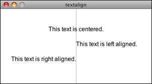
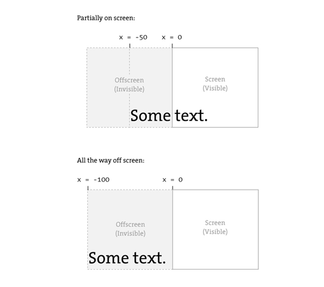
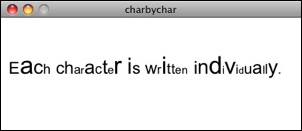
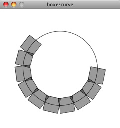
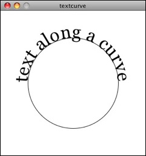

************************
Strings and Drawing Text
************************

:Authors: Daniel Shiffman; Arihant Parsoya (p5 port)
:Copyright: This tutorial is from the book `Learning Processing
   <https://processing.org/books/#shiffman>`_ by Daniel Shiffman,
   published by Morgan Kaufmann, © 2008 Elsevier Inc. All rights
   reserved. The tutorial was ported to p5 by Arihant Parsoya. If you see
   any errors or have comments, open an issue on either the `p5
   <https://github.com/p5py/p5/issues>`_ or `Processing
   <https://github.com/processing/processing-docs/issues?q=is%3Aopen>`_
   repositories.

If you are looking to display text onscreen with Processing, you've got to first become familiar with the String class. Strings are probably not a totally new concept for you, it's quite likely you've dealt with them before. For example, if you've printed some text to the message window or loaded an image from a file, you've written code like so:

.. code:: python
	
	print("printing some text to the message window!") 	# Printing a String
	img = load_image("filename.jpg")  # Using a String for a file name

Nevertheless, although you may have used a String here and there, it's time to unleash their full potential.

Where do we find documentation for the String class?
====================================================

Although technically a Python class, because Strings are so commonly used, Processing includes documentation in its reference: http://www.processing.org/reference/String.html.

This page only covers some of the available methods of the String class. The full documentation can be found on Python's `String <https://docs.python.org/2/library/string.html>`_ page.

What is a String?
=================

A String, at its core, is really just a fancy way of storing an array of characters. If we didn't have the String class, we'd probably have to write some code like this:

.. code:: python

	sometext = ['H', 'e', 'l', 'l', 'o', ' ', 'W', 'o', 'r', 'l', 'd']

Clearly, this would be a royal pain in the Processing behind. It's much simpler to do the following and make a String object:

.. code:: python
	
	sometext = "How do I make String? Type some characters between quotation marks!"

It appears from the above that a String is nothing more than a list of characters in between quotes. Nevertheless, this is only the data of a String. We must remember that a String is an object with methods (which you can find on the reference page.) This is just like how we learned in the Pixels tutorial that a PImage stores both the data associated with an image as well as the functionality: ``copy()``, ``load_pixels()``, etc.

For example, brackets `[]` returns the individual character in the String at a given index. Note that Strings are just like arrays in that the first character is index #0!

.. code:: python

	message = "some text here."
	c = message[0]
	print(c) # Results in 'e'

Another useful method is ``len()``. This is easy to confuse with the length property of an array. However, when we ask for the length of a String object, we must use the parentheses since we are calling a function called ``len()`` rather than accessing a property called length.

.. code:: python 

	message = "This String is 34 characters long."
	print(len(message))

We can also change a String to all uppercase using the ``upper()`` method:

.. code:: python

	uppercase = message.upper()
	print(uppercase)

Finally, let's look at `equals()``. Now, Strings can be compared with the "==" operator as follows:

.. code:: python

	one = "hello"
	two = "hello"
	print(one == two)

One other feature of String objects is concatenation, joining two Strings together. Strings are joined with the "+" operator. Plus, of course, usually means add in the case of numbers. When used with Strings, it means join.

.. code:: python
	
	helloworld = "Hello" + "World"

Variables can also be brought into a String using concatenation.

.. code:: python 

	x = 10
	message = "The value of x is: " + x

Displaying Text
===============

The easiest way to display a String is to print it in the message window. This is likely something you've done while debugging. For example, if you needed to know the horizontal mouse location, you would write:

.. code:: python

	print(mouse_x)

Or if you needed to determine that a certain part of the code was executed, you might print out a descriptive message.

.. code:: python

	print("We got here and we're printing out the mouse location!!!")

While this is valuable for debugging, it's not going to help our goal of displaying text for a user. To place text on screen, we have to follow a series of simple steps.

**1. Declare an object for font**

.. code:: python

	f = None

**2. Create the font by referencing the font name and the function create_font()**

This should be done only once, usually in ``setup()``. Just as with loading an image, the process of loading a font into memory is slow and would seriously affect the sketch's performance if placed inside ``draw()``. When sharing a sketch with other people or posting it on the web, you may need to include a .ttf or .otf version of your font in the data directory of the sketch because other people might not have the font installed on their computer. Only fonts that can legally be distributed should be included with a sketch. In addition to the name of the font, you can specify the size as well as whether the font should be antialiased or not.

.. code:: python

	f = create_font("Arial.ttf", 16,) # Arial, 16 point, anti-aliasing on

**3. Specify the font using text_font()**

``text_font()`` takes one or two arguments, the font variable and the font size, which is optional. If you do not include the font size, the font will be displayed at the size originally loaded. When possible, the ``text()`` function will use a native font rather than the bitmapped version created behind the scenes with ``create_font()`` so you have the opportunity to scale the font dynamically. When using P2D, the actual native version of the font will be employed by the sketch, improving drawing quality and performance. With the P3D renderer, the bitmapped version will be used and therefore specifying a font size that is different from the font size loaded can result in pixelated text.

.. code:: python

	text_font(f, 36)

**4. Specify a color using fill()**

.. code:: python

	fill(255)

**5. Call the text() function to display text**

This function is just like shape or image drawing, it takes three arguments—the text to be displayed, and the x and y coordinate to display that text.

.. code:: python

	text("Hello Strings!", (10, 100))

.. code:: python

	from p5 import *

	f = None # STEP 1 Declare PFont variable

	def setup():
		size(200,200)
		f = create_font("Arial", 16) # STEP 2 Create Font

	def draw():
		background(255)
		text_font(f, 16)
		fill(0)
		text("Hello Strings!", (10,100))

	if __name__ == '__main__':
		run()

Animating Text
==============

Let's look at two more useful Processing functions related to displaying text:

``text_align()``- specifies RIGHT, LEFT or CENTER alignment for text.

.. code:: python

	from p5 import *

	f = None # STEP 1 Declare PFont variable

	def setup():
		global f
		size(400,200)
		f = create_font("Arial.ttf", 16) # STEP 2 Create Font

	def draw():
		global f
		background(255)

		stroke(175)
		line((width/2,0), (width/2,height))

		text_font(f)
		fill(0)

		text_align("CENTER")
		text("This text is centered.",(width/2,60))

		text_align("LEFT")
		text("This text is left aligned.", (width/2,100))

		text_align("RIGHT")
		text("This text is right aligned.", (width/2,140))

	if __name__ == '__main__':
		run()

``text_width()``- Calculates and returns the width of any character or text string.

Let's say we want to create a news ticker, where text scrolls across the bottom of the screen from left to right. When the news headline leaves the window, it reappears on the right hand side and scrolls again. If we know the x location of the beginning of the text and we know the width of that text, we can determine when it is no longer in view. textWidth() gives us that width.

To start, we declare headline, font, and x location variables, initializing them in setup().

.. code:: python

	headline = "New study shows computer programming lowers cholesterol."
	f  # Global font variable
	x  # horizontal location of headline

	def setup():
		global f, x
		f = create_font("Arial",16) #Loading font
		x = width # initializing headline off-screen to the right

In ``draw()``, we display the text at the appropriate location.

.. code:: python

	# Display headline at x  location
	text_font(f, 16)
	text_align("LEFT")
	text(headline, (x,180))

We change x by a speed value (in this case a negative number so that the text moves to the left.)

.. code:: python
	
	x = x - 3

Now comes more difficult part. It was easy to test when a circle reached the left side of the screen. We would simply ask: is x less than 0? With text, however, since it is left-aligned, when x equals zero, it is still viewable on screen. Instead, the text will be invisible when x is less than 0 minus the width of the text (See figure below). When that is the case, we reset x back to the right-hand side of the window, i.e. width.

.. code:: python

	# If x is less than the negative width, then it is completely off the screen
	w = text_width(headline)
	if x < -w:
		x = width

Here's the full example that displays a different headline each time the previous headline leaves the screen. The headlines are stored in a String array.

.. code:: python

	from p5 import *

	headlines = [
		"Processing downloads break downloading record.", 
		"New study shows computer programming lowers cholesterol."]

	f = None # Global font variable
	x = None # horizontal location of headline
	index = 0 

	def setup():
		global f, x
		size(400,200)
		f = create_font("Arial.ttf", 16)

		# Initialize headline offscreen to the right 
		x = width

	def draw():
		global f, x, index
		background(255)

		fill(0)

		# Display headline at x  location
		text_font(f,16)
		text_align("LEFT")
		text(headlines[index],(x,180))

		# Decrement x
		x = x - 3

		# If x is less than the negative width
		# then it is off the screen
		w = text_width(headlines[index])
		if x < -w:
			x = width
			index = (index + 1) % len(headlines)

	if __name__ == '__main__':
		run()

In addition to ``text_align()`` and ``text_width()``, Processing also offers the functions ``text_leading()``, ``text_mode()``, ``text_size()`` for additional display functionality.

Rotating text
=============

Translation and rotation can also be applied to text. For example, to rotate text around its center, translate to an origin point and use textAlign(CENTER) before displaying the text.

.. code:: python

	from p5 import *

	message = "this text is spinning"
	f = None
	theta = 0

	def setup():
		global f
		size(200, 200)
		f = create_font("Arial.ttf", 16)

	def draw():
		global f, theta
		background(255)
		fill(0)
		text_font(f)                  # Set the font
		translate(width/2,height/2)  # Translate to the center
		rotate(theta)                # Rotate by theta
		text_align("CENTER")            
		text(message,(0,0))            
		theta += 0.05                # Increase rotation

	if __name__ == '__main__':
		run()

Displaying text character by character
======================================

In certain graphics applications, displaying text with each character rendered individually is required. For example, if each character needs to move or be colored independently then simply saying...

.. code:: python

	text("a bunch of letters", (0,0))

will not do.

The solution is to loop through a String, displaying each character one at a time.

Let's start by looking at an example that displays the text all at once.

.. code:: python

	from p5 import *

	message = "Each character is not written individually."
	f = None

	def setup():
		global f
		size(400, 200)
		f = create_font("Arial.ttf", 16)

	def draw():
		global f, theta
		background(255)
		fill(0)
		text_font(f)

		# Displaying a block of text all at once using text().   
		text(message, (10,height/2))

	if __name__ == '__main__':
		run()

We can rewrite the code to display each character in loop:

.. code:: python

	message = "Each character is written individually."

	# The first character is at pixel 10
	x = 10

	for i in range(len(message)):
		# Each character is displayed one at a time
		text(message[i], (x, height/2))
		# All characters are spaced 10 pixels apart.
		x += 10

Calling the ``text()`` function for each character will allow us more flexibility (for coloring, sizing, and placing characters within one String individually). The above code has a pretty major flaw, however—the x location is increased by 10 pixels for each character. Although this is approximately correct, because each character is not exactly ten pixels wide, the spacing is off.

The proper spacing can be achieved using the ``text_width()`` function as demonstrated in the code below. Note how this example achieves the proper spacing even with each character being a random size!

.. code:: python 

	from p5 import *

	message = "Each character is not written individually."
	f = None

	def setup():
		global f
		size(400, 200)
		f = create_font("Arial.ttf", 16)

	def draw():
		global f, theta
		background(255)
		fill(0)
		text_font(f)

		x = 10
		for i in range(len(message)):
			text_size(int(random_uniform(12,36)))
			text(message[i], (x,height/2))

			# textWidth() spaces the characters out properly.
			x += text_width(message[i])

		no_loop()

	if __name__ == '__main__':
		run()

This "letter by letter" methodology can also be applied to a sketch where characters from a String move independently of one another. The following example uses object-oriented design to make each character from the original String a Letter object, allowing it to both be a displayed in its proper location as well as move about the screen individually.

.. code:: python

	from p5 import *

	message = "Each character is not written individually."
	f = None
	letters = []

	def setup():
		global f
		size(260, 200)
		f = create_font("Arial.ttf", 16)
		text_font(f)
		
		# Initialize Letters at the correct x location
		x = 16
		for i in range(len(message)):
			letters.append(Letter(x, 100, message[i]))
			x += text_width(message[i])

	def draw():
		global f, letters
		background(255)
		
		for i in range(len(message)):

			# Display all letters
			letters[i].display()

			# If the mouse is pressed the letters shake
			# If not, they return to their original location
			if mouse_is_pressed:
				letters[i].shake()
			else:
				letters[i].home()

	class Letter:
		def __init__(self, x_, y_, letter_):
			self.letter = letter_

			self.homex = x_
			self.homey = y_

			self.x = x_
			self.y = y_

		def display(self):
			fill(0)
			text_align("LEFT")
			text(self.letter, (self.x, self.y))

		def shake(self):
			self.x += random_uniform(-2, 2)
			self.y += random_uniform(-2, 2)

		def home(self):
			self.x = self.homex
			self.y = self.homey

	if __name__ == '__main__':
		run()

The character by character method also allows us to display text along a curve. Before we move on to letters, let's first look at how we would draw a series of boxes along a curve. This example makes heavy use of Trignometry.

.. code:: python

	from p5 import *

	f = None

	# The radius of a circle
	r = 100

	# The width and height of the boxes
	w = 40
	h = 40

	def setup():
		global f
		size(320, 320)
		f = create_font("Arial.ttf", 16)
		text_font(f)

	def draw():
		global f, letters
		background(255)
		
		# Start in the center and draw the circle
		translate(width / 2, height / 2)
		no_fill()
		stroke(0)

		# Our curve is a circle with radius r in the center of the window.
		ellipse((0, 0), r*2, r*2)

		# 10 boxes along the curve
		totalBoxes = 10

		# We must keep track of our position along the curve
		arclength = 0

		# For every box
		for i in range(totalBoxes):
			# Each box is centered so we move half the width
			arclength += w/2

			# Angle in radians is the arclength divided by the radius
			theta = arclength / r

			with push_matrix():
				# Polar to cartesian coordinate conversion
				translate(r*cos(theta), r*sin(theta))

				# Rotate the box
				rotate(theta)

				# Display the box
				fill(0, 100)

				rect_mode("CENTER")
				rect((0,0),w,h)

			# Move halfway again
			arclength += w/2

	if __name__ == '__main__':
		run()

What we need to do is replace each box with a character from a String that fits inside the box. And since characters all do not have the same width, instead of using a variable "w" that stays constant, each box will have a variable width along the curve according to the ``text_width()`` function.

.. code:: python

	from p5 import *

	f = None

	# The radius of a circle
	r = 100

	# The width and height of the boxes
	w = 40
	h = 40

	message = "text along a curve"

	def setup():
		global f
		size(320, 320)
		f = create_font("Arial.ttf", 16)
		text_font(f)

		# The text must be centered!
		text_align("CENTER")

	def draw():
		global f, letters
		background(255)
		
		# Start in the center and draw the circle
		translate(width / 2, height / 2)
		no_fill()
		stroke(0)

		# Our curve is a circle with radius r in the center of the window.
		ellipse((0, 0), r*2, r*2)

		# 10 boxes along the curve
		totalBoxes = 10

		# We must keep track of our position along the curve
		arclength = 0

		# For every box
		for i in range(totalBoxes):
			# Instead of a constant width, we check the width of each character.
			currentChar = message[i]
			x = text_width(currentChar)

			# Each box is centered so we move half the width
			arclength += w/2

			# Angle in radians is the arclength divided by the radius
			# Starting on the left side of the circle by adding PI
			theta = PI + arclength / r

			with push_matrix():
				# Polar to cartesian coordinate conversion
				translate(r*cos(theta), r*sin(theta))

				# Rotate the box
				rotate(theta)

				# Display the box
				fill(0, 100)

				text(currentChar, (0,0)) 

			# Move halfway again
			arclength += w/2

	if __name__ == '__main__':
		run()

