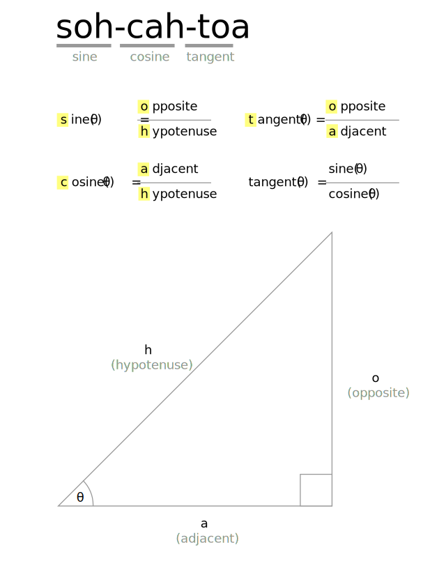
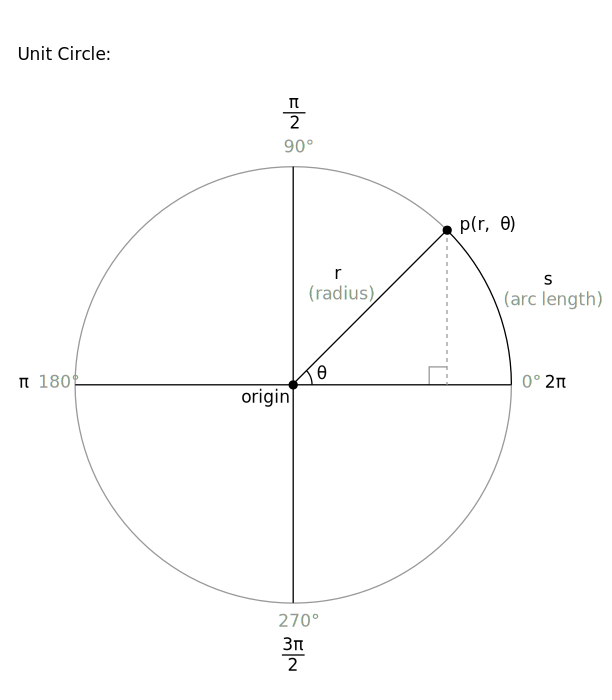

*******************
Trigonometry Primer
*******************

:Authors: Ira Greenberg; Arihant Parsoya (p5 port)

:Copyright: This tutorial is "Extension 5" from `Processing: A
   Programming Handbook for Visual Designers and Artists, Second
   Edition <https://processing.org/handbook>`_, published by MIT
   Press. © 2014 MIT Press. If you see any errors or have comments,
   please let us know. The tutorial was ported to p5 by Arihant Parsoya. If
   you see any errors or have comments, open an issue on either the
   `p5 <https://github.com/p5py/p5/issues>`_ or `Processing
   <https://github.com/processing/processing-docs/issues?q=is%3Aopen>`_
   repositories.

Trigonometry (really just a couple of the trig functions) is central to graphics programming. That being said, if you're anything like me you probably have a hazy memory of trig. Perhaps you remember the mnemonic device soh-cah-toa to remember the relationships between the trig functions and a right triangle. Here's a diagram to awaken your memory.

You should also notice in the figure that tangent equals sine(θ) over cosine(θ). You may also remember that sine and cosine are similar when you graph them, both forming periodic waves. Only the cosine wave is shifted a bit (90° or pi/2) on the graph, which is technically called a phase shift. I fully realize that it is difficult to deal with this stuff in the abstract. Fortunately, there is another model, the unit circle (shown below) used to visualize and study the trig functions.

The unit circle is a circle with a radius of 1 unit in length—hence its imaginative name. When you work with the unit circle, you don't use the regular and trusted Cartesian coordinate system; instead you use a polar coordinate system. The Cartesian system works great in a rectangular grid space, where a point can be located by a coordinate, such as (x, y). In a polar coordinate system, in contrast, location is specified by (r, θ), where r is the radius and θ (the Greek letter theta) is the angle of rotation. The unit circle has its origin at its center, and you measure angles of rotation beginning at the right-middle edge of the unit circle (facing 3 o'clock) and moving in a counterclockwise direction around it.

In the unit circle diagram, the point p is at 45° or pi / 4. You can use pi also to measure around the unit circle, as illustrated in the figure. Halfway around the circle (180°) is equal to pi radians, and all the way around the circle is equal to 2pi radians and also 0 radians, since a circle is continuous and ends where it begins. The number pi is a constant that is equal to the circumference of a circle divided by its diameter, and is approximately 3.142.

In the polar system, you use radians to measure angles, instead of degrees. The angle of rotation in radians is commonly referred to as θ (the Greek letter theta). The arc length of this rotation is calculated by r*θ where r is the radius. In a unit circle, with a radius of 1, θ is equal to the arc length of rotation (arc s in unit circle diagram). It's nice to know the arc length, but most of the time (in computer graphics), you really just want to know the location of a point in relation to the unit circle. For example, if I wanted to rotate a point around the unit circle, I'd need to know how to place and move the point in a circle. With the unit circle, this is an incredibly easy task and precisely the kind of thing trig is used for.

There is a really simple relationship between the trig functions and the unit circle. Notice in the unit circle diagram that from point p on the ellipse, a right triangle is formed within the unit circle. This should immediately make you think of good old Pythagoras. Notice also that r (the radius) is the hypotenuse of the right triangle. In addition, you now also know that with the trig functions, you can use theta and any one side (opposite, adjacent, or hypotenuse) to solve the rest of the triangle. The big payoff of these relationships, for our purposes, is that to translate point p in the polar coordinate system to the Cartesian coordinate system (the system used by our monitors), you would use these simple expressions:

.. code:: python

	x = cosine(theta) * radius
	y = sine(theta) * radius

These seemingly humble little expressions are very powerful and can be exploited for all sorts of expressive and organic purposes.

Here's how you actually use the trig functions in Processing:

.. code:: python

	x = cos(radians(angle)) * radius;
	y = sin(radians(angle)) * radius;

Notice the function call (radians(angle)) inside each of the trig function calls. Remember that theta is measured in radians, in the polar coordinate system. However, in the Cartesian coordinate system, you work in degrees. To convert between radians and degrees and vice versa, you can use the following expressions:

.. code:: python

	theta = angle*pi/180
	angle = theta*180/pi

Or better yet, just use Processing's handy conversion functions:

.. code:: python

	theta = radians(angle)
	angle = degrees(theta)

Lastly, I include a Processing sketch that demonstrates how the unit circle and sine function relate:

.. figure:: ./trigonometry_primer-res/trig_console.jpg
   :align: center

.. code:: python

	from p5 import *

	px, py, px2, py2 = (0, 0, 0, 0)
	angle, angle2 = (0, 0)
	radius = 50
	frequency = 2
	frequency2 = 2
	x, x2 = (0, 0)

	def setup():
	    size(600, 200)
	    background(127)

	def draw():
	    global px, py, px2, py2
	    global angle, angle2
	    global radius, frequency2, frequency
	    global x, x2

	    background (127)
	    no_stroke()
	    fill(255)
	    ellipse((width/8, 75), radius*2, radius*2)

	    # Rotates rectangle around circle
	    px = width/8 + cos(radians(angle))*(radius)
	    py = 75 + sin(radians(angle))*(radius)
	    fill(0)

	    rect ((px, py), 5, 5)
	    stroke(100)
	    line((width/8, 75), (px, py))
	    stroke(200)

	    # Keep reinitializing to 0, to avoid
	    # flashing during redrawing
	    angle2 = 0

	    # Draw static curve - y = sin(x)
	    for i in range(width):
	        px2 = width/8 + cos(radians(angle2))*(radius)
	        py2 = 75 + sin(radians(angle2))*(radius)
	        point(width/8+radius+i, py2)
	        angle2 -= frequency2

	    # Send small ellipse along sine curve
	    # to illustrate relationship of circle to wave
	    no_stroke()
	    ellipse((width/8+radius+x, py), 5, 5)
	    angle -= frequency
	    x+=1

	    # When little ellipse reaches end of window,
	    # set the variables back to 0
	    if x >= width-60:
	        x = 0
	        angle = 0
	        
	    # Draw dynamic line connecting circular path with wave
	    stroke(50)
	    line((px, py), (width/8+radius+x, py))

	if __name__ == '__main__':
	    run()