**********
Typography
**********

:Authors: Casey Reas and Ben Fry; Arihant Parsoya (p5 port)
:Copyright: This tutorial is "Typography" from `Processing: A
   Programming Handbook for Visual Designers and Artists, Second
   Edition <https://processing.org/handbook>`_, published by MIT
   Press. © 2014 MIT Press. If you see any errors or have comments,
   please let us know. The tutorial was ported to p5 by Arihant Parsoya. If
   you see any errors or have comments, open an issue on either the
   `p5 <https://github.com/p5py/p5/issues>`_ or `Processing
   <https://github.com/processing/processing-docs/issues?q=is%3Aopen>`_
   repositories.

The evolution of typographic reproduction and display technologies has and continues to impact human culture. Early printing techniques developed by Johannes Gutenberg in fifteenth-century Germany using letters cast from lead provided a catalyst for increased literacy and the scientific revolution. Automated typesetting machines, such as the Linotype invented in the nineteenth century, changed the way information was produced, distributed, and consumed. In the digital era, the way we consume text has changed drastically since the proliferation of personal computers in the 1980s and the rapid growth of the Internet in the 1990s. Text from emails, websites, and instant messages fill computer screens, and while many of the typographic rules of the past apply, type on screen requires additional considerations for enhanced communication and legibility.

Letters on screen are created by setting the color of pixels. The quality of the typography is constrained by the resolution of the screen. Because, historically, screens have a low resolution in comparison to paper, techniques have been developed to enhance the appearance of type on screen. The fonts on the earliest Apple Macintosh computers comprised small bitmap images created at specific sizes like 10, 12, and 24 points. Using this technology, a variation of each font was designed for each size of a particular typeface. For example, the character A in the San Francisco typeface used a different image to display the character at size 12 and 18. When the LaserWriter printer was introduced in 1985, Postscript technology defined fonts with a mathematical description of each character’s outline. This allowed type on screen to scale to large sizes and still look smooth. Apple and Microsoft later developed TrueType, another outline font format. More recently, these technologies were merged into the OpenType format. In the meantime, methods to smooth text on screen were introduced. These anti-aliasing techniques use gray pixels at the edge of characters to compensate for low screen resolution.

The proliferation of personal computers in the mid-1980s spawned a period of rapid typographic experimentation. Digital typefaces are software, and the old rules of metal and photo type no longer apply. The Dutch typographers known as LettError explain, “The industrial methods of producing typography meant that all letters had to be identical… Typography is now produced with sophisticated equipment that doesn’t impose such rules. The only limitations are in our expectations.”1 LettError expanded the possibilities of typography with their typeface Beowolf (p. 131). It printed every letter differently so that each time an A is printed, for example, it will have a different shape. During this time, typographers such as Zuzana Licko and Barry Deck created innovative typefaces with the assistance of new software tools. The flexibility of software has enabled extensive font revivals and historic homages such as Adobe Garamond from Robert Slimbach and The Proteus Project from Jonathan Hoefler. Typographic nuances such as ligatures—connections between letter pairs such as fi and æ—made impractical by modern mechanized typography are flourishing again through software font tools.

Draw text
=========

The ``text()`` function is used to draw letters, words, and paragraphs to the screen. In the simplest use, the first parameter can be a String, char, int, or float. The second and third parameters set the position of the text. By default, the second parameter defines the distance from the left edge of the window; the third parameter defines the distance from the text’s baseline to the top of the window. The ``text_size()`` function defines the size the letters will draw in units of pixels. The number used to define the text size will not be the precise height of each letter, the difference depends on the design of each font. For instance, the statement ``text_size(30)`` won’t necessarily draw a capital H at 30 pixels high. The ``fill()`` function controls the color and transparency of text. This function affects text the same way it affects shapes such as ``rect()`` and ``ellipse()``, but text is not affected by ``stroke()`` (this feature will be implemented in later versions).

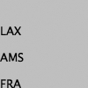

.. code:: python

   from p5 import *

   def setup():
      size(100, 100)

   def draw():
      fill(0)
      text("LAX", (0, 40)) #  Write "LAX" at coordinate (0,40)
      text("AMS", (0, 70))  # Write "AMS" at coordinate (0,70)
      text("FRA", (0, 100)) # Write "FRA" at coordinate (0,100)

   if __name__ == '__main__':
      run()

----

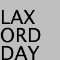

.. code:: python

   from p5 import *

   def setup():
      size(100, 100)

   def draw():
      text_size(32)

      fill(0)
      text("LAX", (0, 40))
      text("AMS", (0, 70))
      text("FRA", (0, 100))

   if __name__ == '__main__':
      run()

----

.. code:: python

   from p5 import *

   def setup():
      size(100, 100)

   def draw():
      text_size(32)

      fill(0)
      text("LAX", (0, 40)) 
      fill(126)
      text("AMS", (0, 70)) 
      fill(255)
      text("FRA", (0, 100))

   if __name__ == '__main__':
      run()

----

.. code:: python

   from p5 import *

   def setup():
      size(100, 100)

   def draw():
      text_size(64)
      fill(0, 140) # Fill black with low opacity
      text("8", (0, 60))
      text("8", (15, 65))
      text("8", (30, 70))
      text("8", (45, 75))
      text("8", (60, 80))

   if __name__ == '__main__':
      run()

Another version of ``text()`` draws the characters inside a rectangle. In this use, the second and third parameters define the position of the upper-left corner of the box and fourth and fifth parameters define the width and height of the box. If the length of the text exceeds the dimensions of the defined box, the text will not display.

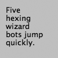

.. code:: python

   from p5 import *

   def setup():
      size(100, 100)

   def draw():
      s = "Five hexing wizard bots jump quickly."
      fill(0)
      text(s, (10, 10), (60, 80))

   if __name__ == '__main__':
      run()

----

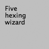

.. code:: python

   from p5 import *

   def setup():
      size(100, 100)

   def draw():
      s = "Five hexing wizard bots jump quickly."
      fill(0)
      text(s, 10, 10, 60, 55) #  Box too small

   if __name__ == '__main__':
      run()

The examples in this chapter are the first to load external media into a sketch. Up to now, all examples have used only graphics generated within Processing through drawing functions such as ``line()`` and ``ellipse()``. Processing is capable of loading and displaying other media, including fonts, images, vector files, formatted data, and sounds. While this chapter focuses on loading fonts and other chapters discuss specific information about other media types, there are a few things about loading media that apply to all categories. These similarities are discussed here.

Before external media can be used in a Processing sketch, it needs to be loaded each time the program is run. Media can be loaded directly from a sketch’s folder, another location on the computer, or though the Internet. Most typically, the media is loaded directly from the sketch’s folder.

To make media files accessible from anywhere in a program, they are typically declared as globally available variables outside of ``setup()`` and ``draw()``. Files are usually loaded inside ``setup()`` because they need only be loaded once and because it takes time to load them. Loading a file inside ``draw()`` reduces the frame rate of a program because it causes the file to reload each frame. Once a file is loaded in ``setup()``, it may be utilized anywhere in the program. In most Processing programs, all files are loaded when the program starts.

Vector Fonts
============

Before a font is used in a program, it must be converted and set as the current font. Processing has a unique data type called PFont to store font data. Make a new variable of the type PFont and use the ``create_font()`` function to convert the font. The first parameter to ``create_font()`` is the name of the font to convert and the second parameter defines the base size of the font. (Optional third and fourth parameters are defined in the Reference.) The ``text_font()`` function must then be used to set the current font. 

.. code:: python

   from p5 import *
   

   def setup():
      global zigBlack # declare zigBlack "global" in setup, should be accessible later if you want
      size(100, 100)
      zigBlack = create_font("Ziggurat-Black.otf", 32)
      text_font(zigBlack)
      fill(0)

   def draw():
      background(204)
      text("LAX", (0, 40))
      text("LHR", (0, 70))
      text("TXL", (0, 100))

   if __name__ == '__main__':
      run()

To ensure a font will load on all computers, regardless if the font is installed, add the file to the sketch’s data folder. When fonts inside the data folder are used, the complete file name, including the data type extension, needs to be written as the parameter to ``create_font()``. The following example is similar to the prior example, but it uses an OpenType font inside the data folder. It uses Source Code Pro, an open source typeface that can be found online and downloaded through a web browser.

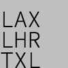

.. code:: python

   from p5 import *

   def setup():
      global sourceLight # declare sourceLight "global" in setup, should be accessible later if you want
      size(100, 100)
      sourceLight = create_font("SourceCodePro-Light.otf", 34)
      text_font(sourceLight)
      fill(0)

   def draw():
      background(204)
      text("LAX", (0, 40))
      text("LHR", (0, 70))
      text("TXL", (0, 100))

   if __name__ == '__main__':
      run()

To use two fonts in one program, create two PFont variables and use the ``text_font()`` function to change the current font. Based on the prior two examples, the Ziggurat-Black font loads from its location on the local computer and Source Code Pro loads from the data folder.

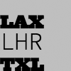

.. code:: python

   from p5 import *

   def setup():
      global sourceLight, zigBlack # declare sourceLight / zigBlack "global" in setup, should be accessible later draw()
      size(100, 100)
      sourceLight = create_font("SourceCodePro-Light.otf", 34)
      zigBlack = create_font("SourceCodePro-Light.otf", 44)
      fill(0)

   def draw():
      background(204)
      text_font(zigBlack)
      text("LAX", (0, 40))
      text_font(sourceLight)
      text("LHR", (0, 70))
      text_font(zigBlack)
      text("TXL", (0, 100))

   if __name__ == '__main__':
      run()

Text attributes
===============

Processing includes functions to control the leading (the spacing between lines of text) and alignment. Processing can also calculate the width of any character or group of characters, a useful technique for arranging shapes and typographic elements. The ``text_leading()`` function sets the spacing between lines of text. It has one parameter that defines this space in units of pixels.

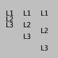

.. code:: python

   from p5 import *

   def setup():
      size(100, 100)
      fill(0)

   def draw():
      lines = "L1 L2 L3"
      text_size(12)
      fill(0)
      textLeading(10)
      text(lines, (10, 15), (30, 100))
      textLeading(20)
      text(lines, (40, 15), (30, 100))
      textLeading(30)
      text(lines, (70, 15), (30, 100))

   if __name__ == '__main__':
      run()

Letters and words can be drawn from their center, left, and right edges. The ``text_align()`` function sets the alignment for drawing text through its parameter, which can be LEFT, CENTER, or RIGHT. It sets the display characteristics of the letters in relation to the x-coordinate stated in the ``text()`` function.

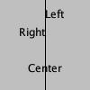

.. code:: python

   from p5 import *

   def setup():
      size(100, 100)
      fill(0)

   def draw():
      text_size(12)
      fill(0)

      line((50, 0), (50, 100))
      text_align("LEFT")
      text("Left", (50, 20))
      text_align("RIGHT")
      text("Right", (50, 40))
      text_align("CENTER")
      text("Center", (50, 80))

   if __name__ == '__main__':
      run()

The settings for ``text_size()``, ``text_leading()``, and ``text_align()`` will be used for all subsequent calls to the ``text()`` function. However, note that the ``text_size()`` function will reset the text leading, and the ``text_font()`` function will reset both the size and the leading.

The ``text_width()`` function calculates and returns the pixel width of any character or text string. This number is calculated from the current font and size as defined by the ``text_font()`` and ``text_size()`` functions. Because the letters of every font are a different size and letters within many fonts have different widths, this function is the only way to know how wide a string or character is when displayed on screen. For this reason, always use ``text_width()`` to position elements relative to text, rather than hard-coding them into your program.

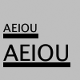

.. code:: python

   from p5 import *

   def setup():
      size(100, 100)
      fill(0)

   def draw():
      s = "AEIOU"
      fill(0)

      text_size(14)
      tw = text_width(s)
      text(s, (4, 40))
      rect((4, 42), tw, 5)

      text_size(28)
      tw = text_width(s)
      text(s, (4, 76))
      rect((4, 78), tw, 5)

   if __name__ == '__main__':
      run()

Typing
======

Drawing letters to the screen becomes more engaging when used in combination with the keyboard. The ``key_pressed()`` event function introduced on page 97 can be used to record each letter as it is typed. The following two examples use this function to read and analyze input from the keyboard by using the String methods introduced in the Text chapter (p. 143). In both, the String variable letters starts empty. Each key typed is added to the end of the string. The first example displays the string as it grows as keys are pressed and removes letters from the end when backspace is pressed. The second example builds on the first—when the Return or Enter key is pressed, the program checks if the word “gray” or “black” was typed. If one of these words was input, the background changes to that value.

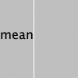

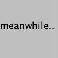

.. code:: python

   from p5 import *

   letters = ""

   def setup():
      size(100, 100)
      stroke(255)
      fill(0)
      text_size(16)

   def draw():
      background(204)
      cursorPosition = text_width(letters)
      line((cursorPosition, 0), (cursorPosition, 100))
      text(letters, (0, 50))

   def key_pressed():
      global letters
      if key == "BACKSPACE":
         if len(letters) > 0:
            letters = letters[:-1]
      elif text_width(letters+str(key)) < width:
         letters = letters + str(key)

   if __name__ == '__main__':
      run()

----

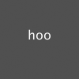

.. code:: python

   from p5 import *

   letters = ""
   back = 102 # Background color
   fil = 0 # Letters color

   def setup():
      size(100, 100)
      text_align("CENTER")
      

   def draw():
      fill(fil)
      background(back)
      text(letters, (50, 50))

   def key_pressed():
      global letters, back, fil # Declared global variables so you can use them
      if key == "ENTER" or key == "RETURN":
         letters = letters.lower()
         print(letters)
         if letters == "black":
            back = 0
            fil = 255  # this changes the color of the letters so you can see
        elif letters == "gray":
            back = 204
            fil = 0  # this changes the color of the letters so you can see

         letters = ""
      elif ord(str(key)) > 31 and key != "CODED":
         # If the key is alphanumeric, add it to the String
         letters = letters + str(key)

   if __name__ == '__main__':
      run()

Many people spend hours a day inputting letters into computers, but this action is very constrained. What features could be added to a text editor to make it more responsive to the typist? For example, the speed of typing could decrease the size of the letters, or a long pause in typing could add many spaces, mimicking a person’s pause while speaking. What if the keyboard could register how hard a person is typing (the way a piano plays a soft note when a key is pressed gently) and could automatically assign attributes such as italics for soft presses and bold for forceful presses? These analogies suggest how conservatively current software treats typography and typing.

Many artists and designers are fascinated with type and have created unique ways of exploring letterforms with the mouse, keyboard, and more exotic input devices. A minimal yet engaging example is John Maeda’s Type, Tap, Write software, created in 1998 as homage to manual typewriters. This software uses the keyboard as the input to a black-and-white screen representation of a keyboard. Pressing the number keys cause the software to cycle through different modes, each revealing a playful interpretation of keyboard data. In Jeffrey Shaw and Dirk Groeneveld’s The Legible City (1989–91), buildings are replaced with three-dimensional letters to create a city of typography that conforms to the streets of a real place. In the Manhattan version, for instance, texts from the mayor, a taxi driver, and Frank Lloyd Wright comprise the city. The image is presented on a projection screen, and the user navigates by pedaling and steering a stationary bicycle situated in front of the projected image. Projects such as these demonstrate that software presents an extraordinary opportunity to extend the way we read and write.

Typographic elements can be assigned behaviors that define a personality in relation to the mouse or keyboard. A word can express aggression by moving quickly toward the mouse, or moving away slowly can express timidity. The following examples demonstrate basic applications of this area. In the first, the word avoid stays away from the mouse because its position is set to the inverse of the cursor position. In the second, the word tickle jitters when the cursor hovers over its position.

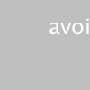

.. code:: python

   from p5 import *

   def setup():
      size(100, 100)
      text_align("CENTER")
      text_size(24)

   def draw():
      background(204)
      text("avoid", (width-mouse_x, height-mouse_y))

   if __name__ == '__main__':
      run()

----

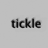

.. image:: ./typography-res/12_19_3.png
   :align: left

.. code:: python

   from p5 import *

   x = 33
   y = 60

   def setup():
      size(100, 100)
      #text_size(24)
      no_stroke()

   def draw():
      global x, y
      background(204, 120)

      fill(0)
      # If cursor is over the text, change the position
      if mouse_x >= x and mouse_x <= x + 55 and mouse_y >= y - 24 and mouse_y <= y:
         x += random_uniform(-2, 2)
         y += random_uniform(-2, 2)

      text("tickle", (x, y))

   if __name__ == '__main__':
      run()
