******
Vector
******

:Authors: Daniel Shiffman; Abhik Pal (p5 port)
:Copyright: This tutorial is adapted from `The Nature of Code
   <http://natureofcode.com/>`_ by Daniel Shiffman. This work is
   licensed under a `Creative Commons Attribution-NonCommercial 3.0
   Unported License
   <https://creativecommons.org/licenses/by-nc/3.0/>`_. The tutorial
   was ported to p5 by Abhik Pal. If you see any errors or have
   comments, open an issue on either the `p5
   <https://github.com/p5py/p5/issues>`_ or `Processing
   <https://github.com/processing/processing-docs/issues?q=is%3Aopen>`_
   repositories.

The most basic building block for programming motion is the
**vector**. And so this is where we begin. Now, the word **vector**
can mean a lot of different things. Vector is the name of a new wave
rock band formed in Sacramento, CA in the early 1980s. It's the name
of a breakfast cereal manufactured by Kellogg's Canada. In the field
of epidemiology, a vector is used to describe an organism that
transmits infection from one host to another. In the C++ programming
language, a Vector (``std::vector``) is an implementation of a
dynamically resizable array data structure. While all interesting,
these are not the definitions we are looking for. Rather, what we want
is this vector:

    **A vector is a collection of values that describe relative position
    in space.**

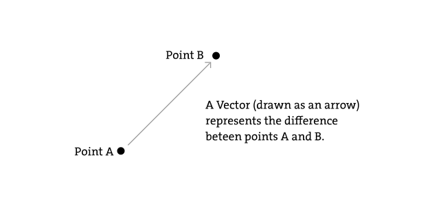

Vectors: You Complete Me
========================

Before we get into vectors themselves, let's look at a beginner
Processing example that demonstrates why it is in the first place we
should care. If you've read any of the introductory Processing
textbooks or taken a class on programming with Processing (and
hopefully you've done one of these things to help prepare you for this
book), you probably, at one point or another, learned how to write a
simple bouncing ball sketch.

.. figure:: vector-res/bouncingball1.jpg
   :align: left

.. code:: python

    from p5 import *
    x = 100
    y = 100

    xspeed = 1
    yspeed = 3.3

    def setup():
        size(200, 200)
        background(255)

    def draw():
        global x
        global y
        global xspeed
        global yspeed

        no_stroke()
        fill(255, 10)
        rect((0, 0), width, height)

        # add the current speed to the location
        x = x + xspeed
        y = y + yspeed

        if x > width or x < 0:
            xspeed = -xspeed

        if y > height or y < 0:
            yspeed = -yspeed

        stroke(0)
        fill(175)
        circle((x, y), 16)

    if __name__ == '__main__':
        run()

In the above example, we have a very simple world -- a blank canvas
with a circular shape ("ball") traveling around. This "ball" has some
properties.

* LOCATION: ``x`` and ``y``
* SPEED: ``xspeed`` and ``yspeed``

In a more advanced sketch, we could imagine this ball and world having
many more properties:

* ACCELERATION: ``xacceleration`` and ``yacceleration``
* TARGET LOCATION: ``xtarget`` and ``ytarget``
* WIND: ``xwind`` and ``ywind``
* FRICTION: ``xfriction`` and ``yfriction``

It's becoming more and more clear that for every singular concept in
this world (wind, location, acceleration, etc.), we need two
variables. And this is only a two-dimensional world, in a 3D world,
we'd need ``x``, ``y``, ``z``, ``xspeed``, ``yspeed``, ``zspeed``,
etc. Our first goal in this chapter is learn the fundamental concepts
behind using vectors and rewrite this bouncing ball example. After
all, wouldn't it be nice if we could simple write our code like the
following?

Instead of:

.. code:: python

   x = ...
   y = ...
   xspeed = ...
   yspeed = ...

Wouldn't it be nice to have...

.. code:: python

   location = Vector(...)
   speed = Vector(...)

Vectors aren't going to allow us to do anything new. Using vectors
won't suddenly make your Processing sketches magically simulate
physics, however, they will simplify your code and provide a set of
functions for common mathematical operations that happen over and over
and over again while programming motion.

As an introduction to vectors, we're going to live in 2 dimensions for
quite some time (at least until we get through the first several
chapters.) All of these examples can be fairly easily extended to
three dimensions (and the class we will use -- :class:`p5.Vector` --
allows for three dimensions.) However, for the time being, it's easier
to start with just two.

Vectors: What are they to us, the Processing programmer?
========================================================

Technically speaking, the definition of a vector is the difference
between two points. Consider how you might go about providing
instructions to walk from one point to another.

Here are some vectors and possible translations:

.. figure:: ./vector-res/steps.svg
   :align: center

You've probably done this before when programming motion. For every
frame of animation (i.e. single cycle through Processing's
:meth:`p5.draw` loop), you instruct each object on the screen to move
a certain number of pixels horizontally and a certain number of pixels
(vertically).

For a Processing programmer, we can now understand a vector as the
instructions for moving a shape from point A to point B, an object's
"pixel velocity" so to speak. For every frame:

.. math::

   location = location + velocity

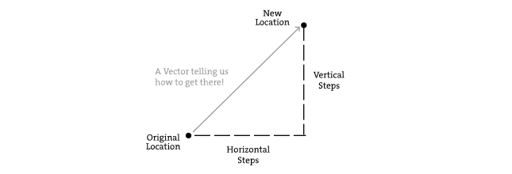

If velocity is a vector (the difference between two points), what is
location? Is it a vector too? Technically, one might argue that
location is not a vector, it's not describing the change between two
points, it's simply describing a singular point in space -- a
location. And so conceptually, we think of a location as different: a
single point rather than the difference between two points.

Nevertheless, another way to describe a location is as the path taken
from the origin to reach that location. Hence, a location can be
represented as the vector giving the difference between location and
origin. Therefore, if we were to write code to describe a vector
object, instead of creating separate Point and Vector classes, we can
use a single class which is more convenient.

Let's examine the underlying data for both location and velocity. In
the bouncing ball example we had the following:

.. math::

   \begin{align*}
   location &\to \mathtt{x}, \mathtt{y} \\
   velocity &\to \mathtt{xspeed}, \mathtt{yspeed}
   \end{align*}

Notice how we are storing the same data for both -- two numbers, an
``x`` and a ``y``. If we were to write a vector class ourselves, we'd
start with something rather basic:

.. code:: python

    class Vector:
        def __init__(self, x, y):
            self.x = x
            self.y = y

At its core, a :meth:`p5.Vector` is just a convenient way to store two
values (or three, as we'll see in 3D examples.).

And so this...

.. code:: python

   x = 100
   y = 100
   xspeed = 1
   yspeed = 3.3

...becomes...

.. code:: python

   location = Vector(100, 100)
   velocity = Vector(1, 3.3)

Now that we have two vector objects (``location`` and ``velocity``),
we're ready to implement the algorithm for motion -- ``location =
location + velocity``. In the bouncing ball example, without vectors,
we had:

.. code:: python

   # add the current speed to the location
   x = x + xspeed
   y = y + yspeed

By default Python's ``+`` operator works on primitive values, however
we can teach Python to add two vectors together using the ``+``
operator. The :class:`p5.Vector` class is implemented with functions
for common mathematical operations using the usual operators(``+`` for
addition, ``*`` for multiplication, etc) These allow us to rewrite the
above as:

.. code:: python

   # add the current speed to the location
   location = location + velocity

Vectors: Addition
=================

Before we continue looking at the :class:`p5.Vector` class and its
:meth:`p5.Vector.__add__` method (purely for the sake of learning
since it's already implemented for us in Processing itself), let's
examine vector addition using the notation found in math/physics
textbooks.

Vectors are typically written as with either boldface type or with an
arrow on top. For the purposes of this tutorial, to distinguish a
**vector** from a **scalar** (scalar refers to a single value, such as
integer or floating point), we'll use an arrow on top:

Vector: :math:`\vec v`

Scalar: :math:`x`

Let's say I have the following two vectors:

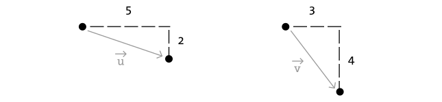

.. math::

   \vec u = \begin{pmatrix} 5 \\ 2 \end{pmatrix},
   \qquad
   \vec v = \begin{pmatrix} 3 \\ 4 \end{pmatrix}

Each vector has two components, an :math:`x` and a :math:`y`. To add
two vectors together we simply add both :math:`x` 's and both
:math:`y` 's. In other words:

.. math::

   \vec w = \vec u + \vec v

translates to:

.. math::
   
   \begin{align*}
   w_x &= u_x + v_x \\
   w_y &= u_y + v_y
   \end{align*}

and therefore

.. math::

   \vec w = \begin{pmatrix} 8 \\ 6 \end{pmatrix}

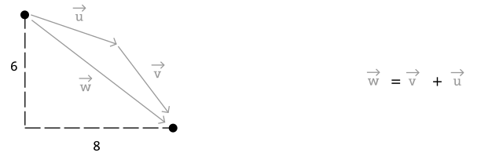

Now that we understand how to add two vectors together, we can look at
how addition is implemented in the :class:`p5.Vector` class itself.
Let's write a function called ``__add__`` that takes as its argument
another :class:`p5.Vector` object.

.. code:: python

    class Vector:
        def __init__(self, x, y):
            self.x = x
            self.y = y

        # New! A function to add another Vector to this vector. Simply
        # add the x components and the y components together.
        def __add__(self, v):
            self.x = self.x + v.x
            self.y = self.y + v.y
            return self
            
Now that we can how ``__add__`` is written inside of
:class:`p5.Vector`, we can return to the ``location + velocity``
algorithm with our bouncing ball example and implement vector
addition:

.. code:: python

   # add the current speed to the location
   location = location + velocity

And here we are, ready to successfully complete our first goal --
rewrite the entire bouncing ball example using :class:`p5.Vector`.

.. code:: python

    from p5 import *

    class Vector:
        def __init__(self, x, y):
            self.x = x
            self.y = y

        def __add__(self, v):
            self.x = self.x + v.x
            self.y = self.y + v.y
            return self

    location = Vector(100, 100)
    velocity = Vector(1, 3.3)

    def setup():
        size(200, 200)
        background(255)

    def draw():
        global location
        global velocity

        no_stroke()
        fill(255, 10)
        rect((0, 0), width, height)

        # add the current speed to the location
        location = location + velocity

        # We still sometimes need to refer to the individual
        # components of a Vector and can do so using the dot syntax
        # (location.x, velocity.y, etc)
        if location.x > width or location.x < 0:
            velocity.x = -velocity.x

        if location.y > height or location.y < 0:
            velocity.y = -velocity.y

        # display circle at x location
        stroke(0)
        fill(175)
        circle((location.x, location.y), 16)

    if __name__ == '__main__':
        run()

Now, you might feel somewhat disappointed. After all, this may
initially appear to have made the code more complicated than the
original version. While this is a perfectly reasonable and valid
critique, it's important to understand that we haven't fully realized
the power of programming with vectors just yet. Looking at a simple
bouncing ball and only implementing vector addition is just the first
step. As we move forward into looking at more a complex world of
multiple objects and multiple forces (we'll cover forces in the next
chapter), the benefits of :class:`p5.Vector` will become more
apparent.

We should, however, make note of an important aspect of the above
transition to programming with vectors. Even though we are using
``Vector`` objects to describe two values -- the x and y of location
and the x and y of velocity -- we still often need to refer to the x
and y components of each ``Vector`` individually. When we go to drawn
an object, there is no means for us to say (using our own ``Vector``
class):

.. code:: python

   circle(location, 16)

The :meth:`p5.circle` function does not understand the ``Vector``
class we've just written. However this functionality has been
implemented in p5's :class:`p5.Vector` class. For our own class, we
must dig into the ``Vector`` object and pull out the x and the y
components using object oriented syntax.

.. code:: python

   circle((location.x, location.y), 16)

The same issue arises when it comes time to test if the circle has
reached the edge of the window, and we need to access the individual
components of both vectors: location and velocity.

.. code:: python
   
   if location.x > width or location.x < 0:
          velocity.x = -velocity.x

Vectors: More Algebra
=====================

Addition was really just the first step. There is a long list of
common mathematical operations that are used with vectors when
programming the motion of objects on the screen. Following is a
comprehensive list of all of the mathematical operations available as
functions in the :class:`p5.Vector` class. We'll then go through a few
of the key ones now. As our examples get more and more sophisticated
we'll continue to reveal the details of these functions.

* ``u + v`` -- add vectors
* ``u - v`` -- subtract vectors
* ``k * u`` -- scale the vector with multiplication
* ``u / k`` -- scale the vector with division
* :meth:`p5.Vector.magnitude` -- calculate the magnitude of a vector
* :meth:`p5.Vector.normalize` -- normalize the vector to unit length
  of 1
* :meth:`p5.Vector.limit` -- limit the magnitude of a vector
* :meth:`p5.Vector.angle` -- the heading of a vector expressed as an
  angle
* :meth:`p5.Vector.distance` -- the euclidean distance between two
  vectors (considered as points)
* :meth:`p5.Vector.angle_between` -- find the angle between two
  vectors
* :meth:`p5.Vector.dot` -- the dot product of two vectors
* :meth:`pt.Vector.cross` -- the cross product of two vectors

Having already run through addition, let's start with subtraction.
This one's not so bad, just take the plus sign from addition and
replace it with a minus!

Vector subtraction:

.. math::

   \vec w = \vec u - \vec v

translates to:

.. math::
   
   \begin{align*}
   w_x &= u_x - v_x \\
   w_y &= u_y - v_y
   \end{align*}

and the function inside our ``Vector`` therefore looks like:

.. code:: python

   def __sub__(self, v):
       self.x = self.x - v.x
       self.y = self.y - v.y
       return self

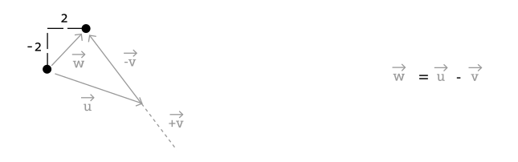

Following is an example that demonstrates vector subtraction by taking
the difference between two points -- the mouse location and the center
of the window.

.. figure:: ./vector-res/vector_sub.jpg
   :align: left
   
.. code:: python

    from p5 import *

    class Vector:
        def __init__(self, x, y):
            self.x = x
            self.y = y

        def __add__(self, v):
            self.x = self.x + v.x
            self.y = self.y + v.y
            return self

        def __sub__(self, v):
            self.x = self.x - v.x
            self.y = self.y - v.y
            return self

    def setup():
        size(200, 200)

    def draw():
        background(255)

        # Two vectors, one for the moust location and one ofr the center
        # of the window
        mouse = Vector(mouse_x, mouse_y)
        center = Vector(width / 2, height / 2)

        # Vector subtraction!
        mouse = mouse - center

        # Draw a line to represent the vector
        translate(center.x, center.y)
        line((0, 0), (mouse.x, mouse.y))

    if __name__ == '__main__':
        run()

.. note::

   Both addition and subtraction with vectors follows the same
   algebraic rules as with real numbers.

   * The commutative rule: :math:`\vec u + \vec v = \vec v + \vec u`
   * The associative rule: :math:`\vec u + (\vec v + \vec w) = (\vec
     u + \vec v) + \vec w`

   The fancy terminology and symbols aside, this is really quite a
   simple concept. We're just saying that common sense properties of
   addition apply with vectors as well.

   .. math:: 

      3 + 2 = 2 + 3

   .. math:: 

      (3 + 2) + 1 = 3 + (2 + 1) 

Moving onto multiplication, we have to think a little bit differently.
When we talk about multiplying a vector what we usually mean is
scaling a vector. Maybe we want a vector to be twice its size or
one-third its size, etc. In this case, we are saying "Multiply a
vector by 2" or "Multiply a vector by 1/3". Note we are multiplying a
vector by a scalar, a single number, not another vector.

To scale a vector by a single number, we multiply each component (x
and y) by that number.

Vector multiplication:

.. math::

   \vec w = \vec v \cdot n

translates to:

.. math::

   \begin{align*}
   w_x &= v_x \cdot n \\
   w_y &= v_y \cdot n \\
   \end{align*}

Let's look at an example with vector notation.

.. math::

   \begin{align*}
   \vec u &= \begin{pmatrix} -3 \\ 7 \end{pmatrix},
   \quad
   n = 3 \\
   w &= u \cdot n \\
   w_x &= -3 \cdot 3\\
   w_y &= 7 \cdot 3\\
   \vec w &= \begin{pmatrix} -9 \\ 21 \end{pmatrix}
   \end{align*}
   
.. figure:: ./vector-res/mult.svg
   :align: center

The function inside the ``Vector`` class therefore is written as:

.. code:: python

    def __mul__(self, n):
        # With multiplication, all components of a vector are
        # multiplied by a number
        self.x = self.x * n
        self.y = self.y * n
        return self

And implementing multiplication in code is as simple as:

.. code:: python

   u = Vector(-3, 7)

   # this vector is now three times the size and is equal to (-9, 21)
   u = u * 3

.. figure:: ./vector-res/vector_mult.jpg
   :align: left
   
.. code:: python

    from p5 import *

    class Vector:
        def __init__(self, x, y):
            self.x = x
            self.y = y

        def __add__(self, v):
            self.x = self.x + v.x
            self.y = self.y + v.y
            return self

        def __sub__(self, v):
            self.x = self.x - v.x
            self.y = self.y - v.y
            return self

        def __mul__(self, n):
            self.x = self.x * n
            self.y = self.y * n
            return self

    def setup():
        size(200, 200)

    def draw():
        background(255)

        mouse = Vector(mouse_x, mouse_y)
        center = Vector(width / 2, height / 2)
        mouse = mouse - center

        # Vector multiplication!
        # The vector is now half its original size (multiplied by (1 / 2))
        mouse = mouse * (1 / 2)

        translate(center.x, center.y)
        line((0, 0), (mouse.x, mouse.y))

    if __name__ == '__main__':
        run()

Division is exactly the same as multiplication, only of course using
divide instead of multiply.

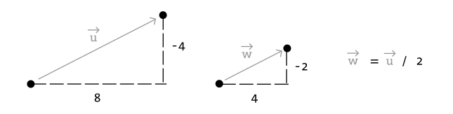

.. code:: python

   def __truediv__(self, n):
       self.x = self.x / n
       self.y = self.y / n
       return self

   # ...

   u = Vector(8, -4)
   u = u / 2

.. note::
   
   As with addition, basic algebraic rules of multiplication and
   division apply to vectors.

   * The associative rule: :math:`(n \cdot m) \cdot \vec v = n \cdot
     (m \cdot \vec v)`
   * The distributive rule, 2 scalars, 1 vector: :math:`(n + m) \cdot
     \vec v = n \cdot \vec v + m \cdot \vec v`
   * The distributive rule, 2 vectors, 1 scalar: :math:`(\vec u +
     \vec v) \cdot n`

Vectors: Magnitude
==================

Multiplication and division, as we just saw, is a means by which the
length of the vector can be changed without affecting direction. And
so, perhaps you're wondering: "Ok, so how do I know what the length of
a vector is?" I know the components (x and y), but I don't know how
long (in pixels) that actual arrow is itself?!

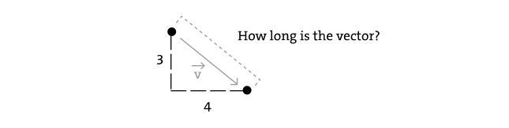

The length or "magnitude" of a vector is often written as:
:math:`\|\vec v\|`

Understanding how to calculate the length (referred from here on out
as magnitude) is incredibly useful and important.

Notice in the above diagram how when we draw a vector as an arrow and
two components (x and y), we end up with a right triangle. The sides
are the components and the hypotenuse is the arrow itself. We're very
lucky to have this right triangle, because once upon a time, a Greek
mathematician named Pythagoras developed a nice formula to describe
the relationship between the sides and hypotenuse of a right triangle.

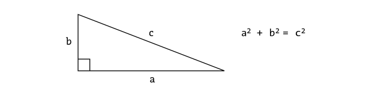

The Pythagorean theorem: a squared plus b squared equals c squared.

Armed with this lovely formula, we can now compute the magnitude of as
follows:

.. math::

   \|\vec v\| = \sqrt{v_x^2 + y_y^2}

or in ``Vector``:

.. code::

   def mag(self):
       return sqrt(self.x * self.x + self.y + self.y)

.. figure:: vector-res/vector_mag.jpg
   :align: left

.. code:: python

    from p5 import *

    class Vector:
        def __init__(self, x, y):
            self.x = x
            self.y = y

        def __add__(self, v):
            self.x = self.x + v.x
            self.y = self.y + v.y
            return self

        def __sub__(self, v):
            self.x = self.x - v.x
            self.y = self.y - v.y
            return self

        def __mul__(self, n):
            self.x = self.x * n
            self.y = self.y * n
            return self

        def __div__(self, n):
            self.x = self.x / n
            self.y = self.y / n
            return self

        def mag(self):
            return sqrt(self.x * self.x + self.y * self.y)

    def setup():
        size(200, 200)

    def draw():
        background(255)

        mouse = Vector(mouse_x, mouse_y)
        center = Vector(width / 2, height / 2)
        mouse = mouse - center

        # The magnitude (i.e., the length) of a vector can be accessed by
        # the mag() function. Here it is used as the width of a rectangle
        # drawn at the top of the window.
        m = mouse.mag()
        fill(0)
        rect((0, 0), m, 10)

        translate(center.x, center.y)
        line((0, 0), (mouse.x, mouse.y))

    if __name__ == '__main__':
        run()

Vectors: Normalizing
====================

Calculating the magnitude of a vector is only the beginning. The
magnitude function opens the door to many possibilities, the first of
which is **normalization**. Normalizing refers to the process of
making something "standard" or, well, "normal." In the case of
vectors, let's assume for the moment that a standard vector has a
length of one. To normalize a vector, therefore, is to take a vector
of any length and, keeping it pointing in the same direction, change
its length to one, turning it into what is referred to as a **unit
vector**.

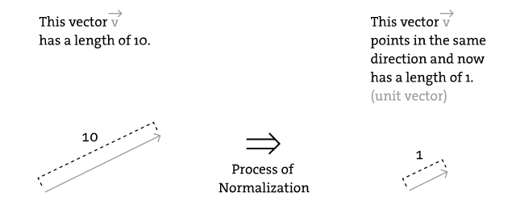

Being able to quickly access the unit vector is useful since it
describes a vector's direction without regard to length. For any given
vector :math:`\vec u`, its unit vector (written as :math:`\hat u`) is
calculated as follows:

.. math::

   \hat u = \frac{\vec u}{\|\vec u\|}

In other words, to normalize a vector, simply divide each component by
its magnitude. This makes pretty intuitive sense. Say a vector is of
length 5. Well, 5 divided by 5 is 1. So looking at our right triangle,
we then need to scale the hypotenuse down by dividing by 5. And so in
that process the sides shrink, dividing by 5 as well.

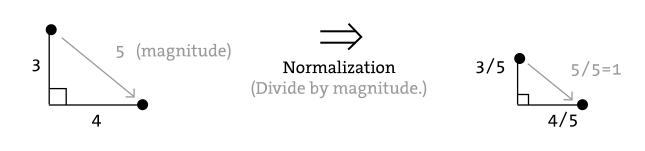

In the ``Vector`` class, we therefore write our normalization function
as follows:

.. code:: python

   def normalize(self):
       m = self.mag()
       self = self / m

Of course, there's one small issue. What if the magnitude of the
vector is zero? We can't divide by zero! Some quick error checking
will fix that right up:

.. code:: python

   def normalize(self):
       m = self.mag()
       if not (m == 0):
           self = self / m

.. figure:: ./vector-res/vector_norm.jpg
   :align: left

.. code:: python

    from p5 import *

    class Vector:
        def __init__(self, x, y):
            self.x = x
            self.y = y

        def __add__(self, v):
            self.x = self.x + v.x
            self.y = self.y + v.y
            return self

        def __sub__(self, v):
            self.x = self.x - v.x
            self.y = self.y - v.y
            return self

        def __mul__(self, n):
            self.x = self.x * n
            self.y = self.y * n
            return self

        def __truediv__(self, n):
            self.x = self.x / n
            self.y = self.y / n
            return self

        def mag(self):
            return sqrt(self.x * self.x + self.y * self.y)

        def normalize(self):
            m = self.mag()
            if not (m == 0):
                self = self / m

    def setup():
        size(200, 200)

    def draw():
        background(255)

        mouse = Vector(mouse_x, mouse_y)
        center = Vector(width / 2, height / 2)
        mouse = mouse - center

        # in this example, after the vector is normalized it is multiplied
        # by 50 so that it is viewable on screen. Note that no matter
        # where the mouse is, the vector will have the same length (50),
        # due to the normalization process
        mouse.normalize()
        mouse = mouse * 50

        translate(center.x, center.y)
        line((0, 0), (mouse.x, mouse.y))

    if __name__ == '__main__':
        run()

Vectors: Motion
===============

Why should we care? Yes, all this vector math stuff sounds like
something we should know about, but why exactly? How will it actually
help me write code? The truth of the matter is that we need to have
some patience. The awesomeness of using the PVector class will take
some time to fully come to light. This is quite common actually when
first learning a new data structure. For example, when you first learn
about an array, it might have seemed like much more work to use an
array than to just have several variables to talk about multiple
things. But that quickly breaks down when you need a hundred, or a
thousand, or ten thousand things. The same can be true for ``Vector``.
What might seem like more work now will pay off later, and pay off
quite nicely.

For now, however, we want to focus on simplicity. What does it mean to
program motion using vectors? We've seen the beginning of this in this
book's first example: the bouncing ball. An object on screen has a
location (where it is at any given moment) as well as a velocity
(instructions for how it should move from one moment to the next).
Velocity gets added to location:

.. code:: python

   location = location + velocity

And then we draw the object at that location:

.. code:: python

   circle((location.x, location.y), 16)

This is Motion 101.

* Add velocity to location
* Draw object at location

In the bouncing ball example, all of this code happened in
Processing's main tab, within :meth:`p5.setup` and :meth:`p5.draw`
What we want to do now is move towards encapsulating all of the logic
for motion inside of a class this way we can create a foundation for
programming moving objects in Processing. We'll take a quick moment to
review the basics of object-oriented programming in this context now,
but this book will otherwise assume knowledge of working with objects
(which will be necessary for just about every example from this point
forward). However, if you need a further refresher, I encourage you to
check out the :doc:`OOP Tutorial <objects>`

The driving principle behind object-oriented programming is the
bringing together of data and functionality. Take the prototypical OOP
example: a car. A car has data -- ``color, size, speed``, etc. A car
has functionality -- ``drive(), turn(), stop()``, etc. A car class
brings all that stuff together in a template from which car instances,
i.e. objects, are made. The benefit is nicely organized code that
makes sense when you read it.

.. code:: python

   c = Car(red, big, fast)
   c.drive()
   c.turn()
   c.stop()

In our case, we're going to create a generic "Mover" class, a class to
describe a shape moving about the screen. And so we must consider the
following two questions:

#. What data does a Mover have?
#. What functionality does a Mover have?

Our "Motion 101" algorithm tells us the answers to these questions.
The data an object has is its location and its velocity, two
:class:`p5.Vector` objects.

.. code:: python

   class Mover:
       def __init__(self, ...):
           self.location = Vector(...)
           self.velocity = Vector(...)

.. note::

   To keep our code concise, we're now switching to the
   :class:`p5.Vector` class that comes with p5. So we can remove the
   custom ``Vector`` code that we wrote from our main sketch.
   
Its functionality is just about as simple. It needs to move and it
needs to be seen. We'll implement these as functions named
``update()`` and ``display()``. ``update()`` is where we'll put all of
our motion logic code and ``display()`` is where we will draw the object.

.. code:: python

   def update(self):
       self.location = self.location + self.velocity

   def display(self):
       stroke(0)
       fill(175)
       circle(self.location, 16)

We've forgotten one crucial item, however, the object's
**constructor** . The constructor is a special function inside of a
class that creates the instance of the object itself. It is where you
give the instructions on how to set up the object. In Python this
constructor should always be called ``__init__``. It gets called
whenever we create a new object using ``my_car = Car()``.

.. important::

   All methods defined in a class in Python require ``self`` as the
   first parameter.

In our case, let's just initialize our mover object by giving it a
random location and a random velocity.

.. code:: python

   class Mover:
       def __init__(self, width, height):
           self.location = Vector(random_uniform(width),
                                  random_uniform(height))

           self.velocity = Vector(random_uniform(low=-2, high=2),
                                  random_uniform(low=-2, high=2))

Let's finish off the Mover class by incorporating a function to
determine what the object should do when it reaches the edge of the
window. For now let's do something simple, and just have it wrap
around the edges.

.. code:: python

   def check_edges(self):
       if self.location.x > width:
           self.location.x = 0

       if self.location.x < 0:
           self.location.x = width

       if self.location.y > height:
           self.location.y = 0

       if self.location.y < 0:
           self.location.y = height
        
Now that the Mover class is finished, we can then look at what we need
to do in our main program. We first declare a placeholder for a Mover
object:

.. code:: python

   mover = None

Then initialize the mover in :meth:`p5.setup`:

.. code:: python

   mover = Mover(width, height)
   
and call the appropriate functions in draw():

.. code:: python

     mover.update()
     mover.check_edges()
     mover.display()

Here is the entire example for reference:

.. figure:: ./vector-res/vector_motion.jpg
   :align: left

.. code:: python

    from p5 import *

    mover = None

    class Mover:
        def __init__(self):
            # our object has two Vectors: location and velocity
            self.location = Vector(random_uniform(width),
                                   random_uniform(height))

            self.velocity = Vector(random_uniform(low=-2, high=2),
                                   random_uniform(low=-2, high=2))

        def update(self):
            # Motion 101: Locations change by velocity
            self.location = self.location + self.velocity

        def display(self):
            stroke(0)
            fill(175)
            circle(self.location, 16)

        def check_edges(self):
            if self.location.x > width:
                self.location.x = 0

            if self.location.x < 0:
                self.location.x = width

            if self.location.y > height:
                self.location.y = 0

            if self.location.y < 0:
                self.location.y = height

    def setup():
        global mover
        size(200, 200)
        background(255)

        # make the mover object
        mover = Mover()

    def draw():
        no_stroke()
        fill(255, 10)
        rect((0, 0), width, height)

        # call functions on Mover object
        mover.update()
        mover.check_edges()
        mover.display()

    if __name__ == '__main__':
        run()

Ok, at this point, we should feel comfortable with two things -- (1)
What is a :class:`p5.Vector`? and (2) How do we use Vectors inside of
an object to keep track of its location and movement? This is an
excellent first step and deserves an mild round of applause. For
standing ovations and screaming fans, however, we need to make one
more, somewhat larger, step forward. After all, watching the Motion
101 example is fairly boring -- the circle never speeds up, never
slows down, and never turns. For more interesting motion, for motion
that appears in the real world around us, we need to add one more
Vector to our class -- acceleration.

The strict definition of acceleration that we are using here is: **the
rate of change of velocity**. Let's think about that definition for a
moment. Is this a new concept? Not really. Velocity is defined as:
**the rate of change of location**. In essence, we are developing a
"trickle down" effect. Acceleration affects velocity which in turn
affects location (for some brief foreshadowing, this point will become
even more crucial in the next chapter when we see how forces affect
acceleration which affects velocity which affects location.) In code,
this reads like this:

.. code:: python

   velocity = velocity + acceleration
   location = location + velocity

As an exercise, from this point forward, let's make a rule for
ourselves. Let's write every example in the rest of this book without
ever touching the value of velocity and location (except to initialize
them). In other words, our goal now for programming motion is as
follows -- come up with an algorithm for how we calculate acceleration
and let the trickle down effect work its magic. And so we need to come
up with some ways to calculate acceleration:

ACCELERATION ALGORITHMS!

#. Make up a constant acceleration
#. A totally random acceleration
#. Perlin noise acceleration
#. Acceleration towards the mouse

Number one, though not particularly interesting, is the simplest, and
will help us get started incorporating acceleration into our code. The
first thing we need to do is add another :class:`p5.Vector` to the
Mover class:

.. code:: python

   class Mover:
       def __init__(self):
           location = Vector(...)
           velocity = Vector(...)

           # A new Vector for acceleration
           acceleration = Vector(...)

And incorporate acceleration into the ``update()`` function:

.. code:: python

   def update(self):
       # our motion algorithm is now two lines of code:
       self.velocity = self.velocity + self.acceleration
       self.location = self.location + self.velocity

We're almost done. The only missing piece is the actual initialization
in the constructor.

Let's start the object in the middle of the window..

.. code:: python

   self.location = Vector(width / 2, height / 2)

...with an initial velocity of zero.

.. code:: python

   self.velocity = Vector(0, 0)

This means that when the sketch starts, the object is at rest. We
don't have to worry about velocity anymore as we are controlling the
object's motion entirely with acceleration. Speaking of which,
according to "algorithm #1" our first sketch involves constant
acceleration. So let's pick a value.

.. code:: python

   self.acceleration = Vector(-0.001, 0.01)

Are you thinking -- "Gosh, those values seem awfully small!" Yes,
that's right, they are quite tiny. It's important to realize that our
acceleration values (measured in pixels) accumulate into the velocity
over time, about thirty times per second depending on our sketch's
frame rate. And so to keep the magnitude of the velocity vector within
a reasonable range, our acceleration values should remain quite small.
We can also help this cause by incorporating the Vector function
:meth:`p5.Vector.limit`

.. code:: python

   # the limit() function constrains the magnitude of the vector
   self.velocity.limit(10)

This translates to the following:

    What is the magnitude of velocity? If it's less than 10, no
    worries, just leave it whatever it is. If it's more than 10,
    however, shrink it down to 10!

Let's take a look at the changes to the Mover class now, complete with
acceleration and ``limit()``.

.. figure:: ./vector-res/vector_acc.jpg
   :align: left

.. code:: python

    class Mover:
        def __init__(self):
            self.location = Vector(width / 2, height / 2)
            self.velocity = Vector(0, 0)

            # Acceleration is the key!
            self.acceleration = Vector(-0.001, 0.01)

            # this will limit the magnitude of velocity
            self.top_speed = 10

        def update(self):
            self.velocity = self.velocity + self.acceleration
            self.velocity.limit(self.top_speed)
            self.location = self.location + self.velocity

        # rest of the methods are the same

Ok, algorithm #2 -- "a totally random acceleration." In this case,
instead of initializing acceleration in the object's constructor we
want to pick a new acceleration each cycle, i.e. each time update() is
called.

.. figure:: ./vector-res/vector_acc.jpg
   :align: left

.. code:: python

    def update(self):
        acc_x = random_uniform(low=(-1), high=1)
        acc_y = random_uniform(low=(-1), high=1)
        self.acceleration = Vector(acc_x, acc_y)
        self.acceleration.normalize()

        self.velocity = self.velocity + self.acceleration
        self.velocity.limit(self.top_speed)
        self.location = self.location + self.velocity

While normalizing acceleration is not entirely necessary, it does
prove useful as it standardizing the magnitude of the vector, allowing
us to try different things, such as:

#. scaling the acceleration to a constant value

   .. code:: python

       acc_x = random_uniform(low=(-1), high=1)
       acc_y = random_uniform(low=(-1), high=1)
       self.acceleration = Vector(acc_x, acc_y)
       self.acceleration.normalize()

       self.acceleration = self.acceleration * 0.5

#. scaling the acceleration to a random value

   .. code:: python

       acc_x = random_uniform(low=(-1), high=1)
       acc_y = random_uniform(low=(-1), high=1)
       self.acceleration = Vector(acc_x, acc_y)
       self.acceleration.normalize()

       self.acceleration = self.acceleration * random_uniform(2)

While this may seem like an obvious point, it's crucial to understand
that acceleration does not merely refer to the speeding up or slowing
down of a moving object, but rather any change in velocity, either
magnitude or direction. Acceleration is used to steer an object, and
it is the foundation of learning to program an object that make
decisions about how to move about the screen.

.. todo:: should the next section be adapted to Python? -- @abhikpal
   (2018-08-10)

..
   <h3>Vectors: Static vs. Non-Static</h3>

   Before we get to acceleration algorithm #4 (accelerate towards the
   mouse), we need to cover one more rather important aspect of
   working with vectors and the PVector class, the difference between
   using static methods and non-static methods.

   Forgetting about vectors for a moment, take a look at the following code:

   <pre>
   float x = 0;
   float y = 5;

   x = x + y;
   </pre>

   Pretty simple right? x has the value of 0, we add y to it, and now
   x is equal to 5. We could write the corresponding code pretty
   easily based on what we've learned about PVector.

   <pre>
   PVector v = new PVector(0,0);
   PVector u = new PVector(4,5);
   v.add(u);
   </pre>

   The vector v has the value of (0,0), we add u to it, and now v is
   equal to (4,5). Easy, right?

   Ok, let's take a look at another example of some simply floating
   point math:

   <pre>
   float x = 0;
   float y = 5;

   float z = x + y;
   </pre>

   x has the value of 0, we add y to it, and <strong>store the result
   in a new variable z</strong>. The value of x is not changed in this
   example (neither is y)! This may seem like a trivial point, and one
   that is quite intuitive when it comes to mathematical operations
   with floats. However, it's not so obvious when it comes to
   mathematical operations with PVector. Let's try to write the code
   based on what we know so far.

   <pre>
   PVector v = new PVector(0,0);
   PVector u = new PVector(4,5);
   PVector w = v.add(u); <strong>// Don't be fooled, this is incorrect!!!</strong>
   </pre>

   The above might seem like a good guess, but it's just not the way
   the PVector class works. If we look at the definition of <strong><a
   href="http://processing.org/reference/PVector_add_.html"><em>add()</em></a></strong>
   . . .

   <pre>

    void add(PVector v) {
       x = x + v.x;
       y = y + v.y;
    }
   </pre>

   . . . we see that it does not accomplish our goal. Number one, it
   does not return a new PVector and number two, it changes the value
   of the PVector upon which it is called. In order to add two PVector
   objects together and return the result as a new PVector, we must
   use the static <strong><a
   href="http://processing.org/reference/PVector_add_.html"><em>add()</em></a></strong>
   function.

   Functions that we call from the class name itself (rather than from
   a specific object instance) are known as <strong>static</strong>
   functions.

   <pre>
   // Assuming two PVector objects: v and u
   // Static: called off of the class name.
   PVector.add(v,u);
   // Not static: called off of an object instance.
   v.add(u);
   </pre>

   Since you can't write <strong>static</strong> functions yourself in
   Processing, it is something you might not have encountered before.
   In the case of PVector, it allows us to generically perform
   mathematical operations on PVector objects, without having the
   adjust the value of one of the input PVector's. Let's look at how
   we might write the static version of add:

   <pre>
     static PVector add(PVector v1, PVector v2) {
       PVector v3 = new PVector(v1.x + v2.x, v1.y + v2.y);
       return v3;
     }
   </pre>

   There are two key differences here:

   <ul>
       <li>The function is labeled as <strong>static</strong>.</li>
       <li>The function creates a new PVector (v3) and returns the
       result of adding the components of v1 and v2 in that new
       PVector.</li>
   </ul>

   When you call a static function, instead of referencing an actual
   object instance, you simply reference the name of the class itself.

   <pre>
   PVector v = new PVector(0,0);
   PVector u = new PVector(4,5);
   <del>PVector w = v.add(u);</del>
   // The static version of add allows us to add two PVectors 
   // together and assign the result to a new PVector while 
   // leaving the original PVectors (v and u) intact.
   PVector w = PVector.add(v,u);
   </pre>

   The PVector class has static versions of <strong><a
   href="http://processing.org/reference/PVector_add_.html"><em>add()</em></a></strong>,
   <strong><a
   href="http://processing.org/reference/PVector_sub_.html"><em>sub()</em></a></strong>,
   <strong><a
   href="http://processing.org/reference/PVector_mult_.html"><em>mult()</em></a></strong>,
   <strong><a
   href="http://processing.org/reference/PVector_div_.html"><em>div()</em></a></strong>.

   <h3>Vectors: Chaining</h3>

   
One detail left out of the above discussion is that all of the
   methods discussed above return an object of type PVector. The key
   distinction is that the static versions return a <b>new</b> PVector
   object rather than act on the existing one. The non-static versions
   return a reference to that existing one. While this feature is not
   typically used in most Processing examples, it allows for the
   methods to be called in a single line of code. This is known as
   <em>chaining</em>. For example, let's say you would like to add to
   a PVector and then multiply it by two.

   <pre>
     PVector a = new PVector(0, 0);
     // Add (5,3) to a
     a.add(5, 3);
     // Multiply a by 2
     a.mult(2);
   </pre>

   
With chaining the above can be written as:

   <pre>
     PVector a = new PVector(0, 0);
     a.add(5, 3).mult(2);
   </pre>

Vectors: Interactivity
======================

Ok, to finish out this tutorial, let's try something a bit more
complex and a great deal more useful. Let's dynamically calculate an
object's acceleration according to a rule, acceleration algorithm #4
-- "the object accelerates towards the mouse."

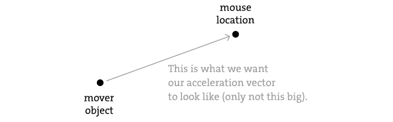

Anytime we want to calculate a vector based on a rule/formula, we need
to compute two things: **magnitude** and **direction**. Let's start
with direction. We know the acceleration vector should point from the
object's location towards the mouse location. Let's say the object is
located at the point ``(x, y)`` and the mouse at ``(mouse_x,
mouse_y)``.

.. figure:: ./vector-res/mouseaccelerate2.svg
   :align: center

As illustrated in the above diagram, we see that we can get a vector
(dx, dy) by subtracting the object's location from the mouse's
location. After all, this is precisely where we started this chapter
-- the definition of a vector is "the difference between two points in
space!"

.. code:: python

   dx = mouse_x - x
   dy = mouse_y - y

Let's rewrite the above using Vector syntax. Assuming we are in the
Mover class and thus have access to the object's location Vector, we
then have:

.. code:: python

   mouse = Vector(mouse_x, mouse_y)
   direction = mouse - self.location

We now have a Vector that points from the mover's location all the
way to the mouse. If the object were to actually accelerate using
that vector, it would instantaneously appear at the mouse location.
This does not make for good animation, of course, and what we want to
do is now decide how fast that object should accelerate towards the
mouse.

In order to set the magnitude (whatever it may be) of our acceleration
PVector, we must first **________** that direction vector. That's
right, you said it. **Normalize**. If we can shrink the vector down to
its unit vector (of length one) then we have a vector that tells us
the direction and can easily be scaled to any value. One multiplied by
anything equals anything.

.. code:: python

   anything = some_number
   direction.normalize()
   direction = direction * anything
   
To summarize, we have the following steps:
   
#. Calculate a vector that points from the object to the target
   location (mouse).
#. Normalize that vector (reducing its length to 1)
#. Scale that vector to an appropriate value (by multiplying it by
   some value)
#. Assign that vector to acceleration

And here are those steps in the update() function itself:

.. figure:: ./vector-res/vector_mouse1.jpg
   :align: left

.. code:: python

    def update(self):
        mouse = Vector(mouse_x, mouse_y)

        # Step 1. direction
        direction = mouse - self.location

        # Step 2: normalize
        direction.normalize()

        # Step 3: scale
        direction = direction * 0.5

        # Step 4: accelerate
        self.acceleration = direction;

        self.velocity = self.velocity + self.acceleration
        self.velocity.limit(self.top_speed)
        self.location = self.location + self.velocity

.. note::
   *Why doesn't the circle stop when it reaches the target?*

   The object moving has no knowledge about trying to stop at a
   destination, it only knows where the destination is and tries to go
   there as fast as possible. Going as fast as possible means it will
   inevitably overshoot the location and have to turn around, again
   going as fast as possible towards the destination, overshooting it
   again, and so on, and so forth. Stay tuned for later chapters where
   we see how to program an object to "arrive"s at a location (slowing
   down on approach.)

Let's take a look at what this example would look like with an array
of Mover objects (rather than just one).

.. figure:: ./vector-res/vector_mouse2.jpg
   :align: left

.. code:: python

    from p5 import *

    num_movers = 20
    movers = []

    class Mover:
        def __init__(self):
            self.location = Vector(random_uniform(width),
                                   random_uniform(height))

            self.velocity = Vector(0, 0)
            self.acceleration = Vector(0, 0)
            self.top_speed = 4

        def update(self):
            # our algorithm for calculating acceleration
            mouse = Vector(mouse_x, mouse_y)

            # find vector pointing towards the mouse
            direction = mouse - self.location

            # normalize
            direction.normalize()

            # scale
            direction = direction * 0.5

            # set acceleration
            self.acceleration = direction;

            self.velocity = self.velocity + self.acceleration
            self.velocity.limit(self.top_speed)
            self.location = self.location + self.velocity

        def display(self):
            stroke(0)
            fill(175)
            circle(self.location, 16)

        def check_edges(self):
            if self.location.x > width:
                self.location.x = 0

            if self.location.x < 0:
                self.location.x = width

            if self.location.y > height:
                self.location.y = 0

            if self.location.y < 0:
                self.location.y = height

    def setup():
        size(200, 200)
        background(255)

        # creating many mover objects
        for _ in range(num_movers):
            movers.append(Mover())

    def draw():
        no_stroke()
        fill(255, 10)
        rect((0, 0), width, height)

        # call functions on all objects in the array
        for mover in movers:
            mover.update()
            mover.check_edges()
            mover.display()

    if __name__ == '__main__':
        run()

