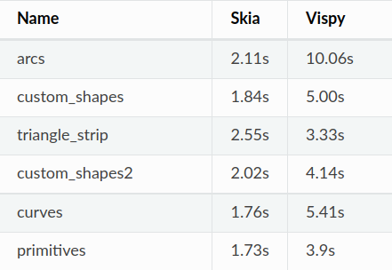
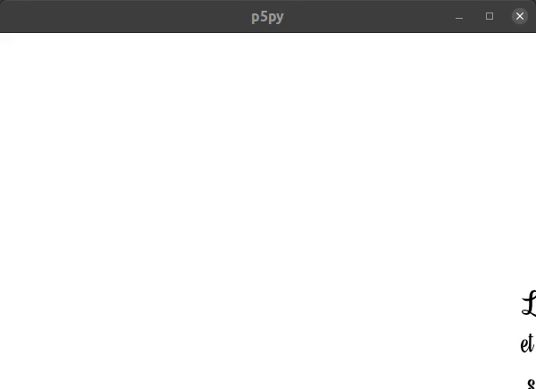
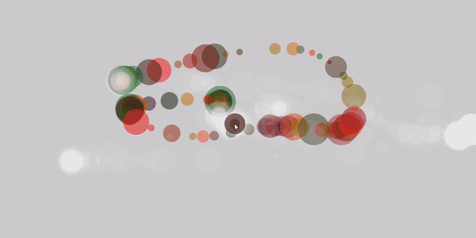
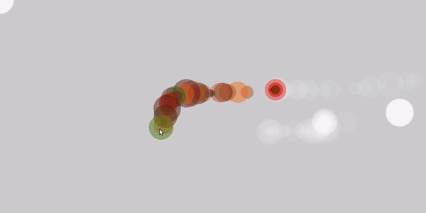

# Implementing a 2D backend renderer using Skia for p5py

| Project | [Implementing Skia Renderer](https://github.com/p5py/p5/issues/212) |
|---------|---------------------------------------------------------------------|
| Student | [Tushar Gupta](https://www.linkedin.com/in/tushar55/)               |
| GitHub  | [@tushar5526](https://github.com/tushar5526)                        |
| Repo    | [p5py](https://github.com/p5py/p5)                                  |
| Mentors | [Mark Zhang](https://github.com/ziyaointl)                          |

My open source journey started with [p5py](https://github.com/p5py) and I was very glad when the [Processing Foundation](undefined) offered to directly sponsor my GSoC project for the Summer’22 after not being able to direDraftctly get a slot under GSoC’22. I also owe this to my mentor **Mark Zhang **for all the selfless efforts he did for me to get this opportunity :)

## Project Description / Brief

p5py started as a GSoC project in 2017 with the aim to replicate Processing APIs in pure pythonic code. p5py used vispy to skip rewriting the native OpenGL code as Vispy provided very convenient APIs to accomplish the huge task of replicating all of the Processing APIs.

But, due to the increased abstraction layers, there was a significant decrease in both efficiency and quality of sketches.

My project specifically focused on improving the efficiency and quality of 2D sketches by implementing a new 2D renderer that uses [skia](https://skia.org/) for rendering.

## Major Milestones

* **Adding a visual testing suite before starting**: This was earlier a part of this proposal, but I contributed it before the GSoC period to help with the development.

* **Refactoring the library to support multiple renderers to draw:** Earlier versions of p5py design didn’t consider the possibility of having multiple renderers to draw sketches, hence the resulting code was highly coupled with vispy logic. This was contributed before the GSoC period as well.

* **Implementing the Skia Renderer:** After the refactoring, it was very easy to define different logic for different rendering backends depending upon the current renderer. This phase majorly dealt with figuring out the best practices to use skia to render sketches, considering different tradeoffs and discussions with mentors to take the right approach.

* **Rendering to an offscreen buffer:** Offscreen buffers were not present in vispy and the current library design to call public functions which drew onto a global buffer made it very challenging to support this API in p5py. Fortunately, with a bit of unconventional pythonic code, we were able to “bind” public functions to buffer objects. This was the most mind-boggling part of the whole project but it was fun to solve it.

## Results

There was a significant increase in both the efficiency and quality of sketches.

|                                                                           |
|:--------------------------------------------------------------------------------------:|
| *Profiling results comparing the time taken to draw 100 frames for different sketches* |

|  |
|:-----------------------------------------------------------------------:|
|      *Sketch drawn using skia has better efficiency and aliasing*       |

|  |
|:-------------------------------------------------------------------------------------------------------------------------------------------:|
|          *Skia’s inbuilt support for text led to a more complete typography APIs in p5py which are way more efficient than vispy*           |

|  |
|:---------------------------------------------------------------------------------------------------:|
|          *Sketches drawn had very less aliasing as compared to sketches drawn using vispy*          |

|  |
|:-----------------------------------------------------------------------:|
|      *Sketches drawn using vispy had comparatively more aliasing*       |

We can see there is a boost in the performance and quality of 2D sketches. The library is now refactored to support more renderers in the future, also there are different GHAs set up for housekeeping and CI.

The skia renderer is now released as a beta version and up for community use. We are hoping to use it as the default 2D renderer in the near future.

## Pull Requests and Issues

- [Setting up Environment APIs for Skia](https://github.com/p5py/p5/pull/344)
- [Enhancing Skia Further](https://github.com/p5py/p5/pull/357)
- [Implementing Image APIs](https://github.com/p5py/p5/issues/379)
- [Adding Typography support for Skia](https://github.com/p5py/p5/issues/371)
- [Support for offscreen buffers in Skia](https://github.com/p5py/p5/issues/386)

## Release Notes

- [0.8.0](https://github.com/p5py/p5/releases/tag/v0.8.0)
- 0.8.1

## Acknowledgments

I express my gratitude to The Processing Foundation for directly supporting the project and to my Mentor [Mark Zhang](https://github.com/ziyaointl) for all his efforts and guidance before and throughout the program. 

## What’s ahead? Your feedback and contributions

Any contributions like trying out the new renderer on different platforms and submitting bugs would help a lot.

p5py is in its alpha stages and we need a lot of community contributions in the documentation and implementation of the additional APIs that were missing in p5py but are now possible using skia.

So, if you are someone who is a beginner in python and is looking to start their open source journey, p5py could be a great start for you.

Cheers!
